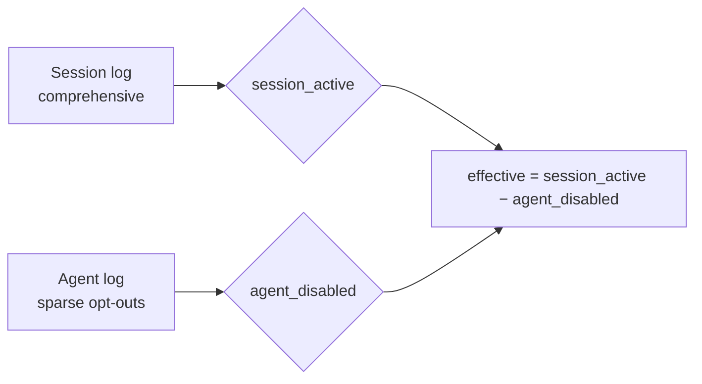

# Extension Framework

Chaz's extension framework is the single surface for adding capabilities
to an agent: tools, slash commands, lifecycle hooks, routine
(cron / one-shot) handlers, and per-turn context augmentation all flow
through it. The framework is built around a two-level model — a static
**declaration** and a per-scope **runtime instance** — chosen so that
sandboxed / WASM extensions land on the same shape as today's in-process
Rust ones.

## Two-level model

Every extension is two traits, both in `crates/lib/src/extension/`:

- **`Extension`** (`mod.rs`) — the static declaration. It knows its
  `name()`, `manifest()`, `supported_hooks()`, the `scopes()` it lives
  at, and how to `instantiate(ScopeCtx) -> ExtensionInstance`. It holds
  no per-turn state.
- **`ExtensionInstance`** (`instance.rs`) — the runtime view, one per
  live scope. It publishes everything it contributes through typed
  endpoints, each defaulting to empty; an instance overrides only what
  it actually provides.

```rust,ignore
trait Extension: Send + Sync {
    fn name(&self) -> &'static str;
    fn extension_ref(&self) -> ExtensionRef;     // identity + version
    fn supported_hooks(&self) -> &[HookKind];     // declaration manifest
    fn manifest(&self) -> ExtensionManifest;      // identity + cap contract

    fn scopes(&self) -> &[Scope] { &[Scope::Global] }  // where it lives
    async fn instantiate(&self, ctx: ScopeCtx)         // build a runtime view
        -> anyhow::Result<Arc<dyn ExtensionInstance>>;
}
```

The declaration says _where_ the extension lives; the host instantiates
it once per scope and the resulting instance says _what_ it contributes.

## Scopes & lifecycle

`Scope` (`instance.rs`) has three values, each with its own lifecycle and
its own instance map on the hub:

| Scope        | Instances     | Keyed by                   | Populated              | Torn down            |
| ------------ | ------------- | -------------------------- | ---------------------- | -------------------- |
| `Global`     | 1 per peer    | extension name             | end of `install_all`   | never (process life) |
| `PerAgent`   | 1 per agent   | `(agent_db_root_id, name)` | lazily, first turn     | never (cached)       |
| `PerSession` | 1 per session | `(session_db_id, name)`    | lazily, first dispatch | never (cached)       |

An extension that contributes at multiple scopes returns each scope in
the slice (e.g. `memory` and `skills` are `[Global, PerSession]` — Global
tools/commands plus a per-session context tail). The host calls
`instantiate` once per scope; the `ScopeCtx` variant matches the scope
being built:

```rust,ignore
enum ScopeCtx<'a> {
    Global  { peer: &'a PeerHandles },
    Agent   { peer: &'a PeerHandles, agent_name: &'a str, agent_db: &'a Database },
    Session { peer: &'a PeerHandles, session_db_id: &'a str, session_db: &'a Database },
}
```

`PeerHandles` is the peer-level bag every instance closes over at
construction: the `SessionRegistry`, the three hosted indices (agent /
memory-bank / skill-bank), the embedder, the secret store, the
`server_cell` back-reference, and the operator `agent_state` allowlist.

There is **no teardown or eviction** for any scope today. Instances are
cached for the process lifetime. `ExtensionInstance::shutdown()` exists
on the trait but is never triggered; `session_shutdown` _hooks_ fire but
do not drop the session's instance.

### Lazy population

`Global` instances are built eagerly at the tail of `install_all`.
`PerSession` and `PerAgent` instances are built lazily the first time a
turn touches them:

- `ensure_session_instances(session_db)` — instantiates every
  `PerSession` extension for a session, keyed by session DB root ID.
- `ensure_agent_instances(agent_name, agent_db)` — the mirror for
  `PerAgent`, keyed by agent DB root ID (so two sessions driven by the
  same agent share one instance).

Per-agent resolution at turn time goes through
`ensure_agent_instances_for_name`, which opens the Living Agent DB via
`peer_handles.server_cell`. It is **zero-cost until an extension declares
`PerAgent`**: `has_per_agent_extensions()` short-circuits the agent-DB
open when no extension opts in. Both helpers no-op when `peer_handles`
isn't wired (isolated unit tests), so those extensions simply don't
instantiate there.

## ExtensionInstance endpoints

What an instance exposes back to the host (`instance.rs`). All default to
empty / `None`:

- **Tools** — `tools() -> Vec<Arc<dyn Tool>>`
- **Commands** — `commands() -> Vec<(String, Arc<dyn ExtensionCommand>)>`
- **Per-turn context** — `prompt_augmentation()`, `context_tail()`
- **Extension-to-extension caps** — `memory_access()`, `messenger()`,
  and the TypeId-keyed escape hatch `extension_cap(type_id)`
- **Hook handlers** — `before_agent_start_hook()`, `tool_call_hook()`,
  `tool_result_hook()`, `agent_end_hook()`, `session_start_hook()`,
  `session_shutdown_hook()`
- **Routine** — `routine_handler()`
- **Lifecycle** — `shutdown()` (async; not yet triggered)

## Two dispatch paths

### 1. Drain path (Global only)

`install_all` (`mod.rs`) validates every manifest, pushes the extensions
onto the hub, then for each `Global` extension builds its instance and
calls `drain_global_instance`. The drain pumps the instance's endpoints
into the hub's legacy registries:

- `tools()` → the owner-attributed tool map (and from there into the
  runtime `ToolRegistry`, built in `main.rs` from
  `hub.tools_for_registry()`).
- `commands()` → the hub command map (first-write-wins; built-in
  reserved names win over extension registrations).
- the six `*_hook()` handlers → the per-kind `RegisteredHook` vectors,
  wrapped by thin `hook_bridge::*Adapter`s that forward to the
  instance-published handler (the handlers take no context argument).
- `routine_handler()` → `installed[name].routine_handler`, where
  `dispatch_routine` looks it up.

The runtime's `fire_<kind>` paths then iterate those owner-tagged
vectors. **Per-agent and per-session instances are not drained** — tools,
commands, and hooks from non-Global scopes are not wired into dispatch
yet (see _Deferred_). Only the per-turn context and cap endpoints flow
from non-Global instances.

### 2. Live-instance path (per-turn)

System-prompt and context-tail augmentation consult live instances
directly each turn. `augment_system_prompt` and `context_tails`
(`mod.rs`) call `context_instances(agent_name, session_db)`, which
returns the deduped union of per-session ∪ per-agent instances (session
wins on name collision; Global is intentionally excluded — those
endpoints need session/agent context Global instances don't carry), then
asks each for `prompt_augmentation` / `context_tail`. Per-session
active-set filtering applies.

Extension-to-extension caps resolve through `cap_resolver_for_turn` →
`HubCapResolver` (`mod.rs`), which walks `instances_for_turn`
(global ∪ agent ∪ session, deduped `session > agent > global`) and
returns the first instance answering `Some` for a given cap. This is
the forward resolution surface — it has no production consumer yet
(prompt/context-tail augmentation iterate instances directly via
`context_instances`; `Messenger`/`MemoryAccess` are published but not
yet consumed). It's kept as the instance-based resolver the WASM host
boundary will bind against.

```rust,ignore
trait CapResolver: Send + Sync {
    fn memory(&self) -> Option<Arc<dyn MemoryAccess>>;
    fn messenger(&self) -> Option<Arc<dyn Messenger>>;
    fn context_tail(&self) -> Option<Arc<dyn ContextTail>>;
    fn prompt_augmentation(&self) -> Option<Arc<dyn PromptAugmentation>>;
    fn extension_cap_by_id(&self, type_id: TypeId)
        -> Option<Arc<dyn Any + Send + Sync>>;
}
```

## Hook kinds

Every registration is tagged with a `HookKind`, and every extension
declares in `supported_hooks()` which kinds it intends to use:

```rust,ignore
enum HookKind {
    BeforeAgentStart, ToolCall, ToolResult, AgentEnd,
    SessionStart, SessionShutdown,
    Tool, Command,
}
```

Declaration drives security (only declared kinds run; for sandboxed
extensions this becomes the manifest the host inspects before loading),
efficiency (the hub skips extensions that don't handle a kind), and
inspection (`/extensions list`).

## Capabilities

Caps are the typed services that cross the extension boundary
(`caps.rs`). They return plain data over `CapFuture<'a, T>` — the seam
that lets the same shape cross a sandbox boundary later. `CapabilityKind`
splits them into two ownership groups (`CapabilityKind::is_host_only` is
authoritative):

- **Host-only** — provided by chaz core; an extension can't publish its
  own, and a host-only kind in a manifest's `provides_capabilities` is a
  validation error. The one live host-only cap trait is `AgentStateAdmin`
  (scoped agent-DB access for the schedule tools, via
  `ScopedAgentStateAdmin`). The remaining host-only `CapabilityKind`s
  (`SessionRead`/`SessionWrite`/`Settings`/`ToolRegistration`/
  `CommandRegistration`) are **declaration vocabulary only** — extensions
  reach their session and publish tools/commands structurally through the
  instance model (`ExtensionInstance` endpoints + `ScopeCtx`), not through
  a cap handle.
- **Extension-providable** — `Messenger`, `MemoryAccess`,
  `PromptAugmentation`, `ContextTail`. Published by an instance through
  its endpoints; `PromptAugmentation`/`ContextTail` are consumed directly
  by context assembly, `Messenger`/`MemoryAccess` are resolvable through
  the `CapResolver` (no consumer yet).

## Routine handlers

Cron and one-shot work fires through the routine engine (`crates/lib/src/routine/`),
not as a hook. A Global instance returns a `routine_handler()`; the
engine dispatches via `ExtensionHub::dispatch_routine(name, &scope,
payload)`.

```rust,ignore
trait RoutineHandler: Send + Sync {
    fn on_fire<'a>(&'a self, payload: Value)
        -> HandlerFuture<'a, anyhow::Result<()>>;
}
```

The handler reads whatever session/agent it targets out of its own
opaque `payload` (e.g. `agent_schedule` deserializes an
`AgentSchedulePayload` and fires the turn through the server). The
`scope` passed to `dispatch_routine` is recorded for tracing. Three fire
scopes exist on the engine side (`RoutineScope::Global` from
`chaz_peer.routines`, `Session(id)` from a session DB's `routines` table,
`Agent(id)` from an agent DB) — they control where the routine is stored
and rescheduled, not what the handler receives.

The engine owns cron rescheduling, one-shot row deletion, and
auto-disable after `max_failures` consecutive errors; the handler just
does the per-fire work. Routine fires are **not** gated by the
per-session active set.

## Per-session active set

Each session has an _active set_ — the subset of peer-installed
extensions that fire hooks, contribute tools, and dispatch commands on
that session. Different sessions on the same peer can differ.

```rust,ignore
impl Server {
    pub async fn active_extensions_for(&self, session_db_id: &str)
        -> HashSet<String>;                              // session-scoped set
    pub async fn agent_disabled_extensions(&self, agent_name: &str)
        -> HashSet<String>;                              // agent opt-outs
    pub async fn active_extensions_for_agent(&self, session_db_id, agent_name)
        -> HashSet<String>;                              // session − agent
}
```

The effective set is `active_extensions_for(session) − agent_disabled`.
It flows into hook firing through `HookContext.active_extensions`, into
tool listing through `ScopedTools::with_active_extensions`, and into the
per-turn context path. `fire_<kind>` skips handlers whose owner isn't in
the set; `try_dispatch_command` returns `None` for inactive owners;
`ScopedTools` hides inactive owners' tools from the LLM entirely.

MCP-loaded tools register with `owner: None` — they're always available,
not subject to the extension lifecycle.

## Activation event log

Active state is persisted as an event log, in a `Table<ExtensionEvent>`
store named `extensions`:

```rust,ignore
enum ExtensionEvent {
    Activated   { name, extension_ref, timestamp },
    Deactivated { name, timestamp },
}
```

There are two logs, with deliberately different shapes:

- **Session DB — comprehensive.** `record_active(session_db)` runs at
  every `session_start` and writes `Activated` for the full installed
  set (skipping no-op repeats). `read_active` folds it: per `name`, the
  latest event by timestamp wins.
- **Agent DB — sparse.** Only explicit opt-outs (`Deactivated`) are
  written. `read_disabled(agent_db)` folds it into the set of names the
  agent has opted out of. An agent with no records filters nothing.

**Intersection rule.** The effective set is
`session_active − agent_disabled`: both scopes must agree, and an agent
can only _narrow_ — never widen past what the session allows. This gives
zero-migration backward compatibility (agents with no records behave
exactly as before).

`/extensions add|remove <name> [agent|session]` drives both logs;
`session` is the default target. To survive restarts, `record_active`
and the add/remove commands clamp event timestamps to
`max(Utc::now(), latest_observed_ts + 1ms)` so a freshly-written event
always wins the fold — important under CRDT sync with skewed clocks.



## Per-session settings

Each extension can store a per-session JSON blob keyed by extension name
in a `DocStore` named `extension_settings` on the session DB. Handlers
reach it through the host-only `Settings` cap
(`caps.settings.get/set(...)`), or via the `read_settings` /
`write_settings` helpers an instance calls at instantiate time (e.g.
`memory` reads `attached_banks` when building its per-session context
tail).

## Extension identity

Every extension carries an `ExtensionRef`, written to the activation log
so the active set can be replayed on another peer:

```rust,ignore
enum ExtensionRef {
    Builtin  { name, chaz_version },
    Eidetica { name, db_id, version },
    Ipld     { name, cid },
    Git      { name, repo, sha },
}
```

Only `Builtin` is produced today (every built-in defaults to
`ExtensionRef::builtin(self.name())`). The other variants are
placeholders for non-compile-time loader paths. `name()` and `version()`
flatten the variants; the type serializes with `#[serde(tag = "kind")]`
so it round-trips through eidetica.

## Module layout

| Path                                             | Purpose                                                                                                                                                   |
| ------------------------------------------------ | --------------------------------------------------------------------------------------------------------------------------------------------------------- |
| `crates/lib/src/extension/mod.rs`                | Framework: `Extension` trait, `ExtensionHub`, `install_all`, dispatch, activation log                                                                     |
| `crates/lib/src/extension/instance.rs`           | `ExtensionInstance`, `Scope`, `ScopeCtx`, `PeerHandles`, `CapResolver`                                                                                    |
| `crates/lib/src/extension/caps.rs`               | Cap traits (`Messenger`, `MemoryAccess`, `PromptAugmentation`, `ContextTail`, `AgentStateAdmin`) + `CapabilityKind`/`CapabilityRequest` declaration vocab |
| `crates/lib/src/extension/agent_state.rs`        | `AgentStateAdmin` cap + scoped impl                                                                                                                       |
| `crates/lib/src/extension/manifest.rs`           | `ExtensionManifest` + per-manifest validation                                                                                                             |
| `crates/lib/src/extension/handler.rs`            | Hook-handler traits + `InstalledExtension` (Global drain target)                                                                                          |
| `crates/lib/src/extension/hook_bridge.rs`        | Adapters bridging instance hook handlers into the fire vecs                                                                                               |
| `crates/lib/src/extension/hooks.rs`              | Per-kind hook trait definitions + `HookKind`                                                                                                              |
| `crates/lib/src/extensions/mod.rs`               | `all_builtins` + `BuiltinDeps` — wires the built-in set                                                                                                   |
| `crates/lib/src/extensions/core.rs`              | `shell`, `compact`, `spawn_agent`, `spawn_worker`                                                                                                         |
| `crates/lib/src/extensions/fs.rs`                | `read_file`, `write_file`, `edit_file`                                                                                                                    |
| `crates/lib/src/extensions/system.rs`            | `get_time`, `calculate`, `describe_tool`                                                                                                                  |
| `crates/lib/src/extensions/web.rs`               | `web_fetch`, `web_search`                                                                                                                                 |
| `crates/lib/src/extensions/memory.rs`            | `remember`, `recall`, `list_memory_banks`, `/memory`, recall context tail                                                                                 |
| `crates/lib/src/extensions/skills.rs`            | skill tools + `/skills`, prompt augmentation                                                                                                              |
| `crates/lib/src/extensions/schedule.rs`          | schedule tools + `/schedule` (agent-owned schedules)                                                                                                      |
| `crates/lib/src/extensions/agent_schedule.rs`    | routine handler running the agent-owned schedule fire path                                                                                                |
| `crates/lib/src/extensions/mcp.rs`               | `McpExtension` — one per configured MCP server                                                                                                            |
| `crates/lib/src/extensions/path_normalizer.rs`   | `tool_call` hook stripping trailing `/` from path args                                                                                                    |
| `crates/lib/src/extensions/security_warnings.rs` | `tool_result` hook scanning for prompt-injection patterns                                                                                                 |

## Built-in extensions

| Extension           | Scopes                 | Declared hooks    | Routine | What it provides                                           |
| ------------------- | ---------------------- | ----------------- | ------- | ---------------------------------------------------------- |
| `core`              | `Global`               | `Tool`            | —       | `shell`, `compact`, `spawn_agent`, `spawn_worker`          |
| `fs`                | `Global`               | `Tool`            | —       | `read_file`, `write_file`, `edit_file`                     |
| `system`            | `Global`               | `Tool`            | —       | `get_time`, `calculate`, `describe_tool`                   |
| `web`               | `Global`               | `Tool`            | —       | `web_fetch`, `web_search`                                  |
| `memory`            | `Global`, `PerSession` | `Tool`, `Command` | —       | memory tools + `/memory` + per-session recall context tail |
| `skills`            | `Global`, `PerSession` | `Tool`, `Command` | —       | skill tools + `/skills` + prompt augmentation              |
| `schedule`          | `Global`               | `Tool`, `Command` | yes     | schedule tools + `/schedule`                               |
| `agent_schedule`    | `Global`               | —                 | yes     | routine handler for agent-owned schedule fires             |
| `path_normalizer`   | `Global`               | `ToolCall`        | —       | strips trailing `/` from filesystem-tool path args         |
| `security_warnings` | `Global`               | `ToolResult`      | —       | logs prompt-injection patterns in tool output              |

MCP servers are data-driven, not compile-time: `main.rs` pushes one
`McpExtension` (`Global`) per configured server, sharing the same
lifecycle. All built-ins are in the default-active set for new sessions
("default = everything"); users disable individual ones per session via
`/extensions remove`.

## Adding a new extension

1. Create `crates/lib/src/extensions/my_ext.rs` implementing `Extension`:
   - return your hook kinds from `supported_hooks()` and build a
     matching `manifest()`;
   - declare your `scopes()` (default `[Global]`);
   - implement `instantiate(ctx)` to return an `ExtensionInstance` that
     overrides the endpoints you contribute — `tools()`, `commands()`,
     the `*_hook()` slots, `prompt_augmentation()` / `context_tail()`,
     `memory_access()` / `messenger()`, `routine_handler()`.
2. Add the module to `crates/lib/src/extensions/mod.rs` and the constructor to the
   `all_builtins` vec. If it needs shared deps (session registry, agent
   index, embedder, …), add them to `BuiltinDeps` and thread through
   `main.rs`.
3. (Optional) Override `extension_ref()` if the extension's identity
   isn't `Builtin` — e.g. when implementing a loader for git / IPLD /
   eidetica refs.

The framework attributes everything the Global instance publishes,
filters by per-session (and per-agent) active set, and surfaces
inspection via `/extensions list`. No additional plumbing in `main.rs`
or the runtime.

## Deferred / reserved

- **Non-Global tools & commands** — instances at `PerAgent` /
  `PerSession` scope can publish `prompt_augmentation` / `context_tail` /
  caps, but their `tools()` / `commands()` are not yet wired into
  dispatch (only Global instances are drained). This waits on
  dispatch-time tool scoping.
- **Instance teardown** — `ExtensionInstance::shutdown()` and eviction
  are unimplemented; instances live for the process. `session_shutdown`
  _hooks_ fire but don't drop instances.
- **Non-builtin loading** — only `ExtensionRef::Builtin` is produced.
  `Eidetica` / `Ipld` / `Git` and a filesystem path are reserved for
  loader paths that don't exist yet.
- **WASM / sandboxed extensions** — the real execution mechanism for
  non-builtin extensions. The whole framework was shaped for it: a
  declared scope + manifest the host inspects before loading, typed
  endpoints, and caps returning plain data over `CapFuture` so the same
  handler shape works across a sandbox boundary.
