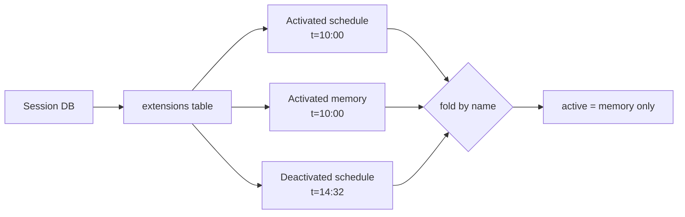

# Extension Framework

Chaz's extension framework is the single surface for adding capabilities
to an agent: tools, slash commands, lifecycle hooks, and routine
(cron / one-shot) handlers all flow through it. An extension is a piece
of code that declares a capability manifest and an `install()` body —
the host then resolves the caps it asked for, hands it a typed bundle,
and drives all of its work through that bundle.

The shape is built around two future directions: WASM / sandboxed
extensions land on the same `install()` + `ExtensionCaps` surface as
today's in-process Rust ones, and per-session enforcement filters one
attributed handler list rather than three separate registries.

## Extension trait

```rust,ignore
trait Extension: Send + Sync {
    fn name(&self) -> &'static str;
    fn extension_ref(&self) -> ExtensionRef;            // identity + version
    fn supported_hooks(&self) -> &[HookKind];           // declaration manifest
    fn extension_api_version(&self) -> u32;             // hook ABI version
    fn default_settings(&self) -> serde_json::Value;    // settings schema

    fn manifest(&self) -> ExtensionManifest;            // cap contract
    fn build_providers(&self)                           // capability impls
        -> anyhow::Result<HashMap<CapabilityKind, CapProvider>>;
    async fn install(&self, caps: ExtensionCaps)        // wire handlers
        -> anyhow::Result<InstalledExtension>;

    // Legacy no-op default. Kept on the trait only because the hub's
    // own unit tests still drive the pre-cap registration path; no
    // built-in overrides it.
    fn register(self: Arc<Self>, _hub: &mut ExtensionHub) {}
}
```

The wiring path is `manifest()` → `build_providers()` → `install(caps)`.
Tools and slash commands aren't fields on the trait — they're registered
inside `install()` through capability traits the host hands the
extension. Hook and routine handlers come back as the
`InstalledExtension` return value.

## Capability surface

An extension's manifest declares what capabilities it consumes and what
it provides. `ExtensionHub::install_all` resolves the manifest and
hands the extension an `ExtensionCaps` bundle at install time.

```rust,ignore
struct ExtensionManifest {
    name: String,
    extension_ref: ExtensionRef,
    supported_hooks: Vec<HookKind>,
    required_capabilities: Vec<CapabilityRequest>,
    requested_capabilities: Vec<CapabilityRequest>,
    provides_capabilities: Vec<CapabilityKind>,
}

struct ExtensionCaps {
    session_read: Option<Arc<dyn SessionRead>>,
    session_write: Option<Arc<dyn SessionWrite>>,
    settings: Option<Arc<dyn Settings>>,
    tool_registration: Option<Arc<dyn ToolRegistration>>,
    command_registration: Option<Arc<dyn CommandRegistration>>,
    messengers: CapSet<dyn Messenger>,
    memory: CapSet<dyn MemoryAccess>,
}
```

Capabilities split into two ownership groups (`CapabilityKind::is_host_only`
is authoritative):

- **Host-only** — `SessionRead`, `SessionWrite`, `Settings`,
  `ToolRegistration`, `CommandRegistration`. Provided by chaz core;
  extensions can't publish their own impls. Each session has exactly one
  impl of each, supplied per-fire by the host.
- **Extension-providable** — `Messenger`, `MemoryAccess`. Any extension
  can publish an impl via `build_providers()`. Consumers resolve by kind
  plus optional provider name through a `CapSet`. Zero, one, or many
  providers may register per kind; the operator picks the default in
  config (`capability_defaults`).

Manifest entries are `required` (missing → load fails, cascades to
dependent extensions) or `requested` (missing → slot reads as `None`,
extension handles it gracefully). Putting a host-only kind in
`provides_capabilities` is a validation error.

## Hook kinds

Every registration is tagged with a `HookKind`, and every extension must
declare in `supported_hooks()` which kinds it intends to use. The hub
validates that an extension's installed handlers match its declaration.

```rust,ignore
enum HookKind {
    BeforeAgentStart, ToolCall, ToolResult, AgentEnd,
    SessionStart, SessionShutdown,
    Tool, Command,
}
```

Declaration serves three purposes:

1. **Security.** Only handlers whose extension declared the kind run.
   For WASM / sandboxed extensions this becomes the manifest the host
   inspects before loading.
2. **Efficiency.** The hub skips extensions that don't handle a given
   kind without invoking them.
3. **Inspection.** `/extensions list` reads `supported_hooks()` to
   describe what each extension does.

## ExtensionHub

The central registry, held on `Server` as `Arc<ExtensionHub>`. It owns:

- The list of installed extensions
- Per-kind hook handler vectors, each handler tagged with owner
- `installed: HashMap<String, InstalledExtension>` — the per-extension
  return values of `install()` (routine handlers live here)
- A name-indexed tool registry with owner attribution
- A name-indexed command registry with owner attribution
- The capability registry (extension-publishable providers) +
  operator-configured per-kind defaults
- A `SessionRegistry` handle for resolving session-scoped routine fires
- Reverse indexes for inspection (`hooks_for(name)`, etc.)

`install_all` is the single entry point. It runs in two phases:

```rust,ignore
hub.set_session_registry(registry.clone());
hub.install_all(extensions::all_builtins(deps)).await?;
//   ^^^^^^^^^^
// Phase 1: build_providers() for every extension; populate the cap
//          registry; apply operator defaults.
// Phase 2: for each extension, assemble its ExtensionCaps bundle
//          (caps it requested + a fresh ToolRegistration /
//          CommandRegistration that buffers into pending queues),
//          call install(), capture the InstalledExtension.
// Drain:   pending tool / command queues into the owner-attributed
//          legacy registries.
// Bridge:  push every cap-based hook handler returned in
//          InstalledExtension through a hook_bridge::*Adapter into
//          the legacy per-kind fire vec.
```

The bridge step keeps the existing `fire_<kind>` paths in the hub
unchanged: they iterate `Vec<RegisteredHook<dyn HookXxx>>` and call the
legacy `Hook*` trait. Each adapter takes a `&HookContext` per fire,
builds a session-scoped `ExtensionCaps` (populating `session_read`,
`session_write`, and `settings` from `ctx.session`), then invokes the
inner cap-based handler. See `src/extension/hook_bridge.rs`.

## Tools as hooks

Tool registration flows through `caps.tool_registration` inside `install`:

```rust,ignore
impl Extension for FsExtension {
    fn name(&self) -> &'static str { "fs" }
    fn supported_hooks(&self) -> &[HookKind] { &[HookKind::Tool] }

    fn manifest(&self) -> ExtensionManifest {
        ExtensionManifest {
            name: self.name().to_string(),
            extension_ref: ExtensionRef::builtin(self.name()),
            supported_hooks: vec![HookKind::Tool],
            required_capabilities: vec![CapabilityRequest::ToolRegistration],
            requested_capabilities: Vec::new(),
            provides_capabilities: Vec::new(),
        }
    }

    fn install<'a>(
        &'a self,
        caps: ExtensionCaps,
    ) -> Pin<Box<dyn Future<Output = anyhow::Result<InstalledExtension>> + Send + 'a>> {
        Box::pin(async move {
            let tool_reg = caps.tool_registration.as_ref()
                .ok_or_else(|| anyhow::anyhow!("fs install requires ToolRegistration"))?;
            for t in [Arc::new(ReadFile), Arc::new(WriteFile), Arc::new(EditFile)] {
                let t: Arc<dyn Tool> = t;
                tool_reg.register(t.descriptor(), t).await?;
            }
            Ok(InstalledExtension::empty())
        })
    }
}
```

`InProcToolRegistration` buffers each registration onto a pending
queue; the hub drains it after `install()` returns and routes each
entry through the existing owner-attributed registry path. The legacy
`ToolRegistry` still exists — `main.rs` builds it after `install_all` by
draining `hub.tools_for_registry()` into it. Each entry carries
`owner: Option<&'static str>` so `ScopedTools` can filter by
per-session active extension set.

MCP-loaded tools register with `owner: None`. They're always available
regardless of which extensions are active on a session — they're not
subject to the extension lifecycle.

## Hook handlers

Cap-based hook handlers go in `InstalledExtension`. One slot per hook
kind, each `Option<Box<dyn HookHandler...>>`:

```rust,ignore
struct InstalledExtension {
    pub before_agent_start: Option<Box<dyn HookHandlerBeforeAgentStart>>,
    pub tool_call:          Option<Box<dyn HookHandlerToolCall>>,
    pub tool_result:        Option<Box<dyn HookHandlerToolResult>>,
    pub agent_end:          Option<Box<dyn HookHandlerAgentEnd>>,
    pub session_start:      Option<Box<dyn HookHandlerSessionStart>>,
    pub session_shutdown:   Option<Box<dyn HookHandlerSessionShutdown>>,
    pub routine_handler:    Option<Box<dyn RoutineHandler>>,
}
```

Each cap-based hook trait receives `&ExtensionCaps` instead of the
legacy `&HookContext`, so handlers reach the session through narrow
typed traits (`SessionRead`, `SessionWrite`, `Settings`) rather than
holding `Arc<Mutex<Session>>` directly. That's the seam that lets the
same trait shape carry through a sandbox boundary later — the cap
methods all return plain data over `CapFuture<'a, T>`.

The runtime's `fire_<kind>` paths haven't changed; they call the
legacy `Hook*` trait on the adapter, which in turn invokes the
inner cap-based handler. Per-session active-set filtering still happens
at the fire boundary — `ctx.active_extensions.contains(reg.owner)` —
because owner attribution is laid down identically through both
registration paths.

## Routine handlers

Cron and one-shot work fires through the routine engine (see
`src/routine/`) rather than as a hook. An extension declares
`routine_handler: Some(...)` in its `InstalledExtension`, and the
engine dispatches via `ExtensionHub::dispatch_routine(name, &scope, payload)`.

```rust,ignore
trait RoutineHandler: Send + Sync {
    fn on_fire<'a>(
        &'a self,
        caps: &'a ExtensionCaps,
        payload: serde_json::Value,
    ) -> HandlerFuture<'a, anyhow::Result<()>>;
}
```

Routine fires come in two scopes:

- **`RoutineScope::Global`** — fired from `chaz_peer.routines`. The
  caps bundle gets extension-providable defaults (messengers, memory)
  but no session-scoped slots.
- **`RoutineScope::Session(id)`** — fired from a session DB's
  `routines` table. The hub resolves the session through its
  `SessionRegistry` handle and populates `caps.session_read`,
  `caps.session_write`, and `caps.settings` for that session. The
  handler appends directives through `caps.session_write.append(...)`
  exactly the same way it would inside a normal hook.

The engine handles cron rescheduling and one-shot row deletion; the
handler's job is just the per-fire work. Auto-disable after
`max_failures` consecutive errors is bookkeeping the engine owns too.

## Per-session active set

Each session has an _active set_ of extensions: a subset of the peer-
installed extensions that fire hooks, contribute tools, and dispatch
commands on this session. Other sessions on the same peer can have
different active sets.

The active set is folded from a per-session event log (see below) and
cached on `Server`:

```rust,ignore
impl Server {
    pub async fn active_extensions_for(&self, session_db_id: &str)
        -> HashSet<String> { /* cached lookup */ }

    pub async fn refresh_active_extensions(&self, session_db_id: &str)
        -> HashSet<String> { /* recompute + refresh cache */ }
}
```

The set flows into hook firing through `HookContext.active_extensions`
and into tool listing through `ScopedTools::with_active_extensions`.
The hub's `fire_<kind>` methods skip any handler whose owner isn't in
the set. `try_dispatch_command` returns `None` for inactive owners.
`ScopedTools::definitions` hides tools whose owner is inactive, and
`get()` returns `None` for them — the LLM never sees them and can't
call them even if it tries.

Routine fires aren't gated by the active set; the routine engine fires
any routine that's enabled regardless of whether its owning extension
is active on the session. (Disabling `schedule` on a session and still
expecting cron rules on that session to fire would be surprising, but
that's the current behavior.)

## Activation event log

Active state is persisted as an event log on each session's eidetica
DB, in a `Table<ExtensionEvent>` store named `extensions`. Each row is
one activation or deactivation:

```rust,ignore
enum ExtensionEvent {
    Activated   { name, extension_ref, timestamp },
    Deactivated { name, timestamp },
}
```

Current state is derived by folding events: per `name`, the latest
event by `timestamp` wins. `Activated` keeps it in; `Deactivated`
drops it. The fold is done in `extension::read_active(session_db)`.

This shape is intentionally CRDT-friendly — each event is a discrete
row keyed implicitly by eidetica, so two peers concurrently editing the
set merge cleanly without coordination. There's no shared `Vec` to
clobber.



### record_active semantics

`ExtensionHub::record_active(session_db)` runs at every `session_start`
hook fire. It reconciles the hub's currently-installed extensions
against the session's log:

| Latest event for name            | Action                              |
| -------------------------------- | ----------------------------------- |
| None (no prior event)            | Write `Activated` (default-include) |
| `Activated` with same `ref`      | Skip — no-op                        |
| `Activated` with different `ref` | Write `Activated` (version bump)    |
| `Deactivated`                    | Skip — respect the removal          |

The "respect Deactivated" rule is what makes `/extensions remove X`
survive restarts. Reactivation must be an explicit user action that
writes a fresh `Activated` event (via `/extensions add X`).

To handle CRDT-synced events with skewed-forward timestamps,
`record_active` and `/extensions add|remove` both clamp their event
timestamps to `max(Utc::now(), latest_observed_ts + 1ms)` — a
freshly-written event always wins the fold.

## Per-session settings

Each extension can store a per-session settings blob: arbitrary JSON
keyed by extension name in a `DocStore` named `extension_settings` on
the session DB. Cap-based handlers access it through the `Settings`
cap:

```rust,ignore
// Inside a cap-based handler:
let pollover: Option<serde_json::Value> =
    caps.settings.as_ref().unwrap().get("max_results").await?;
caps.settings.as_ref().unwrap()
    .set("max_results", serde_json::json!(8))
    .await?;
```

The `Settings` cap is one of the host-only kinds — chaz core owns the
single in-process impl per `(extension, session)` pair. The legacy
`HookContext::{get,set}_settings` methods take the extension name
explicitly (rather than relying on ambient context) and are what the
bridge adapter calls through under the hood.

`Extension::default_settings()` returns the extension's default schema —
the `/extensions settings <name>` command surfaces this for users to
see what's tunable. Missing keys in the stored settings should fall
back to the default; extensions handle their own merge.

## Extension identity

Every extension carries an `ExtensionRef`, written to the activation
event log so the active set can be replayed on another peer:

```rust,ignore
enum ExtensionRef {
    Builtin   { name, chaz_version },
    Eidetica  { name, db_id, version },
    Ipld      { name, cid },
    Git       { name, repo, sha },
}
```

Only `Builtin` is produced today (every built-in extension defaults to
`ExtensionRef::builtin(self.name())`). The other variants are
placeholders for the loader paths that will land with dynamic extension
support — extensions loaded from an eidetica DB, content-addressed via
IPLD, or pinned to a remote git commit.

`ExtensionRef::name()` and `::version()` flatten the variants for
callers that want the addressing token regardless of kind. The type
serializes with `#[serde(tag = "kind")]` so it round-trips cleanly
through eidetica.

## HookContext vs ExtensionCaps

Two handles, depending on which side of the bridge a piece of code
runs on:

```rust,ignore
struct HookContext {
    agent_name: String,
    model: Option<String>,
    call_depth: usize,
    session: Arc<Mutex<Session>>,
    active_extensions: HashSet<String>,
}
```

`HookContext` is the legacy per-fire handle the runtime constructs and
hands to the hub's `fire_<kind>` methods. The bridge adapter uses it to
build a fresh `ExtensionCaps` bundle for the cap-based handler it
wraps.

New code targets `&ExtensionCaps`. Session access is via
`caps.session_read.entries(...)` and `caps.session_write.append(...)`
rather than `ctx.session.lock().await.add_entry(...)` — narrower, typed,
and the same shape works for sandboxed WASM extensions later.

## Module layout

| Path                                  | Purpose                                                   |
| ------------------------------------- | --------------------------------------------------------- |
| `src/extension/mod.rs`                | Framework: trait, hub, `install_all`, persistence         |
| `src/extension/caps.rs`               | Cap traits + `ExtensionCaps` bundle                       |
| `src/extension/caps_inproc.rs`        | In-process impls of host-only caps                        |
| `src/extension/manifest.rs`           | `ExtensionManifest` + validation                          |
| `src/extension/registry.rs`           | `CapRegistry` (per-kind provider map)                     |
| `src/extension/handler.rs`            | Cap-based handler traits + `InstalledExtension`           |
| `src/extension/hook_bridge.rs`        | Adapters bridging cap handlers into legacy fire vecs      |
| `src/extension/hooks.rs`              | Legacy per-kind hook trait definitions                    |
| `src/extensions/mod.rs`               | `all_builtins` — wires built-ins                          |
| `src/extensions/core.rs`              | `shell`, `compact`, `spawn_*`                             |
| `src/extensions/fs.rs`                | `read_file`, `write_file`, `edit_file`                    |
| `src/extensions/system.rs`            | `get_time`, `calculate`, `describe_tool`                  |
| `src/extensions/web.rs`               | `web_fetch`, `web_search`                                 |
| `src/extensions/memory.rs`            | `remember`, `recall`, `list_memory_banks`                 |
| `src/extensions/schedule.rs`          | Schedule tools + `/schedule` command                      |
| `src/extensions/scheduler.rs`         | YAML-schedule routine handler                             |
| `src/extensions/path_normalizer.rs`   | `tool_call` hook stripping `/` suffix                     |
| `src/extensions/security_warnings.rs` | `tool_result` hook scanning for prompt injection patterns |

## Built-in extensions

| Extension           | Declared hooks    | Routine handler | What it provides                                                                            |
| ------------------- | ----------------- | --------------- | ------------------------------------------------------------------------------------------- |
| `core`              | `Tool`            | —               | `shell`, `compact`, `spawn_agent`, `spawn_task`                                             |
| `fs`                | `Tool`            | —               | `read_file`, `write_file`, `edit_file`                                                      |
| `system`            | `Tool`            | —               | `get_time`, `calculate`, `describe_tool`                                                    |
| `web`               | `Tool`            | —               | `web_fetch`, `web_search`                                                                   |
| `memory`            | `Tool`            | —               | `remember`, `recall`, `list_memory_banks`                                                   |
| `schedule`          | `Tool`, `Command` | yes             | 5 schedule tools + `/schedule` command (agent-owned schedules)                              |
| `scheduler`         | —                 | yes             | YAML `schedules:` translated to per-session Routine rows; fires scheduled Directive entries |
| `path_normalizer`   | `ToolCall`        | —               | Strips trailing `/` from filesystem-tool path args                                          |
| `security_warnings` | `ToolResult`      | —               | Logs prompt-injection patterns in tool output                                               |

All are in the default-active set for new sessions (the
"default = everything" rule). Users can disable individual extensions
per session via `/extensions remove`. `scheduler` has no hooks
declared — it only exists to receive routine fires the engine
translated from YAML config.

## Adding a new extension

1. Create `src/extensions/my_ext.rs` implementing `Extension`.
   - Return your hook kinds from `supported_hooks()`.
   - Build an `ExtensionManifest` from `manifest()` declaring
     `required_capabilities` (cap traits the extension _must_ have to
     function) and `requested_capabilities` (caps it would like but
     can run without). If you publish a cap impl, fill
     `provides_capabilities` and override `build_providers()`.
   - In `install(caps)`, register tools / commands through
     `caps.tool_registration` / `caps.command_registration`, and
     return an `InstalledExtension` whose slots carry your hook /
     routine handlers.
2. Add the module to `src/extensions/mod.rs` and the constructor to the
   `all_builtins` vec. If the extension needs shared deps (session
   registry, agent index, embedder, ...), add them to `BuiltinDeps` and
   thread through `main.rs`.
3. (Optional) Override `default_settings()` if the extension has a
   tunable config schema.
4. (Optional) Override `extension_ref()` if the extension's identity
   isn't `Builtin { chaz_version }` — e.g. when implementing a loader
   for git / IPLD / eidetica refs.

The framework attributes everything you register through `install()`,
filters by per-session active set, and surfaces inspection via
`/extensions list`. No additional plumbing required in `main.rs` or the
runtime.

## Deferred / reserved

- **WASM / sandboxed extensions** — `ExtensionRef::{Eidetica, Ipld, Git}`
  variants are reserved for non-compile-time extensions. The cap
  surface was designed with these in mind: `ExtensionCaps`'s trait
  methods return plain data over `CapFuture`, so the same handler
  shape works across a sandbox boundary. No loader exists yet.
- **Legacy registration helpers** — `ExtensionHub::register_extension`
  - `on_<kind>` + `register_tool` + `register_command` survive on the
    hub solely to support the hub's own legacy-path unit tests. Once
    those tests are ported to `install_all`, the helpers go away along
    with the trait's no-op `register()` default.
