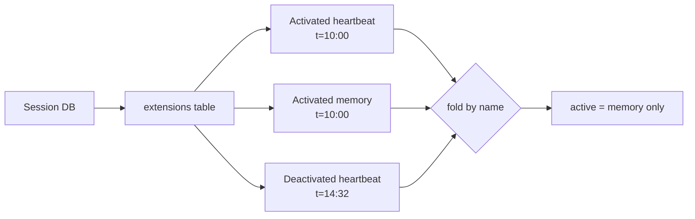

# Extension Framework

Chaz's extension framework is the single surface for adding capabilities to
an agent: tools, slash commands, and lifecycle hooks all flow through it.
An extension is a piece of code that registers handlers for a set of
hooks — nothing more. The runtime fires events; extensions can choose to
respond.

This shape was chosen so that future WASM/sandboxed extensions land on
the same API as today's in-process Rust extensions, and so per-session
enforcement can be implemented as a single filter rather than three.

## Extension trait

```rust,ignore
trait Extension: Send + Sync {
    fn name(&self) -> &'static str;
    fn extension_ref(&self) -> ExtensionRef;           // identity + version
    fn supported_hooks(&self) -> &[HookKind];          // declaration manifest
    fn register(self: Arc<Self>, hub: &mut ExtensionHub); // wire handlers
    fn default_settings(&self) -> serde_json::Value;   // settings schema
    fn extension_api_version(&self) -> u32;            // hook ABI version
}
```

That's the whole surface. Tools and slash commands aren't fields on the
trait — they're hooks registered inside `register()` via
`hub.register_tool(...)` and `hub.register_command(...)`.

## Hook kinds

Every registration is tagged with a `HookKind`, and every extension must
declare in `supported_hooks()` which kinds it intends to use. The hub
validates the declaration against actual registrations at startup —
registering a hook kind that wasn't declared is a programming error.

```rust,ignore
enum HookKind {
    BeforeAgentStart, ToolCall, ToolResult, AgentEnd,
    SessionStart, SessionShutdown,
    Tool, Command,
    Cron,  // reserved — declarable but not yet fired
}
```

Declaration serves three purposes:

1. **Security.** Only handlers whose extension declared the kind run. For
   WASM/sandboxed extensions this becomes the manifest — the host can
   inspect what an extension claims to handle before loading it.
2. **Efficiency.** The hub can skip extensions that don't handle a given
   kind without invoking them.
3. **Inspection.** `/extensions list` reads `supported_hooks()` to
   describe what each extension does.

## ExtensionHub

The central registry, held on `Server` as `Arc<ExtensionHub>`. It owns:

- The list of registered extensions
- Per-kind handler vectors (each handler tagged with its owner extension)
- A name-indexed tool registry (each tool tagged with owner)
- A name-indexed command registry (each handler tagged with owner)
- Reverse indexes for inspection: `hooks_for(name)`, `commands_for(name)`,
  `tools_for(name)`, `extensions_for_kind(kind)`

Owner attribution flows from a hub-private pointer that is set during
`register_extension(ext)` for the duration of the extension's `register()`
call. The pointer is `None` outside that window — calling `on_<kind>` or
`register_tool` / `register_command` from anywhere else panics, which
prevents un-owned handlers from sneaking in.

```rust,ignore
hub.register_extension(Arc::new(MyExt));
//   ^^^^^^^^^^^^^^^^^
// 1. Sets current_registering = Some("my_ext")
// 2. Calls ext.register(self) — registrations inside capture owner
// 3. Clears current_registering
// 4. Validates: registered kinds ⊆ supported_hooks()
```

## Tools as hooks

Tools used to be registered directly into a `ToolRegistry` from `main.rs`.
They now flow through extensions:

```rust,ignore
impl Extension for FsExtension {
    fn name(&self) -> &'static str { "fs" }
    fn supported_hooks(&self) -> &[HookKind] { &[HookKind::Tool] }
    fn register(self: Arc<Self>, hub: &mut ExtensionHub) {
        hub.register_tool(Arc::new(ReadFile));
        hub.register_tool(Arc::new(WriteFile));
        hub.register_tool(Arc::new(EditFile));
    }
}
```

The legacy `ToolRegistry` still exists — `main.rs` builds it after hub
registration by draining `hub.tools_for_registry()` into it. The
registry's entries gain an `owner: Option<&'static str>` field so
`ScopedTools` can filter by per-session active extension set.

MCP-loaded tools register with `owner: None`. They're always available
regardless of which extensions are active on a session — they're not
subject to the extension lifecycle.

## Per-session active set

Each session has an *active set* of extensions: a subset of the peer-
registered extensions that fire hooks, contribute tools, and dispatch
commands on this session. Other sessions on the same peer can have
different active sets.

The active set is folded from a per-session event log (see below) and
cached on `Server`:

```rust,ignore
impl Server {
    pub async fn active_extensions_for(&self, session_db_id: &str)
        -> HashSet<String> { /* cached lookup */ }

    pub async fn refresh_active_extensions(&self, session_db_id: &str)
        -> HashSet<String> { /* recompute + refresh cache */ }
}
```

The set flows into hook firing through `HookContext.active_extensions`
and into tool listing through `ScopedTools::with_active_extensions`. The
hub's `fire_<kind>` methods skip any handler whose owner isn't in the
set. `try_dispatch_command` returns `None` for inactive owners.
`ScopedTools::definitions` hides tools whose owner is inactive, and
`get()` returns `None` for them — the LLM never sees them and can't call
them even if it tries.

## Activation event log

Active state is persisted as an event log on each session's eidetica DB,
in a `Table<ExtensionEvent>` store named `extensions`. Each row is one
activation or deactivation:

```rust,ignore
enum ExtensionEvent {
    Activated   { name, extension_ref, timestamp },
    Deactivated { name, timestamp },
}
```

Current state is derived by folding events: per `name`, the latest event
by `timestamp` wins. `Activated` keeps it in; `Deactivated` drops it.
The fold is done in `extension::read_active(session_db)`.

This shape is intentionally CRDT-friendly — each event is a discrete row
keyed implicitly by eidetica, so two peers concurrently editing the set
merge cleanly without coordination. There's no shared `Vec` to clobber.



### record_active semantics

`ExtensionHub::record_active(session_db)` runs at every `session_start`
hook fire. It reconciles the hub's currently-registered extensions
against the session's log:

| Latest event for name             | Action                                |
| --------------------------------- | ------------------------------------- |
| None (no prior event)             | Write `Activated` (default-include)   |
| `Activated` with same `ref`       | Skip — no-op                          |
| `Activated` with different `ref`  | Write `Activated` (version bump)      |
| `Deactivated`                     | Skip — respect the removal            |

The "respect Deactivated" rule is what makes `/extensions remove X`
survive restarts. Reactivation must be an explicit user action that
writes a fresh `Activated` event (via `/extensions add X`).

To handle CRDT-synced events with skewed-forward timestamps,
`record_active` and `/extensions add|remove` both clamp their event
timestamps to `max(Utc::now(), latest_observed_ts + 1ms)` — a
freshly-written event always wins the fold.

## Per-session settings

Each extension can store a per-session settings blob: arbitrary JSON
keyed by extension name in a `DocStore` named `extension_settings` on
the session DB.

```rust,ignore
// Inside a hook handler:
let my_settings: serde_json::Value =
    ctx.get_settings(self.name()).await;
ctx.set_settings(self.name(), serde_json::json!({"poll_secs": 60}))
    .await?;
```

Settings are read/written through `HookContext::{get,set}_settings`,
which take the extension name explicitly (rather than relying on
ambient context). This keeps the API forward-compatible with WASM
extensions where ownership must be proven, not inferred.

`Extension::default_settings()` returns the extension's default schema —
the `/extensions settings <name>` command surfaces this for users to
see what's tunable. Missing keys in the stored settings should fall back
to the default; extensions handle their own merge.

## Extension identity

Every extension carries an `ExtensionRef`, written to the activation
event log so the active set can be replayed on another peer:

```rust,ignore
enum ExtensionRef {
    Builtin   { name, chaz_version },
    Eidetica  { name, db_id, version },
    Ipld      { name, cid },
    Git       { name, repo, sha },
}
```

Only `Builtin` is produced today (every built-in extension defaults to
`ExtensionRef::builtin(self.name())`). The other variants are
placeholders for the loader paths that will land with dynamic extension
support — extensions loaded from an eidetica DB, content-addressed via
IPLD, or pinned to a remote git commit.

`ExtensionRef::name()` and `::version()` flatten the variants for
callers that want the addressing token regardless of kind. The type
serializes with `#[serde(tag = "kind")]` so it round-trips cleanly
through eidetica.

## HookContext

The lightweight handle passed to every hook handler:

```rust,ignore
struct HookContext {
    agent_name: String,
    model: Option<String>,
    call_depth: usize,
    session: Arc<Mutex<Session>>,
    active_extensions: HashSet<String>,
}
```

It's deliberately narrower than `ToolContext` — extensions don't get
raw access to the tool registry, grants, or the tool host. Session
access is currently a raw `Arc<Mutex<Session>>`; a future change will
narrow this to typed capability handles
(`read_session_history`, `write_session_entry`, ...) so the same API
surface works for sandboxed WASM extensions.

## Module layout

| Path                              | Purpose                                  |
| --------------------------------- | ---------------------------------------- |
| `src/extension/mod.rs`            | Framework: trait, hub, types, persistence|
| `src/extension/hooks.rs`          | Per-event hook trait definitions         |
| `src/extensions/mod.rs`           | `register_builtins` — wires built-ins    |
| `src/extensions/core.rs`          | `shell`, `compact`, `spawn_*`            |
| `src/extensions/fs.rs`            | `read_file`, `write_file`, `edit_file`   |
| `src/extensions/system.rs`        | `get_time`, `calculate`, `describe_tool` |
| `src/extensions/web.rs`           | `web_fetch`, `web_search`                |
| `src/extensions/memory.rs`        | `remember`, `recall`, `list_memory_banks`|
| `src/extensions/heartbeat.rs`     | Heartbeat tools + `/heartbeat` command   |
| `src/extensions/path_normalizer.rs` | `tool_call` hook stripping `/` suffix  |
| `src/extensions/security_warnings.rs` | `tool_result` hook scanning for prompt injection patterns |

## Built-in extensions

| Extension            | Declared hooks      | What it provides                                    |
| -------------------- | ------------------- | --------------------------------------------------- |
| `core`               | `Tool`              | `shell`, `compact`, `spawn_agent`, `spawn_task`     |
| `fs`                 | `Tool`              | `read_file`, `write_file`, `edit_file`              |
| `system`             | `Tool`              | `get_time`, `calculate`, `describe_tool`            |
| `web`                | `Tool`              | `web_fetch`, `web_search`                           |
| `memory`             | `Tool`              | `remember`, `recall`, `list_memory_banks`           |
| `heartbeat`          | `Tool`, `Command`   | 4 heartbeat tools + `/heartbeat` slash command      |
| `path_normalizer`    | `ToolCall`          | Strips trailing `/` from filesystem-tool path args  |
| `security_warnings`  | `ToolResult`        | Logs prompt-injection patterns in tool output       |

All are in the default-active set for new sessions (the
"default = everything" rule). Users can disable individual extensions
per session via `/extensions remove`.

## Adding a new extension

1. Create `src/extensions/my_ext.rs` implementing `Extension`.
   - Return your hook kinds from `supported_hooks()`.
   - Register tools/commands/hooks inside `register()` — the hub
     captures owner attribution automatically.
2. Add the module to `src/extensions/mod.rs` and the constructor to the
   `extensions` list inside `register_builtins`. If the extension needs
   shared deps (session registry, agent index, embedder, ...), add
   them to `BuiltinDeps` and thread through `main.rs`.
3. (Optional) Override `default_settings()` if the extension has a
   tunable config schema.
4. (Optional) Override `extension_ref()` if the extension's identity
   isn't `Builtin { chaz_version }` — e.g. when implementing a loader
   for git/IPLD/eidetica refs.

The framework attributes everything you register inside `register()`,
filters by per-session active set, and surfaces inspection via
`/extensions list`. No additional plumbing required in `main.rs` or
the runtime.

## Deferred / reserved

- **`HookKind::Cron`** — declarable today, no firing path. Once
  implemented, will let extensions register cron-driven handlers and
  the framework own the scheduler. Heartbeat's runner is the obvious
  first migration.
- **WASM/sandboxed extensions** — `ExtensionRef::{Eidetica, Ipld, Git}`
  variants are reserved for non-compile-time extensions. The hook
  declaration model (`supported_hooks()`) was chosen with these in
  mind — it doubles as the manifest a sandbox host inspects before
  loading. No loader exists yet.
- **Typed capability handles on `HookContext`** — currently extensions
  get a raw `Arc<Mutex<Session>>`. A narrower surface
  (`read_session_history`, `write_session_entry`, etc.) will land
  alongside the first sandboxed extension.
