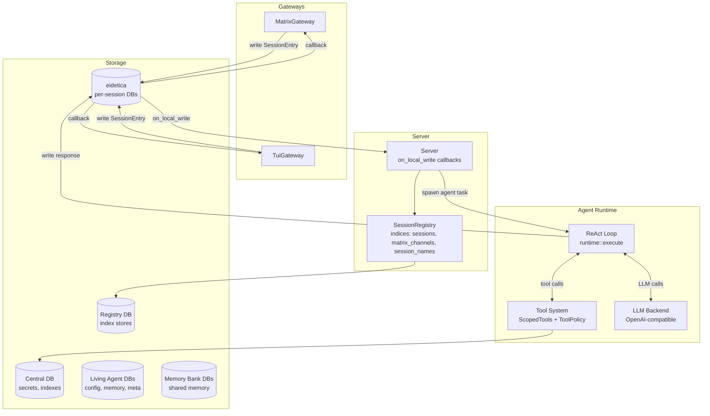

# Architecture Overview

Chaz is structured as a layered system: gateways handle transport concerns, the server coordinates agent execution, and the runtime runs the ReAct loop.

## System Diagram



## Key Components

### Gateways

Gateways bridge between a transport (Matrix, terminal) and the session database. They:

- Write user messages as `SessionEntry` records to the session DB
- Register `on_local_write` callbacks to detect agent responses
- Deliver responses to their transport

Gateways are transport-specific but the server is transport-agnostic. Adding a new gateway (Slack, Discord, HTTP API) requires implementing the `Gateway` trait and writing/reading session entries.

**Source**: `src/gateway/` (Matrix: `matrix/mod.rs`, TUI: `tui.rs`)

### Server

The callback-driven server watches session databases and spawns agent tasks:

1. Gateways call `register_session` to set up `on_local_write` callbacks
2. When a callback fires, the processing loop checks the latest entry
3. If it's a `Message` from a non-agent or a `Directive`, the server spawns an agent task
4. The agent writes its response to the session DB, triggering gateway callbacks

Per-session serialization ensures only one agent task runs per session at a time, preventing duplicate responses from concurrent writes.

The server also handles child session registration for `spawn_agent`, propagating call depth, tool scope, and completion signals.

**Source**: `src/server.rs`

### Runtime

The ReAct loop (`runtime::execute`) drives agent reasoning:

1. Build context from session history
2. Call LLM with tool definitions
3. If the LLM returns tool calls: check approval, execute with timeout, scan for leaks, feed results back
4. If the LLM returns text: return as the agent's response
5. After max iterations: force a summary

The runtime emits `RuntimeEvent`s (ToolCall, ToolResult) via an optional event sink for audit trail logging.

**Source**: `src/runtime.rs`

### Session Model

Each conversation is an eidetica `Database` containing a `Table<SessionEntry>` (history) and a `DocStore` called `meta` (session config: name, agent, model, role, backend). Sessions are identified globally by their DB root ID. The `SessionRegistry` holds index stores only: `sessions`, `matrix_channels` (Matrix `room_id` → `session_db_id`, fan-out supported), and `session_names`.

See [Session Model](sessions.md) for details.

### Tool System

Tools implement the `Tool` trait (descriptor + execute). `ToolPolicy` controls risk level, approval requirements, and timeouts. `ScopedTools` provides per-agent tool visibility with transitive narrowing.

See [Tool System](tools.md) for details.

## Source Layout

```text
src/
  main.rs          CLI, config, eidetica init, tool registration, gateway dispatch
  config.rs        Config types (backends, agents, security)
  types.rs         ConversationId
  agent.rs         Agent definitions, AgentRegistry, spawn permissions
  session.rs       SessionEntry, EntryType, Session, SessionRegistry
  server.rs        Callback-driven server, agent task spawning
  runtime.rs       ReAct loop, RuntimeEvent, approval gates
  context.rs       ContextBuilder — token-budgeted context assembly (tiktoken)
  tool.rs          Tool trait, ToolPolicy, ToolRegistry, ScopedTools, RateLimiter
  mcp.rs           MCP subprocess server management, auto-restart, tool discovery
  scheduler.rs     Cron-driven scheduled task execution
  backends.rs      LLMBackend trait, BackendManager, ChatContext
  openai.rs        OpenAI-compatible backend implementation
  role.rs          Role/system prompt management
  defaults.rs      Built-in default config and roles
  tools/
    agent.rs       spawn_agent (routes through server)
    shell.rs       shell execution with allowlist/denylist
    file.rs        read_file, write_file
    web.rs         web_fetch with network policy
    search.rs      web_search (tavily/brave/serper + DuckDuckGo HTML fallback)
    memory.rs      remember, recall (optional `bank` arg for shared banks), list_memory_banks
    compact.rs     compact — write Summary entry for context compaction
    describe.rs    describe_tool — on-demand tool discovery
    time.rs        get_time
    calculate.rs   calculate (meval)
  security/
    mod.rs         SecurityContext
    secrets.rs     SecretStore (eidetica-backed)
    leak_detector.rs  12-pattern secret scanner
    network.rs     Endpoint allowlisting, SSRF protection
    sanitizer.rs   Prompt injection detection
  gateway/
    mod.rs         Gateway trait, ApprovalExchange
    tui.rs         TUI with session picker, debug mode, sync
    matrix/
      mod.rs       MatrixGateway lifecycle
      commands.rs  Matrix-specific commands
      history.rs   Room history backfill
```
