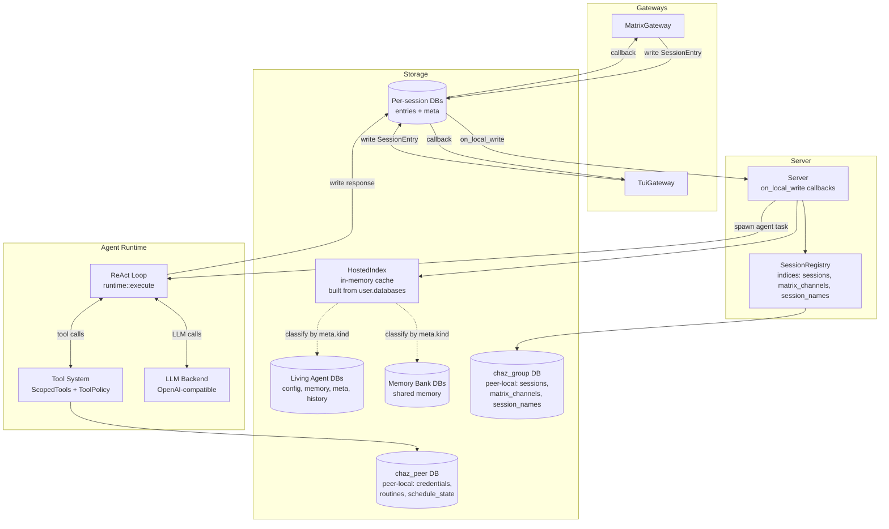

# Architecture Overview

Chaz is structured as a layered system: gateways handle transport concerns, the server coordinates agent execution, and the runtime runs the ReAct loop.

## System Diagram



**Three peer-local layers, none synced:** `user.databases()` (eidetica's catalog of every DB this peer holds keys for) is the source of truth for "which DBs do we host"; `HostedIndex` is an in-memory cache derived from it at startup; `chaz_group` holds session/channel/name indices; `chaz_peer` holds credentials and cron/schedule state. Sync-ful state lives in per-session, per-agent, and per-bank DBs.

## Key Components

### Gateways

Gateways bridge between a transport (Matrix, terminal) and the session database. They:

- Write user messages as `SessionEntry` records to the session DB
- Register `on_local_write` callbacks to detect agent responses
- Deliver responses to their transport

Gateways are transport-specific but the server is transport-agnostic. Adding a new gateway (Slack, Discord, HTTP API) requires implementing the `Gateway` trait and writing/reading session entries.

**Design stance — a gateway is a transport, not a CLI mode.** Matrix in particular is "expose this session to a room," not "run chaz in matrix mode." That framing has two consequences:

- The CLI surface picks the *user interface* (TUI default, `-p` one-shot), and gateways activate based on what they actually expose. `--matrix` is the explicit short-term opt-in; the longer-term direction is that Matrix runs alongside the TUI in the same process whenever `matrix:` is configured, so a TUI user and Matrix users can both drive the same hosted session. (Tracked as a follow-up; today they are still mutually exclusive blocking gateways.)
- Future gateways (HTTP, Slack, …) follow the same rule: their presence in config means "this session is reachable via that transport," not "chaz runs in *that* mode." `chaz` the binary is always a TUI on a terminal first.

**Source**: `crates/bin/src/gateway/` (TUI: `tui/mod.rs`, Matrix: `matrix/mod.rs`, CLI: `cli.rs`)

### Server

The callback-driven server watches session databases and spawns agent tasks:

1. Gateways call `register_session` to set up `on_local_write` callbacks
2. When a callback fires, the processing loop checks the latest entry
3. If it's a `Message` from a non-agent or a `Directive`, the server spawns an agent task
4. The agent writes its response to the session DB, triggering gateway callbacks

Per-session serialization ensures only one agent task runs per session at a time, preventing duplicate responses from concurrent writes.

The server also handles child session registration for `spawn_agent`, propagating call depth, tool scope, and completion signals.

**Source**: `crates/lib/src/server.rs`

### Runtime

The ReAct loop (`runtime::execute`) drives agent reasoning:

1. Build context from session history
2. Call LLM with tool definitions
3. If the LLM returns tool calls: check approval, execute with timeout, scan for leaks, feed results back
4. If the LLM returns text: return as the agent's response
5. After max iterations: force a summary

The runtime emits `RuntimeEvent`s (ToolCall, ToolResult) via an optional event sink for audit trail logging.

**Source**: `crates/lib/src/runtime.rs`

### Session Model

Each conversation is an eidetica `Database` containing a `Table<SessionEntry>` (history) and a `DocStore` called `meta` (session config: name, agent, model, role, backend). Sessions are identified globally by their DB root ID. The `SessionRegistry` holds index stores only: `sessions`, `matrix_channels` (Matrix `room_id` → `session_db_id`, fan-out supported), and `session_names`.

See [Session Model](sessions.md) for details.

### Tool System

Tools implement the `Tool` trait (descriptor + execute). `ToolPolicy` controls risk level, approval requirements, and timeouts. `ScopedTools` provides per-agent tool visibility with transitive narrowing.

Tools access system resources through the `ToolHost` trait — a sandboxed capability boundary. The default `NativeToolHost` executes capabilities in-process with grant enforcement; future WASM and bubblewrap hosts provide VM-level and OS-level sandboxing without changing any tool code.

See [Tool System](tools.md) for details.

## Source Layout

```text
crates/lib/src/
  main.rs              CLI, config, eidetica init, extension install, gateway dispatch
  config.rs            Config types (backends, agents, security, multi_agent, agent_state_allowlist)
  types.rs             ConversationId
  util.rs              Shared utilities
  agent.rs             Agent definitions, AgentRegistry, spawn permissions
  agent_db.rs          Living Agents — AgentDb (config/memory/meta/history/memory_banks/skills/schedules stores)
  memory_bank_db.rs    Standalone Memory Bank DBs (parallel to agent_db)
  skill_bank_db.rs     Standalone Skill Bank DBs (parallel to memory_bank_db)
  db_kind.rs           meta.kind + display_name markers on entity DBs
  hosted_index.rs      In-memory peer-local pubkey/name → DB cache, built from user.databases()
  server.rs            Callback-driven server, agent task spawning, home-peer gate, fire_agent_schedule
  runtime.rs           ReAct loop, RuntimeEvent, approval gates, leak/injection scanning, loop detector
  context.rs           ContextBuilder — token-budgeted context assembly (tiktoken), room note + augmentation
  tool.rs              Tool trait, ToolPolicy, ToolRegistry, ScopedTools, ToolProfile, ToolError, RateLimiter
  tool_host.rs         ToolHost trait — sandboxed capability boundary (Native, future WASM/bwrap)
  bubblewrap_host.rs   ToolHost impl wrapping commands in `bwrap` (OS-level sandbox)
  wasm_host.rs         ToolHost impl for WASM-sandboxed extensions
  grants.rs            Typed capability grants (shell/network/fs)
  error.rs             Error + LlmError (retryable/permanent classification)
  backends.rs          LLMBackend trait, BackendManager, ChatContext
  openai.rs            OpenAI-compatible backend (async-openai byot)
  embedding.rs         Embedder trait + OpenAiEmbedder (for memory/skill semantic search)
  defaults.rs          Built-in default config and built-in agents (chaz, chazmina, bash, fish, zsh, nu)
  routine/             RoutineEngine — sleep-until-next driver for cron + one-shot Routines
    mod.rs             Module root + re-exports
    engine.rs          Engine — register/reload/deregister, fire_due, dispatch through ExtensionHub
    types.rs           Routine, RoutineId, RoutineScope (Global/Session/Agent), AgentSchedulePayload
  session/             SessionRegistry, Session, EntryType, SessionMeta
    mod.rs             Public types (EntryType, SessionEntry, AgentRef, SessionMeta) + helpers
    registry.rs        SessionRegistry struct, chaz_group/chaz_peer accessors, session CRUD
    channels.rs        Matrix channel attach/detach
    agents.rs          attach/detach + turn-taking resolve_agent (home_pubkey set on attach)
    keys.rs            agent DB helpers, ephemeral keys, user_lock accessor
    usage.rs           Per-session/model/total cost rollups from assistant ResponseMetadata
  commands/            Transport-neutral session commands
    mod.rs             Command, CommandContext, CommandOutcome, dispatch, CoOwnerPermission
    session.rs         /sessions, /info, /name, /share, /sync, etc.
    agent.rs           /agent add|remove|list|host|new|set|delete|share|import|invite|revoke-peer|rehost|home-status
    sharing.rs         /sharing queue handlers (bootstrap requests across agents/banks/sessions)
    extensions.rs      /extensions list|add|remove (session/agent scope split)
  extension/           Extension framework (declaration + per-scope instance model)
    mod.rs             Extension trait, ExtensionHub, install_all, dispatch, activation log
    instance.rs        ExtensionInstance trait, Scope, ScopeCtx, PeerHandles, CapResolver
    caps.rs            CapabilityKind, CapabilityRequest, cap traits (Messenger, MemoryAccess, …)
    agent_state.rs     AgentStateAdmin cap + ScopedAgentStateAdmin
    manifest.rs        ExtensionManifest + validation
    handler.rs         Hook handler traits + InstalledExtension (Global drain target)
    hook_bridge.rs     Adapters bridging instance hook handlers into the fire vecs
    hooks.rs           Per-kind hook trait definitions + HookKind
  extensions/          Built-in extensions (each declares scopes + caps + endpoints)
    mod.rs             all_builtins, BuiltinDeps
    core.rs            shell, compact, spawn_agent, spawn_worker
    fs.rs              read_file, write_file, edit_file
    system.rs          get_time, calculate, describe_tool
    web.rs             web_fetch, web_search (Tavily/Brave/Serper/SearxNG/Kagi + DuckDuckGo fallback)
    memory.rs          remember, recall, list_memory_banks, /memory, recall context tail
    skills.rs          skill tools, /skills, prompt augmentation
    schedule.rs        schedule_add|modify|remove|list|once, /schedule (agent-owned)
    agent_schedule.rs  routine handler running the standalone agent-owned schedule fire path
    mcp.rs             McpExtension — one per configured MCP server
    path_normalizer.rs tool_call hook stripping trailing `/` from path args
    security_warnings.rs tool_result hook scanning for prompt-injection patterns
  tools/               Built-in tool impls (referenced from extensions/* above)
    agent.rs           spawn_agent (delegate to a peer Living Agent)
    worker.rs          spawn_worker (invoke a per-Agent Worker template — no keys, no identity)
    shell.rs           shell execution with allowlist/denylist
    file.rs            read_file, write_file
    edit.rs            edit_file
    web.rs             web_fetch with network policy
    search.rs          WebSearch + SearchBackend variants
    memory.rs          Remember, Recall, ListMemoryBanks (+ shared search_memory helper)
    schedule.rs        ScheduleAdd, ScheduleModify, ScheduleRemove, ScheduleList, ScheduleOnce
    compact.rs         compact — write Summary entry for context compaction
    describe.rs        describe_tool — on-demand tool discovery
    time.rs            get_time
    calculate.rs       calculate (meval)
  security/            SecurityContext bundle
    mod.rs             SecurityContext
    secrets.rs         SecretStore (chaz_peer.credentials backed)
    leak_detector.rs   12-pattern secret scanner
    network.rs         Endpoint allowlisting, SSRF protection
    sanitizer.rs       Prompt injection detection
  mcp/                 MCP integration (stdio + Streamable HTTP)
    mod.rs             MCP server lifecycle
    parse.rs           JSON-RPC framing
    transport.rs       Stdio + HTTP transports
    server.rs          Tool descriptor + invoke
  gateway/             Gateway trait + transport implementations
    mod.rs             Gateway trait, ApprovalExchange
    cli.rs             One-shot CLI gateway (`chaz prompt …`)
    tui/               TUI with multi-session tabs, mouse + keyboard nav (mod/input/view)
    matrix/            Matrix gateway
      mod.rs           Lifecycle, channel callbacks
      commands.rs      Matrix-syntax command parsing
      history.rs       Room history backfill
```
