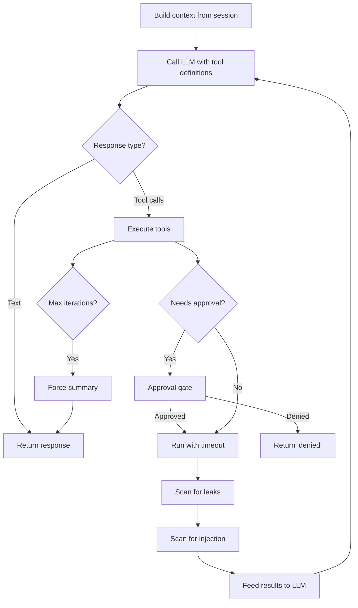

# ReAct Runtime

The ReAct (Reason + Act) loop is the core agent execution model. The runtime takes a conversation context, calls an LLM, executes any requested tool calls, and feeds results back until the LLM produces a text response.

## Loop Flow



## Security Gates

Each tool call passes through multiple checks. Most are unconditional; the
extension hooks fire only when an extension is registered for that hook
kind and is active on the session.

1. **Rate limiting**: If the tool's resolved policy carries a `rate_limit`, a sliding-window counter checks the call frequency. Excess calls are rejected before execution.

2. **Approval gate**: Checks the tool's `ApprovalRequirement` against the `SecurityContext`. If approval is needed, sends an `ApprovalExchange` to the gateway and waits for the user's decision (`Approve`, `Deny`, `ApproveAll`). `ApproveAll` skips approval for the rest of the turn.

3. **`tool_call` extension hook**: Extensions can mutate the arguments or return `ToolCallDecision::Block { reason }` to short-circuit the call (e.g. `path_normalizer` strips trailing `/` from path args; `security_warnings` is `tool_result`-only).

4. **Timeout + retry**: Execution runs under `tokio::time::timeout(policy.timeout)`. Network errors retry once after 500ms; `Timeout` is never retried (partial work may have succeeded).

5. **Leak detection**: Tool output is scanned against 12 secret regex patterns (`security/leak_detector.rs`). Detected secrets are redacted (`LeakPolicy::Redact`, default) or the call returns an error (`Block`).

6. **`tool_result` extension hook**: After leak scanning, extensions can rewrite the output (e.g. `security_warnings` annotates likely prompt-injection patterns; the scan is currently warning-only and never strips content).

7. **XML wrapping**: Tool results are wrapped in `<tool_output tool="name">` delimiters with angle-bracket escaping before being fed back to the LLM, preventing the result content from being parsed as instructions.

The `before_agent_start` and `agent_end` hooks bracket the whole turn (used today for skill prompt injection at the start and any cleanup the extension wants on completion).

## Event Sink

The runtime accepts an optional `RuntimeEventSink` (an `mpsc::Sender<RuntimeEvent>`). When provided, it emits events during the loop:

- `RuntimeEvent::ToolCall` -- before executing a tool
- `RuntimeEvent::ToolResult` -- after a tool returns

The server consumes these events and writes `ToolCall` and `ToolResult` entries to the session DB for audit trail and TUI display.

## Fallback Behavior

- If the backend doesn't support tool calling, the runtime falls back to a single-shot LLM call.
- If the first tool-aware call fails after retries, it retries once without tools (covers models/providers that advertise tools but reject the schema).
- A `LoopDetector` fingerprints each tool-call set (name + canonical args); when the same fingerprint repeats `LOOP_DETECTION_THRESHOLD` times the runtime pushes a "you're stuck in a loop" `User` message and breaks out.
- If `MAX_TOOL_ITERATIONS` (10) is reached, a forced no-tools summary call is made so the agent always returns a text response.

## Context Assembly

The `ContextBuilder` assembles session entries into `RuntimeMessage` vectors within a token budget. The runtime receives these pre-built messages:

```text
RuntimeMessage::System(role prompt)
RuntimeMessage::User(message 1)
RuntimeMessage::Assistant(message 2)
RuntimeMessage::User(message 3)
...
RuntimeMessage::AssistantToolCalls(calls)
RuntimeMessage::ToolResult(result)
...
```

`AssistantToolCalls` and `ToolResult` messages are maintained in the runtime's local message vector (not written to the session during the loop -- the event sink handles that separately).

## Concurrency

The server uses a global `Semaphore(10)` to cap concurrent LLM calls across all sessions. Agent tasks acquire a permit before calling the runtime.
