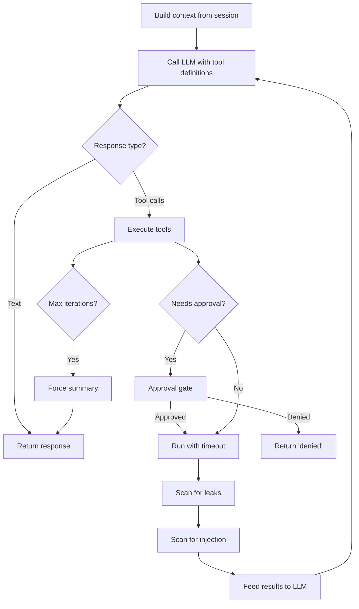

# ReAct Runtime

The ReAct (Reason + Act) loop is the core agent execution model. The runtime takes a conversation context, calls an LLM, executes any requested tool calls, and feeds results back until the LLM produces a text response.

## Loop Flow



## Security Gates

Each tool call passes through multiple security checks:

1. **Approval gate**: Checks the tool's `ApprovalRequirement` against the `SecurityContext`. If approval is needed, sends an `ApprovalExchange` to the gateway and waits for the user's decision (Approve, Deny, ApproveAll).

2. **Timeout**: Tool execution is wrapped in `tokio::time::timeout`. Default varies by tool policy.

3. **Leak detection**: Tool output is scanned against 12 secret patterns. Detected secrets are redacted or the output is blocked, depending on `leak_policy`.

4. **Injection detection**: Tool output is scanned for prompt injection patterns (role markers, instruction overrides). Currently warning-only -- detections are logged but not blocked.

## Event Sink

The runtime accepts an optional `RuntimeEventSink` (an `mpsc::Sender<RuntimeEvent>`). When provided, it emits events during the loop:

- `RuntimeEvent::ToolCall` -- before executing a tool
- `RuntimeEvent::ToolResult` -- after a tool returns

The server consumes these events and writes `ToolCall` and `ToolResult` entries to the session DB for audit trail and TUI display.

## Fallback Behavior

- If the backend doesn't support tool calling, the runtime falls back to a single-shot LLM call
- If the first tool-aware call fails, it retries without tools as a fallback
- If max iterations (10) are reached, a forced summary call is made without tool definitions

## Context Assembly

The runtime converts `ChatContext` into `RuntimeMessage` vectors for the LLM:

```
RuntimeMessage::System(role prompt)
RuntimeMessage::User(message 1)
RuntimeMessage::Assistant(message 2)
RuntimeMessage::User(message 3)
...
RuntimeMessage::AssistantToolCalls(calls)
RuntimeMessage::ToolResult(result)
...
```

`AssistantToolCalls` and `ToolResult` messages are maintained in the runtime's local message vector (not written to the session during the loop -- the event sink handles that separately).

## Concurrency

The server uses a global `Semaphore(10)` to cap concurrent LLM calls across all sessions. Agent tasks acquire a permit before calling the runtime.
