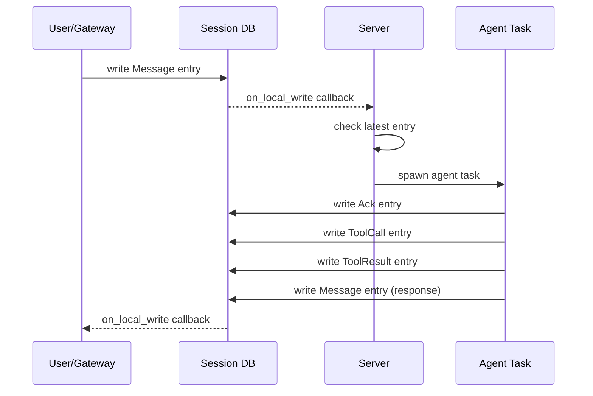
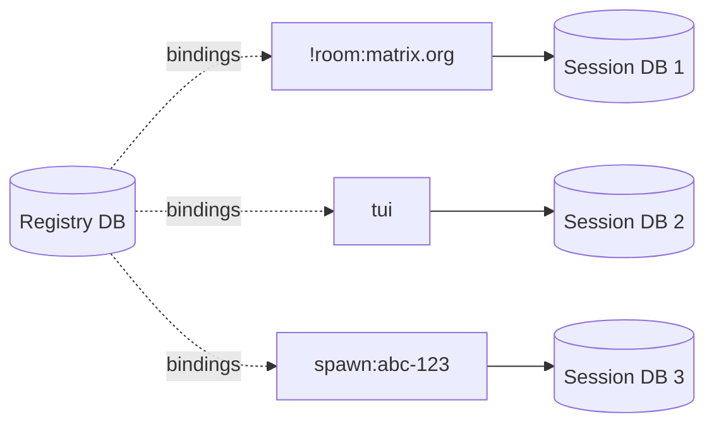

# Session Model

Sessions are the core data model in chaz. Every conversation -- whether from a Matrix room, the TUI, or a spawned sub-agent -- is represented as a stream of entries in an eidetica database.

## Entry Types

```rust,ignore
enum EntryType {
    Message,    // Chat message (from any participant)
    Directive,  // Task instruction (from spawn_agent, scheduler, system)
    ToolCall,   // Record of a tool invocation (audit trail)
    ToolResult, // Record of a tool result (audit trail)
    Ack,        // Agent is processing (thinking indicator)
    Error,      // An error occurred
}
```

Each entry has a sender (participant name), content, timestamp, and type.

### What Enters the LLM Context

Only `Message` and `Directive` entries are included in the LLM context window. The context builder maps senders to roles: entries from the current agent become `assistant` messages, all others become `user` messages.

`ToolCall`, `ToolResult`, `Ack`, and `Error` entries are excluded from the LLM context. The runtime maintains its own in-memory tool call history for the ReAct loop. Session-level tool entries exist for audit trail and TUI display only.

## Session Lifecycle



## Session Registry

The `SessionRegistry` maps transport IDs to eidetica databases:

- **Transport ID**: An opaque string identifying the source (e.g., `!room:matrix.org`, `tui`, `spawn:uuid`)
- **Session DB**: A dedicated eidetica `Database` for that conversation
- **Binding**: A `SessionBinding` record in the central registry DB

The registry creates new databases on demand and persists bindings across restarts.



## Context Building

`ContextBuilder` (in `context.rs`) assembles the LLM context within a token budget:

1. Account for system prompt and tool definition tokens first
2. Find the most recent `Summary` entry (context boundary — older entries excluded)
3. Filter for `Message`, `Directive`, and `Summary` entries
4. Fill from newest messages backward until the token budget is exhausted
5. Map senders to roles: current agent name = `assistant`, everything else = `user`

Token estimation uses a `chars.div_ceil(4)` heuristic. The budget is `max_context_tokens - reserved_output_tokens`, configurable globally and per-agent.

### Compaction

The `compact` tool and `/compact` TUI command write a `Summary` entry to the session. The `ContextBuilder` treats the most recent `Summary` as the conversation start boundary, effectively replacing older messages with the summary.

## Eidetica Sync

Because each session is a standalone eidetica database, sessions can be synced between chaz instances. The `/share` command generates a `DatabaseTicket` URL, and `/sync` pulls a remote session. Eidetica handles the Merkle-CRDT synchronization protocol.

Synced sessions receive remote writes via eidetica's `on_local_write` callbacks with `WriteSource::Remote`, triggering the same gateway notification path as local writes.

## Child Sessions (spawn_agent)

When an agent spawns a sub-agent:

1. The server creates a new session DB via `register_child_session`
2. The parent writes a `Directive` entry to the child session
3. The server detects the directive and runs the child agent
4. The child writes its response, completion is signaled to the parent
5. The parent reads the response from the child session

Child sessions are full session DBs -- they appear in `/sessions` and can be inspected.
