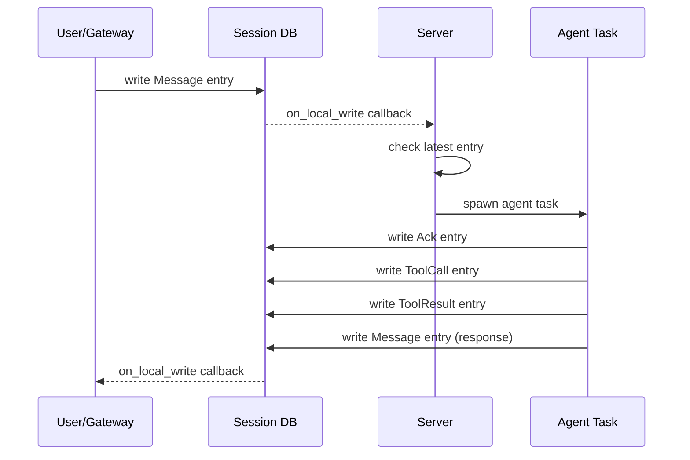
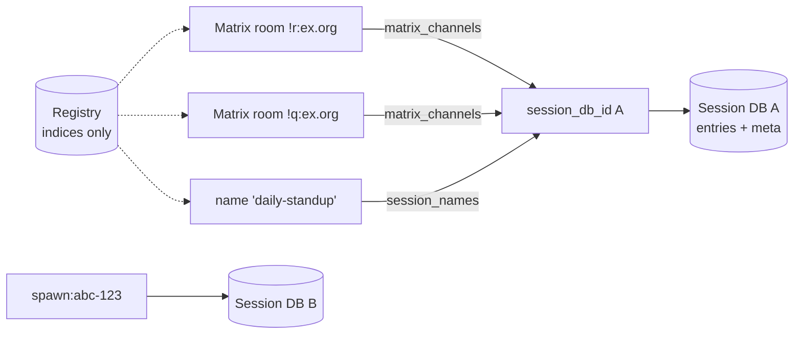

# Session Model

Sessions are the core data model in chaz. Every conversation -- whether from a Matrix room, the TUI, or a spawned sub-agent -- is represented as a stream of entries in an eidetica database.

## Entry Types

```rust,ignore
enum EntryType {
    Message,    // Chat message (from any participant)
    Directive,  // Task instruction (from spawn_agent, scheduler, system)
    ToolCall,   // Record of a tool invocation (audit trail)
    ToolResult, // Record of a tool result (audit trail)
    Ack,        // Agent is processing (thinking indicator)
    Error,      // An error occurred
    Summary,    // Compacted summary of older messages (context-builder boundary)
}
```

Each entry has a sender (participant name), content, timestamp, and type.

### What Enters the LLM Context

Only `Message`, `Directive`, and `Summary` entries are included in the LLM context window. The context builder maps senders to roles: entries from the current agent become `assistant` messages, all others become `user` messages.

`ToolCall`, `ToolResult`, `Ack`, and `Error` entries are excluded from the LLM context. The runtime maintains its own in-memory tool call history for the ReAct loop. Session-level tool entries exist for audit trail and TUI display only.

## Session Lifecycle



## Session Registry

A session is identified solely by the root ID of its own eidetica `Database`. The `SessionRegistry` holds three index stores inside the peer-local `chaz_group` DB — nothing load-bearing about a session lives here:

- **`sessions`**: every known `session_db_id` → origin tag (for debugging/listing)
- **`matrix_channels`**: Matrix `room_id` → `session_db_id` (fan-out supported — one session may receive responses on many rooms)
- **`session_names`**: human-friendly `name` → `session_db_id`

The canonical per-session configuration (name, agent, model, role, backend) lives in each session's own DB under a `meta` DocStore as a `SessionMeta`. Because it lives in the session, it syncs with the session via eidetica — sharing a session also shares its config.



### Matrix channels

A Matrix channel is an explicit `(room_id → session_db_id)` attachment. A room's first message auto-creates a session and a channel. `!chaz attach <session>` rebinds a room to a different session; `!chaz detach` removes the binding; `!chaz channels` lists rooms attached to the current session. At Matrix gateway startup, every persisted channel for a joined room receives both server-processing and response-delivery callbacks — this is how scheduled-session responses reach Matrix even when no user is active in the room.

### Named Sessions

Sessions can be given human-friendly names via `set_session_name()` (TUI: `/name <alias>`). Names are persisted in the registry's `session_names` index and mirrored into the session's `meta` doc. `resolve_session()` tries name → DB ID, so names work everywhere a session identifier is accepted (`/join`, schedules, etc.).

## Context Building

`ContextBuilder` (in `context.rs`) assembles the LLM context within a token budget:

1. Account for system prompt and tool definition tokens first
2. Find the most recent `Summary` entry (context boundary — older entries excluded)
3. Filter for `Message`, `Directive`, and `Summary` entries
4. Fill from newest messages backward until the token budget is exhausted
5. Map senders to roles: current agent name = `assistant`, everything else = `user`

Token estimation uses tiktoken (`cl100k_base` BPE tokenizer) for accurate counting. The budget is `max_context_tokens - reserved_output_tokens`, configurable globally and per-agent.

### Compaction

The `compact` tool and `/compact` TUI command write a `Summary` entry to the session. The `ContextBuilder` treats the most recent `Summary` as the conversation start boundary, effectively replacing older messages with the summary.

## Eidetica Sync

Because each session is a standalone eidetica database, sessions can be synced between chaz instances. The `/share` command generates a `DatabaseTicket` URL, and `/sync` pulls a remote session. Eidetica handles the Merkle-CRDT synchronization protocol.

Synced sessions receive remote writes via eidetica's `on_local_write` callbacks with `WriteSource::Remote`, triggering the same gateway notification path as local writes.

## Child Sessions (spawn_agent)

When an agent spawns a sub-agent:

1. The server creates a new session DB via `register_child_session`
2. The parent writes a `Directive` entry to the child session
3. The server detects the directive and runs the child agent
4. The child writes its response, completion is signaled to the parent
5. The parent reads the response from the child session

Child sessions are full session DBs -- they appear in `/sessions` and can be inspected.
