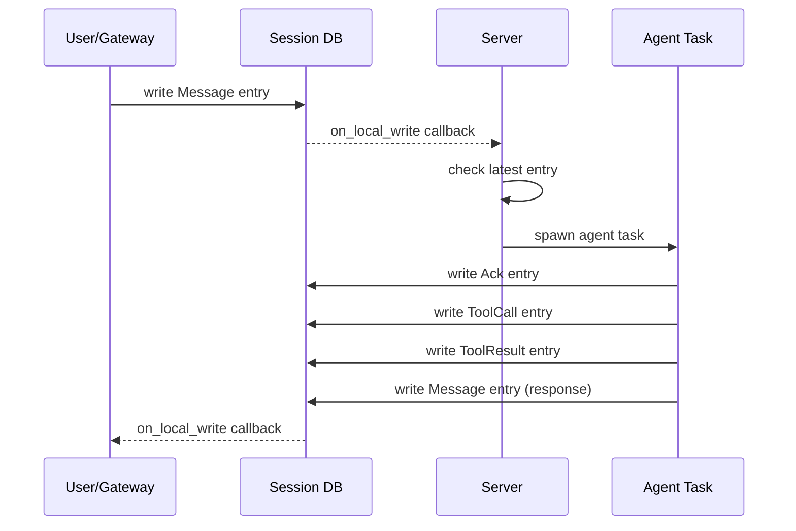
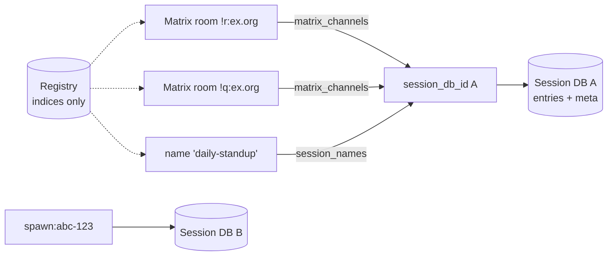

# Session Model

Sessions are the core data model in chaz. Every conversation -- whether from a Matrix room, the TUI, or a spawned sub-agent -- is represented as a stream of entries in an eidetica database.

## Entry Types

```rust,ignore
enum EntryType {
    Message,    // Chat message (from any participant)
    Directive,  // Task instruction (from spawn_agent, scheduler, system)
    ToolCall,   // Record of a tool invocation (audit trail)
    ToolResult, // Record of a tool result (audit trail)
    Ack,        // Agent is processing (thinking indicator)
    Error,      // An error occurred
    Summary,    // Compacted summary of older messages (context-builder boundary)
}
```

Each entry has a sender (participant name), content, timestamp, and type.

### What Enters the LLM Context

Only `Message`, `Directive`, and `Summary` entries enter the conversation portion of the LLM context. The context builder maps senders to roles: entries from the current agent become `assistant` messages, all others become `user` messages.

The **system prompt is assembled fresh every turn** from the agent's `system_prompt` + `system_prompt_files` (resolved at agent construction) plus `PromptAugmentation` contributions from the extension hub (skills, memory recall, …) and the optional multi-agent room note. There is no per-session persona snapshot — the previous `PersonaSnapshot` entry type was deleted along with `persona.rs` / `role.rs` (see [Skills & Prompts](../design/skills_and_prompts.md)). To change an agent's prompt, edit `system_prompt` / `system_prompt_files` via `/agent set <ref> <field> <value>` (or restart against an edited config file).

`ToolCall`, `ToolResult`, `Ack`, and `Error` entries are excluded from the LLM context. The runtime maintains its own in-memory tool call history for the ReAct loop. Session-level tool entries exist for audit trail and TUI display only.

### Assistant `ResponseMetadata`

Every assistant `Message` entry carries an optional `ResponseMetadata`: the model name, an optional provider and response ID, a `TokenUsage` (prompt/completion/cached/cache_creation/reasoning tokens plus an optional `cost_usd`), and any extra wire-format fields the backend retained. This is populated from the `LLMResponse` returned by the configured `LLMBackend` at the moment the assistant turn is committed to the session DB — there is no separate billing log.

`src/session/usage.rs` walks the session catalog and folds these per-entry metadata records into per-session, per-model, and total rollups. Two surfaces consume those rollups today: the `/costs` slash command (TUI) and the `chaz usage` CLI subcommand. See [Cost Tracking & Usage](../user_guide/usage.md) for the user-facing view.

## Session Lifecycle



## Session Registry

A session is identified solely by the root ID of its own eidetica `Database`. The `SessionRegistry` holds three index stores inside the peer-local `chaz_group` DB — nothing load-bearing about a session lives here:

- **`sessions`**: every known `session_db_id` → origin tag (for debugging/listing)
- **`matrix_channels`**: Matrix `room_id` → `session_db_id` (fan-out supported — one session may receive responses on many rooms)
- **`session_names`**: human-friendly `name` → `session_db_id`

The canonical per-session configuration (name, agent, model, role, backend) lives in each session's own DB under a `meta` DocStore as a `SessionMeta`. Because it lives in the session, it syncs with the session via eidetica — sharing a session also shares its config.



### Matrix channels

A Matrix channel is an explicit `(room_id → session_db_id)` attachment. A room's first message auto-creates a session and a channel. `!chaz attach <session>` rebinds a room to a different session; `!chaz detach` removes the binding; `!chaz channels` lists rooms attached to the current session. At Matrix gateway startup, every persisted channel for a joined room receives both server-processing and response-delivery callbacks — this is how scheduled-session responses reach Matrix even when no user is active in the room.

### Named Sessions

Sessions can be given human-friendly names via `set_session_name()` (TUI: `/name <alias>`). Names are persisted in the registry's `session_names` index and mirrored into the session's `meta` doc. `resolve_session()` tries name → DB ID, so names work everywhere a session identifier is accepted (`/join`, schedules, etc.).

## Context Building

`ContextBuilder` (in `context.rs`) assembles the LLM context within a token budget:

1. Account for system prompt and tool definition tokens first
2. Find the most recent `Summary` entry (context boundary — older entries excluded)
3. Filter for `Message`, `Directive`, and `Summary` entries
4. Fill from newest messages backward until the token budget is exhausted
5. Map senders to roles: current agent name = `assistant`, everything else = `user`

Token estimation uses tiktoken (`cl100k_base` BPE tokenizer) for accurate counting. The budget is `max_context_tokens - reserved_output_tokens`, configurable globally and per-agent.

### Compaction

The `compact` tool and `/compact` TUI command write a `Summary` entry to the session. The `ContextBuilder` treats the most recent `Summary` as the conversation start boundary, effectively replacing older messages with the summary.

## Eidetica Sync

Because each session is a standalone eidetica database, sessions can be synced between chaz instances. The `/share` command generates a `DatabaseTicket` URL, and `/sync` pulls a remote session. Eidetica handles the Merkle-CRDT synchronization protocol.

Synced sessions receive remote writes via eidetica's `on_local_write` callbacks with `WriteSource::Remote`, triggering the same gateway notification path as local writes.

## Home Peer (Per-Session, with Agent-Level Fresh-Timer Default)

When an agent is co-owned (multiple peers hold an authorized key on the agent DB) and attached to the same session, both peers would otherwise wake on the same human message and both run the ReAct loop — a forked turn. The home-peer gate elects exactly one peer per (session, agent) to execute.

State lives in two places:

- **Per-session**: `AgentRef.home_pubkey` inside `SessionMeta.agents`. Set automatically on attach to the attaching peer's pubkey on the agent DB. Rewritten by `/agent rehost`. `None` (legacy) means "any keyholder runs" — back-compat for sessions that predate this feature.
- **Agent-level**: `meta.home_pubkey` on the agent DB itself. Used only by `fire_agent_schedule`'s `Fresh` target, where no session exists yet to carry the per-session field. Set automatically by `create_agent_db` to the creator's pubkey. Rewritten by `/agent rehost --agent`.

The gate fires at three sites:

- `process_session` (interactive turns) — uses the per-session home.
- `fire_agent_schedule(Fresh)` — uses the agent-level home (no session yet).
- `fire_agent_schedule(Pinned)` — uses the per-session home of the pinned session.

When a non-home peer's gate fires, an in-memory skip counter increments. At a threshold of 3 consecutive skips per (session, agent), a WARN logs the exact `/agent rehost` command to take over from a surviving peer. The counter resets on a successful run or on rehost.

Failover is **explicit and operator-driven** in v1. If the home peer's chaz process is down, its (session, agent) pairs go silent. Recover with `/agent home-status` (query) and `/agent rehost` (take over from another peer holding a key). Automatic / liveness-based failover is deferred: eidetica's daemon/client split makes presence inference unreliable, and any opportunistic auto-claim re-introduces the very fork this system exists to prevent.

`/agent revoke-peer` emits a soft warning when the revoked key was the home for any sessions or agent-level state, listing what needs rehosting; it does not block the revoke.

Cross-peer `spawn_agent` works without special handling. The spawner is the attacher, so `attach_agent_to_session` on the child session defaults `home_pubkey` to the spawning peer's key — that peer runs the child turn. If a co-owner later syncs the child session, their gate skips it.

## Child Sessions (spawn_agent)

When an agent spawns a sub-agent:

1. The server creates a new session DB via `register_child_session`
2. The parent writes a `Directive` entry to the child session
3. The server detects the directive and runs the child agent
4. The child writes its response, completion is signaled to the parent
5. The parent reads the response from the child session

Child sessions are full session DBs -- they appear in `/sessions` and can be inspected.
