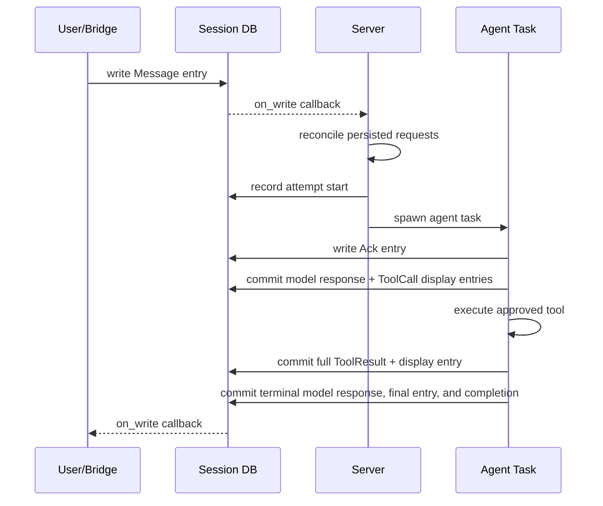
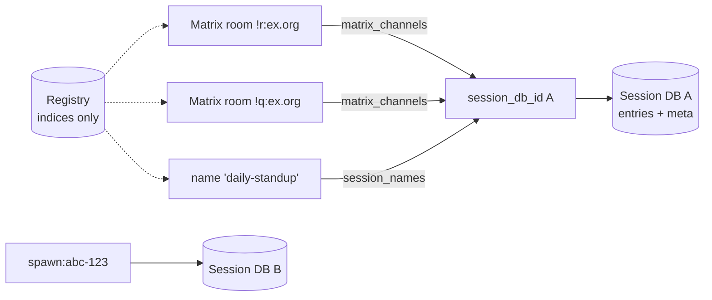

# Session Model

Sessions are the core data model in chaz. Every conversation -- whether from a Matrix room, the TUI, or a spawned Worker invocation -- is represented as a stream of entries in an eidetica database.

## Entry Types

```rust,ignore
enum EntryType {
    Message,    // Chat message (from any participant)
    Directive,  // Task instruction (from spawn_agent, scheduler, system)
    ToolCall,   // Record of a tool invocation (audit trail)
    ToolResult, // Record of a tool result (audit trail)
    Ack,        // Agent is processing (thinking indicator)
    Error,      // An error occurred
    Summary,    // Compacted summary of older messages (context-builder boundary)
    ApprovalRequest,  // Tool approval requested (control entry, daemon → bridge)
    ApprovalDecision, // Human's approval decision (control entry, bridge → daemon)
}
```

Each entry has a sender (participant name), content, timestamp, and type. Its
Eidetica `Table` row key is also the stable identity of a processable turn
request. The key travels with session sync, so two otherwise identical rows
remain distinct requests.

### What Enters the LLM Context

Only `Message`, `Directive`, and `Summary` entries enter the conversation portion of the LLM context. The context builder maps senders to roles: entries from the current agent become `assistant` messages, all others become `user` messages.

The **system prompt is assembled fresh every turn** from the agent's `system_prompt` + `system_prompt_files` (resolved at agent construction) plus `PromptAugmentation` contributions from the extension hub (skills) and the optional multi-agent room note. There is no per-session persona snapshot — the previous `PersonaSnapshot` entry type was deleted along with `persona.rs` / `role.rs` (see [Skills & Prompts](../design/skills_and_prompts.md)). To change an agent's prompt, edit `system_prompt` / `system_prompt_files` via `/agent set <ref> <field> <value>` (or restart against an edited config file).

`ToolCall`, `ToolResult`, `Ack`, and `Error` entries are excluded from the LLM context. The runtime maintains its active ReAct history in memory. Structured completed model responses and tool results are also written to the attempt's `turn_transcript` store; those records support durable observation and audit, not automatic continuation after restart. Session-level tool entries are display projections of committed transcript records.

`ApprovalRequest` and `ApprovalDecision` are **control entries** for the tool-approval protocol a dumb bridge relays over the session DB — also excluded from the LLM context, from bridge message delivery, and from waking an agent turn. See [Dumb Transport Bridges → Tool approvals over the session DB](../design/transport_bridges.md#tool-approvals-over-the-session-db).

### Assistant `ResponseMetadata`

Every assistant `Message` entry carries an optional `ResponseMetadata`: the model name, an optional provider and response ID, a `TokenUsage` (prompt/completion/cached/cache_creation/reasoning tokens plus an optional `cost_usd`), and any extra wire-format fields the backend retained. This is populated from the `LLMResponse` returned by the configured `LLMBackend` at the moment the assistant turn is committed to the session DB — there is no separate billing log.

`crates/lib/src/session/usage.rs` walks the session catalog and folds these per-entry metadata records into per-session, per-model, and total rollups. Two surfaces consume those rollups today: the `/costs` slash command (TUI) and the `chaz usage` CLI subcommand. See [Cost Tracking & Usage](../user_guide/usage.md) for the user-facing view.

## Session Lifecycle


```mermaid
sequenceDiagram
    participant U as User/Bridge
    participant S as Session DB
    participant SV as Server
    participant A as Agent Task

    U->>S: write Message entry
    S-->>SV: on_write callback
    SV->>SV: reconcile persisted requests
    SV->>S: record attempt start
    SV->>A: spawn agent task
    A->>S: write Ack entry
    A->>S: commit model response + ToolCall display entries
    A->>A: execute approved tool
    A->>S: commit full ToolResult + display entry
    A->>S: commit terminal model response, final entry, and completion
    S-->>U: on_write callback
```

### Durable turn recovery

The server treats a non-agent `Message` and a `Directive` as a durable turn
request. It reconciles the request rows rather than acting only on the latest
entry. A queued second request stays pending while the first request runs and
is selected after that attempt finishes.

`turn_attempts` is an append-only table in the session database. A
`TurnAttempt` records the request row key, an attempt ID, a durable generation,
and whether the attempt started or completed. The executor writes the started
record before it can call a model or a tool. It commits a completed record in
the same transaction as the final response or error entry. A silent turn has
no final message, but still records completion.

Attempt generations establish lifecycle precedence; the start and completion
timestamps are audit data, not the ordering authority. This avoids treating
clock movement across processes or restarts as a newer attempt.

Each completed model response and tool result is stored in `turn_transcript` with the request row key, attempt ID, a monotonic attempt-local sequence, and a timestamp. Model records retain optional text, normalized response metadata, opaque provider continuation fields, and ordered tool calls with their provider IDs, names, and full argument strings. Result records retain the model sequence, call index, call ID, tool name, full output, and a structured outcome.

The recorder is awaited. A tool-call response commits before approval or execution begins, and every tool result commits before another model request. A persistence failure stops the turn. If the tool already caused an external effect, the unmatched attempt remains interrupted and is not replayed automatically. The visible final response and terminal model record commit in the same transaction as completion. Provider retries that have not produced a completed response and streamed tokens do not create records.

The full arguments and results live in the transcript store. `ToolCall` and `ToolResult` session entries are presentation records created by the same successful transaction; result display remains truncated and bridge delivery continues to exclude tool entries. This does not widen approval prompts or bridge exposure of tool secrets.

For each request, reconciliation exposes one of four states:

- **Queued** has no attempt and may run.
- **In flight** has a started attempt owned by the current process.
- **Interrupted** has a durable start without a completion but is not owned by
  the current process.
- **Completed** has a completion and never runs again automatically.

On registration, the server captures a session snapshot, installs its
write callback from that snapshot, and reconciles the snapshot for queued
requests. The callback covers commits after the snapshot; the catch-up read
covers work already present before registration. Repeated callbacks are safe:
the persisted request and attempt state decides whether there is work to run.

When a local service client creates a session, the resident executor treats the
peer-local session index as a durable adoption queue. It proves that the shared
user's default key has write authority on the new session, binds that signing
identity, claims the runtime, and registers the ordinary watch/catch-up path.
The executor scans existing rows on startup and rescans after index writes, so
a queued turn survives notification loss and executor restart. This path does
not add transport exposure metadata; bridge-created sessions continue through
the agent registry's `exposed_on` adoption path.

An interrupted attempt is deliberately not replayed. Model and tool work may
already have caused an external effect before the process stopped. The public
library API exposes `Server::interrupted_turns()` to inspect that state and
`Server::retry_interrupted_turn()` to request an explicit retry. The retry is
submitted as a typed row in the session's `session_commands` store. The real
executor accepts it only if its expected interrupted-attempt ID still matches,
then atomically completes the command and writes the new target attempt.
`/interrupted` and `/retry <request_id>` expose this path to TUI and command
clients without granting those clients model or tool authority.

### Durable session commands

`/compact` and `/retry` are typed client-written requests. Their command IDs
are generated before the write and may be reused after an uncertain write;
reusing an ID with a different payload is rejected. They share the session
watch/catch-up callback, per-session processing slot, and `turn_attempts`
lifecycle with ordinary turns. A command start without a completion is
interrupted and never replays automatically. Terminal status and output live
in `session_command_results`, keyed by command ID, so command clients observe
the executor's durable result rather than a local return value.

Retry requests carry both the target turn row ID and the interrupted attempt
ID the client observed. After one retry advances the target generation, a
second command naming the old attempt is rejected as stale. This is durable
deduplication under the documented one-executor assumption, not distributed
fencing or exactly-once external effects.

#### Legacy sessions

New sessions write a turn-schema marker before their first request. When an
executor first registers an older session, it atomically records a baseline of
the rows visible at that point. Those existing transcript rows are consumed;
the server does not infer that they completed, and it does not replay them.
Rows committed concurrently after that baseline are not included and remain
queued. Bridge history backfill is likewise marked consumed rather than made
into new work.

#### Execution boundary and limits

`Server::register_session()` and retry require executor authority. A
client-role server can observe the synced session state, but cannot register
execution, drive agents or models, create execution child sessions, or run
routines and schedules. Build-time validation also rejects runtime options
that would give a client those responsibilities. A future tool fulfiller may
receive separate permission to satisfy selected durable tool requests without
receiving agent/model-driving authority; no such routing, claim, or permission
path exists here, and current tool execution remains local to the executor.

This protocol assumes one executor for a session. The in-process processing
and live-attempt sets serialize that executor's work, but they are not
distributed fencing. The protocol does not provide exactly-once external
effects. Tests cover both a shared Eidetica service with separate client and
executor connections and direct peers syncing a session over HTTP; neither
topology adds multi-executor election or fencing.

## Session Registry

A session is identified solely by the root ID of its own eidetica `Database`. The `SessionRegistry` holds three index stores inside the peer-local `chaz_group` DB — nothing load-bearing about a session lives here:

- **`sessions`**: every known `session_db_id` → origin tag (for debugging/listing)
- **`matrix_channels`**: Matrix `room_id` → `session_db_id` (fan-out supported — one session may receive responses on many rooms)
- **`session_names`**: human-friendly `name` → `session_db_id`

The canonical per-session configuration (name, agent, model, role, backend) lives in each session's own DB under a `meta` DocStore as a `SessionMeta`. Because it lives in the session, it syncs with the session via eidetica — sharing a session also shares its config.


```mermaid
graph LR
    ROOM["Matrix room !r:ex.org"] -->|matrix_channels| SID1["session_db_id A"]
    SID1 --> DB1[(Session DB A<br/>entries + meta)]
    ROOM2["Matrix room !q:ex.org"] -->|matrix_channels| SID1
    NAME["name 'daily-standup'"] -->|session_names| SID1
    SID2["spawn:abc-123"] --> DB2[(Session DB B)]
    REG[(Registry<br/>indices only)] -.-> ROOM
    REG -.-> ROOM2
    REG -.-> NAME
```

### Matrix channels

A Matrix channel is an explicit `(room_id → session_db_id)` attachment. A room's first message auto-creates a session and a channel. `!chaz attach <session>` rebinds a room to a different session; `!chaz detach` removes the binding; `!chaz channels` lists rooms attached to the current session. At Matrix bridge startup, every persisted channel for a joined room receives both server-processing and response-delivery callbacks — this is how scheduled-session responses reach Matrix even when no user is active in the room.

### Named Sessions

Sessions can be given human-friendly names via `set_session_name()` (TUI: `/name <alias>`). Names are persisted in the registry's `session_names` index and mirrored into the session's `meta` doc. `resolve_session()` tries name → DB ID, so names work everywhere a session identifier is accepted (`/join`, schedules, etc.).

## Context Building

`ContextBuilder` (in `context.rs`) assembles the LLM context within a token budget:

1. Account for system prompt and tool definition tokens first
2. Resolve a successful `/compact` snapshot boundary, or the most recent legacy `Summary`
3. Filter for `Message`, `Directive`, and `Summary` entries
4. Fill from newest messages backward until the token budget is exhausted
5. Map senders to roles: current agent name = `assistant`, everything else = `user`

Token estimation uses tiktoken (`cl100k_base` BPE tokenizer) for accurate counting. The budget is `max_context_tokens - reserved_output_tokens`, configurable globally and per-agent.

### Compaction

The `compact` tool retains the legacy behavior of writing a `Summary` entry.
`/compact` captures an Eidetica `Snapshot`, then the executor reads that native
historical view and writes a typed compact result. Context assembly uses the
snapshot's parent history as the coverage boundary: the persisted summary is
followed by every current context entry outside that snapshot. A message
committed while summarization is running therefore remains visible, even when
its timestamp sorts before command completion. Successive compactions read the
prior virtual boundary through the same snapshot-backed context path. No
covered-entry list or parallel Chaz ancestry graph is stored.

## Eidetica Sync

Because each session is a standalone eidetica database, sessions can be synced between chaz instances. The `/share` command generates a `DatabaseTicket` URL, and `/sync` pulls a remote session. Eidetica handles the Merkle-CRDT synchronization protocol.

Synced sessions receive remote writes via eidetica's `on_write` callbacks with `WriteSource::Remote`, triggering the same bridge notification path as local writes.

## Home Peer (Per-Session, with Agent-Level Fresh-Timer Default)

When an agent is co-owned (multiple peers hold an authorized key on the agent DB) and attached to the same session, both peers would otherwise wake on the same human message and both run the ReAct loop — a forked turn. The home-peer gate elects exactly one peer per (session, agent) to execute.

State lives in two places:

- **Per-session**: `AgentRef.home_pubkey` inside `SessionMeta.agents`. Set automatically on attach to the attaching peer's pubkey on the agent DB. Rewritten by `/agent rehost`. `None` (legacy) means "any keyholder runs" — back-compat for sessions that predate this feature.
- **Agent-level**: `meta.home_pubkey` on the agent DB itself. Used only by `fire_agent_schedule`'s `Fresh` target, where no session exists yet to carry the per-session field. Set automatically by `create_agent_db` to the creator's pubkey. Rewritten by `/agent rehost --agent`.

The gate fires at three sites:

- `process_session` (interactive turns) — uses the per-session home.
- `fire_agent_schedule(Fresh)` — uses the agent-level home (no session yet).
- `fire_agent_schedule(Pinned)` — uses the per-session home of the pinned session.

When a non-home peer's gate fires, an in-memory skip counter increments. At a threshold of 3 consecutive skips per (session, agent), a WARN logs the exact `/agent rehost` command to take over from a surviving peer. The counter resets on a successful run or on rehost.

Failover is **explicit and operator-driven** in v1. If the home peer's chaz process is down, its (session, agent) pairs go silent. Recover with `/agent home-status` (query) and `/agent rehost` (take over from another peer holding a key). Automatic / liveness-based failover is deferred: eidetica's daemon/client split makes presence inference unreliable, and any opportunistic auto-claim re-introduces the very fork this system exists to prevent.

`/agent revoke-peer` emits a soft warning when the revoked key was the home for any sessions or agent-level state, listing what needs rehosting; it does not block the revoke.

Cross-peer `spawn_agent` works without special handling. The spawner is the attacher, so `attach_agent_to_session` on the child session defaults `home_pubkey` to the spawning peer's key — that peer runs the child turn. If a co-owner later syncs the child session, their gate skips it.

## Child Sessions (spawn_agent / spawn_worker)

When an Agent spawns a child — either a peer Agent (`spawn_agent`) or a Worker template (`spawn_worker`):

1. The server creates a new session DB via `register_child_session`
2. The parent writes a `Directive` entry to the child session
3. The server detects the directive and runs the child agent
4. The child writes its response, completion is signaled to the parent
5. The parent reads the response from the child session

Child sessions are full session DBs -- they appear in `/sessions` and can be inspected.
