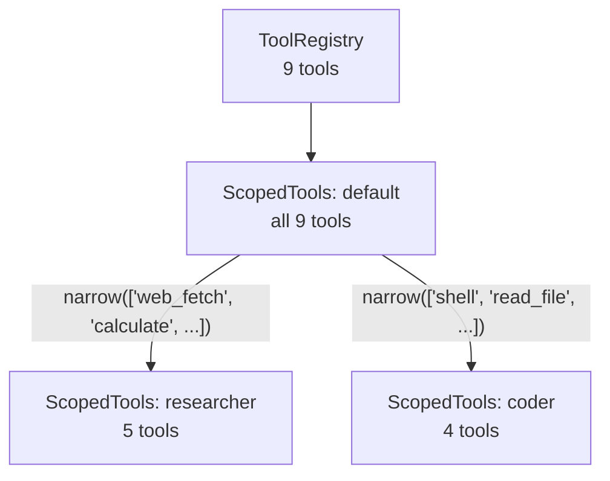

# Tool System

The tool system manages tool registration, policy enforcement, and per-agent tool visibility.

## Tool Trait

Every tool implements the `Tool` trait:

<!-- Code block ignored: trait definition for illustration -->

```rust,ignore
trait Tool: Send + Sync {
    fn descriptor(&self) -> ToolDescriptor;
    fn execute(&self, arguments: Value, ctx: &ToolContext)
        -> Pin<Box<dyn Future<Output = Result<String, String>> + Send>>;
    fn default_policy(&self) -> ToolPolicy { /* defaults */ }
}
```

`ToolDescriptor` provides the tool's name, description, and a JSON Schema for its parameters. The LLM sees these as function definitions.

## Tool Policy

Each tool has a policy controlling its risk level, approval requirements, and execution timeout:

<!-- Code block ignored: struct definition for illustration -->

```rust,ignore
struct ToolPolicy {
    risk: RiskLevel,              // Low, Medium, High
    approval: ApprovalRequirement, // Never, UnlessAutoApproved, Always
    timeout: u64,                  // seconds
    sensitive_params: Vec<String>, // redacted in approval display
}
```

Tools provide a `default_policy()`. Config-level overrides in `security.tool_policies` take precedence. The `ToolPolicyRegistry` resolves the effective policy per tool.

## ScopedTools and Narrowing

`ScopedTools` provides a filtered view of the tool registry:



When agent A spawns agent B, B's tools are computed as the intersection of A's current scope and B's `allowed_tools`. This is transitive -- tools can only decrease down the spawn tree.

<!-- Code block ignored: struct definition for illustration -->

```rust,ignore
struct ScopedTools {
    registry: Arc<ToolRegistry>,
    allowed: Option<Vec<String>>,  // None = all tools
}

impl ScopedTools {
    fn narrow(&self, child_allowed: Option<&[String]>) -> ScopedTools {
        // Intersects parent's allowed with child's allowed
    }
}
```

## ToolContext

The `ToolContext` is passed to every tool execution:

<!-- Code block ignored: struct definition for illustration -->

```rust,ignore
struct ToolContext {
    agent_name: String,       // current agent
    call_depth: usize,        // spawn nesting level
    max_call_depth: usize,    // from agent config
    tools: ScopedTools,       // narrowed tool set
}
```

Tools like `spawn_agent` use the context to enforce depth limits and propagate tool narrowing.

## Adding a New Tool

1. Create `src/tools/my_tool.rs` implementing `Tool`
2. Add `mod my_tool;` and `pub use` to `src/tools/mod.rs`
3. Register in `main.rs`: `tool_registry.register(tools::MyTool);`

The tool will automatically appear in the LLM's function definitions (filtered by agent scope) and have its policy resolved by the registry.
