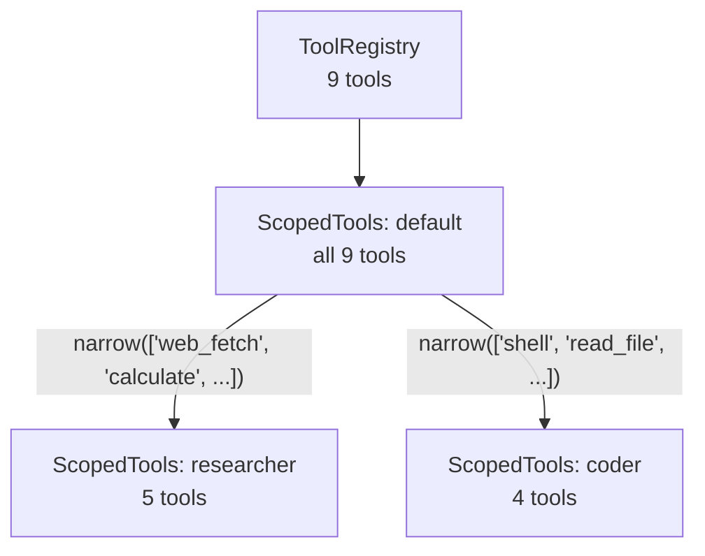

# Tool System

The tool system manages tool registration, policy enforcement, and per-agent tool visibility.

## Tool Trait

Every tool implements the `Tool` trait:

<!-- Code block ignored: trait definition for illustration -->

```rust,ignore
trait Tool: Send + Sync {
    fn descriptor(&self) -> ToolDescriptor;
    fn execute(&self, arguments: Value, ctx: &ToolContext)
        -> Pin<Box<dyn Future<Output = Result<String, ToolError>> + Send>>;
    fn default_policy(&self) -> ToolPolicy { /* defaults */ }
}
```

`ToolDescriptor` provides the tool's name, description, and a JSON Schema for its parameters. The LLM sees these as function definitions.

## ToolError

Tool execution failures are classified by a typed `ToolError` enum so the runtime can make retry/re-prompt decisions:

<!-- Code block ignored: enum definition for illustration -->

```rust,ignore
enum ToolError {
    Timeout { secs: u64 },       // retryable; runtime-enforced timeout fired
    ApprovalDenied,              // user/gate rejected the call
    Network(String),             // retryable; transport-level failure
    InvalidArgument(String),     // LLM supplied bad input
    Execution(String),           // generic operation failure
}
```

`From<String>` and `From<&str>` are implemented so tools that produce untyped errors (e.g. via `?` on helpers returning `Result<_, String>`) auto-convert to `Execution`. `ToolError::is_retryable()` returns true for `Timeout` and `Network`; the runtime retries `Network` errors once with a 500ms backoff (`Timeout` is deliberately NOT retried because the partial work may have succeeded). The built-in MCP wrapper classifies transport-origin errors (HTTP connection failures, subprocess pipe breakage) as `Network`; `web_fetch` does the same for reqwest send/body failures.

## Tool Policy

Each tool has a policy controlling its risk level, approval requirements, and execution timeout:

<!-- Code block ignored: struct definition for illustration -->

```rust,ignore
struct ToolPolicy {
    risk: RiskLevel,              // Low, Medium, High
    approval: ApprovalRequirement, // Never, UnlessAutoApproved, Always
    timeout: u64,                  // seconds
    sensitive_params: Vec<String>, // redacted in approval display
    rate_limit: Option<u32>,      // max calls per minute (None = unlimited)
}
```

Tools provide a `default_policy()`. Config-level overrides in `security.tool_policies` take precedence. The `ToolPolicyRegistry` resolves the effective policy per tool.

## ScopedTools and Narrowing

`ScopedTools` provides a filtered view of the tool registry:



When agent A spawns agent B, B's tools are computed as the intersection of A's current scope and B's `allowed_tools`. This is transitive -- tools can only decrease down the spawn tree.

<!-- Code block ignored: struct definition for illustration -->

```rust,ignore
struct ScopedTools {
    registry: Arc<ToolRegistry>,
    allowed: Option<Vec<String>>,  // None = all tools; supports globs like "namespace.*"
}

impl ScopedTools {
    fn narrow(&self, child_allowed: Option<&[String]>) -> ScopedTools {
        // Intersects parent's allowed with child's allowed
        // Glob patterns (e.g., "filesystem.*") are expanded against the registry
    }
}
```

Allowlist entries support glob patterns: `"filesystem.*"` matches all tools with that namespace prefix (requires a dot after the prefix). This is useful for MCP tool namespaces. Glob patterns work across all ScopedTools operations: `definitions()`, `get()`, `is_empty()`, and `narrow()`.

## ToolHost

The `ToolHost` trait is the sandboxed capability boundary between tools and the operating system. Tools request capabilities (shell commands, file I/O, HTTP requests) through the host rather than calling OS APIs directly:

```rust,ignore
trait ToolHost: Send + Sync {
    fn request(&self, capability: &Capability, grants: &Grants)
        -> Pin<Box<dyn Future<Output = Result<CapabilityResult, ToolError>>>>;
    fn name(&self) -> &str;
}

enum Capability {
    Shell { command: String, working_dir: Option<String> },
    FileRead { path: String },
    FileWrite { path: String, content: String },
    HttpRequest { url: String, method: String, headers: HashMap<String, String>, body: Option<String> },
}
```

The host enforces grants at the capability boundary — the tool says what it wants to do, the host decides whether to allow it and how to execute it. Different host implementations provide different trust tiers:

| Host             | Tier       | Isolation                              |
| ---------------- | ---------- | -------------------------------------- |
| `NativeToolHost` | Native     | In-process, grant enforcement only     |
| (future)         | WASM       | VM-enforced sandbox, capability tokens |
| (future)         | Bubblewrap | OS-level sandboxing via `bwrap`        |

The `Tool` implementations (shell, web, file) are identical across all tiers — they call `ctx.host().request()` regardless of which host sits behind the trait.

## ToolContext

The `ToolContext` is passed to every tool execution:

```rust,ignore
struct ToolContext {
    agent_name: String,       // current agent
    call_depth: usize,        // spawn nesting level
    max_call_depth: usize,    // from agent config
    tools: ScopedTools,       // narrowed tool set
    grants: Grants,           // resolved per-call grants
    host: Arc<dyn ToolHost>,  // sandboxed capability boundary
}
```

Tools use `ctx.host()` for system access (shell, file, network) and `ctx.grants()` only for introspection (e.g., `describe_tool` listing available capabilities).

## Adding a New Tool

1. Create `src/tools/my_tool.rs` implementing `Tool`
2. Add `mod my_tool;` and `pub use` to `src/tools/mod.rs`
3. Register in `main.rs`: `tool_registry.register(tools::MyTool);`

The tool will automatically appear in the LLM's function definitions (filtered by agent scope) and have its policy resolved by the registry.
