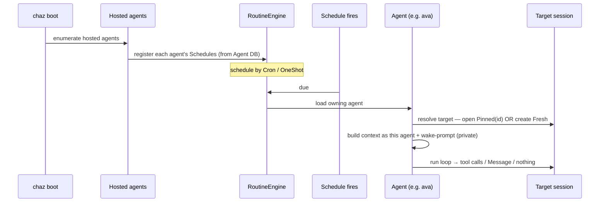

# Agent-Owned Schedules

> **Status: Complete** — supersedes the session-scoped heartbeat/routine model for scheduled agent wakes.
>
> Shipped: Agent-DB `Schedule` type + store (Stage 1); engine agent-source
> discovery + `schedule_fires` audit log (Stage 2); standalone fire path
> via `Server::fire_agent_schedule` + `agent_schedule` extension (Stage 3);
> conditional terminal `Message` on silent turns (Stage 4);
> `ScheduleFire.usage` cost-on-agent; schedule tools + `/schedule`
> command repointed to agent-owned schedules, detach-side routine sweep
> retired, `notify_agent_schedules_changed` engine bridge (Stage 5).
> 5 integration tests + 11 tool/command tests covering the full
> plumbing. The live turn in a real session still needs end-to-end
> integration testing on a dev instance (agent responds, cost
> attributed, silent turn produces no entry).

## Summary

A schedule is an **agent-owned** object: it belongs to an agent (e.g. `ava`),
not to a session. chaz is the runtime — it hosts one or more agents, and on
boot it loads each hosted agent and registers that agent's schedules. When a
schedule fires, chaz loads the owning agent, resolves the schedule's **target**
(an existing pinned session, or a fresh session created per fire), builds
context _as that agent_, feeds the wake-prompt as private invocation input,
and runs the agent's loop. The agent may reply, may act only through tools,
or may do nothing.

Routing is intrinsic: the schedule names its owner, so there is no
"resolve who responds" step. This replaces the current model where a
scheduler writes a generically-routed `Directive` entry into a session.

## Problem

Today scheduled wakes are **session-owned**: `Routine` rows live in each
session DB's `routines` table; `HeartbeatPayload` merely _names_ a target
agent; `RoutineEngine` discovers work by scanning sessions; the
`HeartbeatRoutineHandler` writes a `Directive` entry that
`process_session` then routes through `resolve_agent_for_entry` (override →
@mention → host → first-authorized → default). Consequences:

- In a multi-agent session a wake "for `@beta`" can be answered by whoever
  the generic resolver picks — the target is advisory, not binding.
- Schedules don't travel with the agent. An agent's schedule is scattered
  across the session DBs it happens to have been used in.
- The wake-prompt is a broadcast `Directive` entry every participant sees,
  even though it's a private nudge to one agent.
- A woken agent is _forced_ to emit a terminal `Message` even when it only
  ran tools or chose to stay silent (`server.rs` always appends one).

## Model

A **Schedule** is owned by an agent and stored in that agent's Living-Agent
DB (the same signed eidetica DB that already holds the agent's
`config`/`meta`/history). Schedules therefore sync and travel with the agent
across peers, exactly like its persona.

```text
Schedule {
    id:       String,
    schedule: Cron(expr) | OneShot(fire_at),
    prompt:   String,                 // the wake-prompt
    target:   Pinned(session_db_id)   // fire into this existing session
            | Fresh,                  // create a new session per fire
    enabled:  bool,
}
```

- **Pinned** — "resume _this_ session at 9pm and check in." The agent's
  home/default session is **not a separate concept** — it is just a Pinned
  schedule whose `session_db_id` is that session.
- **Fresh** — "every 9pm, go do X" — an autonomous recurring task. Each
  fire creates a new session owned by the agent; no other participants, so
  the multi-agent wake-chain (see [Autonomous Agents in Shared
  Sessions](./autonomous_agents.md)) cannot start there.

The `target` choice is made at create time and recorded in the schedule.

### chaz as runtime



The engine's discovery inverts: it enumerates **hosted agents** and reads
their schedule registries, rather than scanning session DBs for routine rows.
The existing "does this peer host the target agent?" check
(`heartbeat.rs:169`, today only multi-peer dedup) becomes _the_ dispatch
gate — the ownership boundary falls out naturally.

### Intrinsic routing & private wake-prompt

Because the schedule belongs to the agent, the fire path invokes that agent
directly and never consults `resolve_agent_for_entry`. The wake-prompt is
_invocation-scoped context_ for that turn — not a broadcast `Directive`
entry. The agent's resulting tool calls and any `Message` are written to
the target session as normal entries (audit + visibility land where they
belong); the prompt itself is not a shared entry.

### Execution path (decided: standalone; never touches the target's runtime)

A fired schedule's turn runs through a **standalone execution path**, not
the interactive `process_session` → `SessionRuntime` → `spawn_agent_task`
machinery. This is a hard requirement: a `Pinned` target **may be a live
session** a user is actively conversing in, and the schedule turn must not
mutate or hijack that session's `SessionRuntime` (its `agent_override`,
backend, completion channel, watcher wiring). Reusing
`register_child_session` (which pins the agent by _overwriting_
`SessionRuntime.agent_override`, `server.rs:369`) is therefore only valid
for `Fresh`; it is **forbidden for `Pinned`**.

The standalone path:

1. **Host check** — `agent_index.find_by_id(owner)`; not hosted ⇒ skip
   (the owning peer fires it). This is the dispatch gate.
2. **Resolve session** — `Fresh`: create a new session
   (`source = schedule:<owner_db_id>:<schedule_id>`) and attach the owner.
   `Pinned`: open the existing session; idempotently (re)attach the
   owner so it's authorized; if the session is gone or the owner can't
   be a member, **self-skip + log** (membership-at-fire).
3. **Serialize, don't hijack** — acquire the session's existing
   per-session `processing` lock so the schedule turn cannot interleave
   entries with a concurrent interactive turn. If the session is busy,
   skip this fire (cron will come around again; a missed one-shot is
   logged) rather than block or run concurrently. The lock is the
   _only_ shared state touched — no `SessionRuntime` entry is created
   or modified, so the live session's own routing is unaffected.
4. **Run the owner's turn directly** — load + hydrate the owner agent,
   build context _as that agent_ from the session's current entries
   with the wake-prompt as private invocation input, run the ReAct
   loop, emit `ToolCall`/`ToolResult` and a terminal `Message` _only if
   non-empty_ (see Optional response). The path **returns the turn
   outcome** to its caller — it is not fire-and-forget — so cost is
   recoverable.
5. **Attribute cost to the agent** — write `ScheduleFire { …, usage =
outcome.metadata }` to the owner's `schedule_fires` store. Autonomous
   wake cost lands on the agent's ledger; session usage stays
   Message-only (its tested invariant is untouched).
6. **One-shot cleanup** — on a successful one-shot fire, delete the
   `Schedule` row from the owner's `schedules` store (the engine drops the
   in-memory entry via its existing OneShot path).

Implementation note: the standalone runner is a focused, separate method
— it deliberately does **not** modify `spawn_agent_task`, to keep the
interactive hot path untouched. Some assemble/execute sequence is
duplicated; that cost is accepted to isolate risk from every
interactive turn.

### Optional response

The runtime must allow a turn to end **without** a `Message`. Today
`server.rs` unconditionally appends a terminal `Message` with
`outcome.body` even when empty. This becomes conditional: skip the
`Message` entry when the body is empty/whitespace; `ToolCall`/`ToolResult`
/`Error` entries are still written. (This is also a latent bug for the
chat-room model — empty Messages clutter the room — so it is worth doing
independently.)

### Membership at fire time (Pinned only)

A Pinned schedule targeting a session the agent is no longer a member of must
**self-skip** (logged, not errored) when it fires. This replaces today's
detach-side cleanup (`detach_agent_from_session` sweeping session routine
rows, `sweep_for_agent`): the check moves from "clean up on detach" to
"verify membership on fire," which is correct for an agent-owned object.

## Failure Modes & Mitigations

| Failure                                            | Mitigation                                                                                                                                                            |
| -------------------------------------------------- | --------------------------------------------------------------------------------------------------------------------------------------------------------------------- |
| Schedule fires for an agent this peer doesn't host | Host check is the dispatch gate — silently skip (owning peer fires it)                                                                                                |
| Pinned target session deleted / agent detached     | Membership/existence checked at fire → self-skip + log                                                                                                                |
| Fresh fires accumulate sessions unbounded          | Fresh sessions are normal sessions subject to existing lifecycle/retention; cron cadence is author-chosen                                                             |
| Self-scheduled tight cron self-sustains activity   | Bounded by cron cadence + per-agent `max_iterations`; **not** the chat-room burst budget (a schedule is a deliberate cadence). Revisit a min-interval guard if abused |
| Woken agent forced to speak                        | Conditional terminal `Message` — silence produces no entry                                                                                                            |

## Migration

No migration shim was built. The DB starts from scratch (pre-release
`vibe` branch), so the legacy session-routine path was **deleted
outright** rather than migrated:

1. YAML `schedules:` now imports as agent-owned `Schedule`s (Pinned to
   the resolved session), owned by an explicit `agent:` or the peer's
   default agent.
2. `HeartbeatPayload`, `HeartbeatRoutineHandler`, the `scheduler`
   extension + `SchedulePayload`, and `src/heartbeat.rs`
   (`sweep_for_agent`) were removed.
3. Detach/delete cleanup is replaced by the fire-time membership check
   in `fire_agent_schedule`.

## Naming (post-merge reconciliation)

The user-facing vocabulary is unified on one word: **`schedule`**. The
`Schedule` type, the `schedule_add|modify|remove|list|once` tools, the
`/schedule` command, the `schedule` extension, and the YAML `schedules:`
key are all the same word. "Timer"/"heartbeat" are retired (a timer
connotes a countdown alarm; this is a recurring or future invocation of
an agent — a schedule). See the
[post-merge gap tracker](../../../../brain/tech/projects/chaz/post-merge-gaps.md).

## Open Questions

1. Schedule **id** scope — unique per agent, or globally? Per-agent is
   sufficient and matches ownership.
2. Should `Fresh` sessions be tagged (source = `schedule:<agent>:<id>`) so
   they're discoverable/groupable? Proposed: yes, mirrors `spawn:` tagging.
3. Min-interval / per-day cap on fires as an abuse guard — defer until
   there's evidence it's needed (bounded by cadence + `max_iterations`).
4. Editing a schedule — `schedule_modify` analogue on the agent DB; does a
   schedule edit need a persona-snapshot-style audit entry? Likely no.

## Implementation Touch Points

- ✅ Agent DB: `schedules` store + `Schedule` type; `schedule_fires` audit store + `ScheduleFire` (incl. `usage`).
- ✅ `routine` engine: `RoutineScope::Agent`, `AgentSchedulePayload`, `Schedule→Routine` conversion, `register_agent`/`reload_agent`/`deregister_agent`, boot wiring.
- ✅ `server.rs`: conditional terminal `Message` (skip when body empty).
- ✅ **Standalone fire path** (Stage 3): `Server::fire_agent_schedule` + `agent_schedule` extension. Host check → resolve target → acquire processing lock → run turn → record ScheduleFire → one-shot cleanup.
- ✅ **Tools/commands repoint** (Stage 5): All schedule tools (`schedule_add`, `schedule_modify`, `schedule_remove`, `schedule_list`, `schedule_once`) and the `/schedule` command now write agent-owned `Schedule`s with `target: Pinned(current session)` by default; `target: fresh` option added. `notify_agent_schedules_changed` bridge syncs the engine after mutations. All tools carry `Arc<SessionRegistry>` to open agent DBs.
- ✅ **Detach cleanup retired** — fire-time membership check in `fire_agent_schedule` replaces the sweep in `detach_agent_from_session`.
- ✅ **Legacy path deleted** (no migration — greenfield): `scheduler` extension, `HeartbeatPayload`/`HeartbeatRoutineHandler`, `src/heartbeat.rs`. YAML `schedules:` imports as agent-owned `Schedule`s.
- ✅ **Naming reconciled**: one word `schedule` end-to-end (type, tools, command, extension, YAML key); `/schedule list` is session-wide across attached agents.
