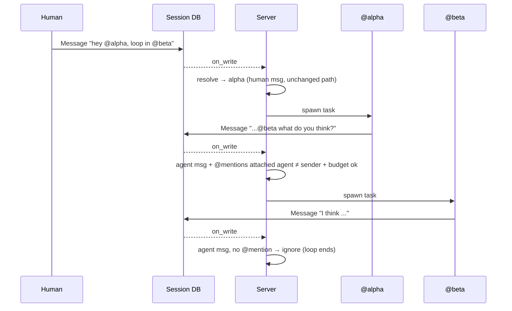

# Autonomous Agents in Shared Sessions

> **Status: Implemented (v1)** — mention-only agent→agent, pure-heuristic gate, burst budget 6, room-note injection.

## Summary

Today a session is a 1:1 router: a human message wakes exactly one agent,
which replies, and processing stops. This design turns a session into a
**chat room**: multiple agents are members, and an agent's message can wake
another agent. v1 keeps this deliberately small and safe — an agent only
wakes another agent when it **explicitly `@mentions`** an attached agent,
and the decision to respond uses **no extra LLM call**. Runaway loops are
bounded by a **per-burst turn budget** derived from the session log.

The human→agent path is unchanged. The only new behavior is mention-chained
agent→agent hand-off (e.g. a human asks `@alpha`; `@alpha` answers and pulls
in `@beta`; `@beta` answers).

## Current Behavior

All invocation flows through the session-messaging primitive (see
[Session Messaging](./session_messaging.md)). The relevant constraints:

- **Loop guard** (`server.rs`, `process_session`):

  ```text
  match latest.entry_type {
      Message  if sender is NOT a known agent  => spawn agent task
      Directive                                 => spawn agent task
      _                                         => ignore
  }
  ```

  Any `Message` authored by a known agent — including the agent's own reply
  and any other agent's — is ignored. This is the hard wall preventing
  agent↔agent loops, and it is exactly what blocks the chat-room model.

- **Single speaker**: `resolve_agent_for_entry` (`session/agents.rs`)
  returns _one_ agent by precedence: explicit override → first `@mention`
  → `host_agent_db_id` → first authorized → legacy `agent_name` → default.

- **Serialized turns**: a per-session `processing` lock means one agent
  task runs at a time per session. This is desirable for a room (no two
  agents talking over each other) and is **kept**. The lock is
  peer-local; cross-peer serialization (when an agent is co-owned and
  attached to a session that syncs to multiple peers) is provided by
  the home-peer gate — see "Home Peer" in [Session Model](../architecture/sessions.md).

- **Multi-membership already exists**: `attach_agent_to_session` grants
  N agents `Write` on the session DB and mirrors them into
  `SessionMeta.agents`. The room and shared log are already there; only
  the wake logic is missing.

## Goals

1. An agent's `Message` may wake another **attached** agent when, and only
   when, it `@mentions` that agent by display name.
2. The decision is **pure heuristic** — no classifier, no extra tokens.
3. Agent→agent recursion is **bounded** and cannot run away on cost.
4. The human→agent path has **zero behavior change** (no regression).

## Non-Goals (v1)

- Ambient participation (every agent free-evaluating every message).
- Any LLM-based "is this for me?" gate.
- Parallel speakers / concurrent agent turns in one session.
- Time-window heuristics ("respond if last message > 30s old").
- Proactive / heartbeat-driven speaking.

These are deferred to later phases — see
[`multi-agent.md`](../../../../brain/ava/research/chaz-ecosystem/multi-agent.md)
(Phase 4) for the broader vision. v1 is the minimum that makes the room real.

## Design

### The seam stays where it is

No fan-out evaluator is needed. The existing `notify → process_session`
loop already re-fires whenever a new entry is written. When an agent writes
its reply `Message`, that write re-triggers `process_session` on the latest
entry. So the only changes are to **(a)** what `process_session` decides to
act on and **(b)** which agent it resolves — recursion falls out of the
existing callback chain, naturally serialized by the per-session lock.



### Change 1 — relax the loop guard (mention-gated)

`process_session`'s `should_process` gains a branch for agent-authored
`Message` entries:

```text
Message, sender IS a known agent  =>
    process IFF  the content @mentions an attached agent
                 whose display_name != sender
            AND  the per-burst turn budget is not exhausted
Message, sender is NOT a known agent  => process   (unchanged)
Directive                              => process   (unchanged)
_                                      => ignore
```

Excluding `display_name == sender` stops an agent waking itself with a
self-mention. Requiring the mention target to be **attached** (authorized
on the session) means a stray `@someone` in prose can't wake anything.

### Change 2 — resolution for the agent→agent case

Reuse `resolve_agent_for_entry`, which is already mention-aware, with one
added constraint: when the triggering entry's sender is an agent, the
resolved agent must be a **mentioned, attached agent other than the
sender**. The human-message path keeps its full precedence chain
(mention → host → first authorized → …) untouched.

### Change 3 — per-burst turn budget (the runaway backstop)

Define a _burst_ as the run of consecutive agent-authored `Message`
entries since the last non-agent `Message` (human/Directive). The budget
is the maximum burst length; when the trailing run of agent messages
reaches it, further agent→agent triggers are suppressed (logged, not
errored) until a human/Directive entry resets the count.

Derive the count from the session log — **no `SessionMeta` schema change**:
walk entries backward from latest, count `Message`s whose `sender` is a
known agent, stop at the first non-agent `Message`/`Directive`. Compare to
a budget constant (proposed default **6**), overridable later via config or
`SessionMeta` if needed.

This bounds: infinite loops, `@alpha`↔`@beta` ping-pong, and cost blowup
(serialized turns × bounded burst). A room with no human present still
terminates — the budget only resets on a human/Directive entry.

### Change 4 — the room note (making agents aware of the convention)

The wake mechanism only fires when an agent's _own output_ contains
`@othername` — nothing forces that. Rather than require every agent's
system prompt to be hand-edited with the convention, `ContextBuilder`
injects a short **room note** into the system prompt when (and only
when) more than one agent is attached:

> You are in a shared session with other agents: @beta, @gamma. To
> address a participant directly, @mention them by display name. They
> will see your message and may reply. Messages with no @mention are not
> routed to other agents.

The roster is the session's `SessionMeta.agents`, **self excluded**,
order-preserving, case-insensitively deduped. It is _appended at
context-build time_, not baked into the agent's stored system prompt:

- **Always current** — membership changes are reflected on the next turn;
  a stored copy would go stale.
- **Cache-safe for the common case** — the system prompt is a prompt-cache
  breakpoint. A _stable_ roster yields a byte-identical note every turn,
  so the cache still hits. Only an `/agent add`/`remove` perturbs the
  note, costing a single-turn re-cache of the system segment (the
  tool-schema breakpoint before it still hits). Cross-agent cache
  non-sharing already exists in multi-agent sessions (distinct system
  prompt per agent) and is not introduced by the note.
- **Zero change for single-agent sessions** — `< 2` participants ⇒ no
  note ⇒ system prompt byte-identical to pre-feature behavior.

## Failure Modes & Mitigations

| Failure                    | Mitigation                                                                    |
| -------------------------- | ----------------------------------------------------------------------------- |
| Infinite agent↔agent loop  | Burst budget; resets only on human/Directive                                  |
| `@alpha`↔`@beta` ping-pong | Burst budget (counts the run regardless of which agents)                      |
| Cost blowup                | Serialized turns (kept) × bounded burst length                                |
| Self-wake via self-mention | Resolution excludes `display_name == sender`                                  |
| Stray `@name` in prose     | Mention must resolve to an _attached, authorized_ agent                       |
| Human-path regression      | Human-sender branch of `should_process`/resolution is byte-for-byte unchanged |

## Open Questions

1. **Resolved.** The burst budget defaults to 6 and is operator-settable
   via global config (`multi_agent.burst_budget`), applied once at startup.
   Per-`SessionMeta` overrides were not needed for v1 — a single peer-wide
   ceiling is the operator control surface. The live roster, host, and
   trailing-burst state are inspectable at runtime via `/agent room`.
2. Exclude the _immediately previous speaker_ from being re-woken (tighter
   ping-pong guard), or rely on the budget alone? Budget-only is simpler;
   leaning that way for v1.
3. Should an agent opt **in** to being mention-wakeable (a flag on
   `AgentRef`), or is "attached" sufficient? v1 proposal: attached is
   sufficient; no new field.
4. **Resolved.** A fired schedule is **not** a burst entry at all.
   Agent-owned schedules run the standalone fire path and feed their
   prompt as invocation-scoped input — no shared `Directive` entry is
   written, so a scheduled wake neither resets nor extends a burst. The
   legacy session-`Directive` scheduler that raised this question is
   deleted. See [Agent-Owned Schedules](./agent_schedules.md).

## Implementation Touch Points

- `server.rs` `process_session` — the `should_process` match arm + budget check; `spawn_agent_task` reads `SessionMeta.agents` and passes the roster to `ContextBuilder`.
- `session/agents.rs` — `resolve_mentioned_agent` (mention-only, sender-excluded, no fallback) for the agent→agent case; `resolve_agent_for_entry` unchanged.
- `session/mod.rs` — `trailing_agent_message_burst` counts the burst from `entries()`; `parse_mentions` already exists.
- `context.rs` — `room_note` + `ContextBuilder::with_room_participants`; appended to the system prompt only when ≥2 agents are attached.
- Tests: burst counting/reset (Ack/Directive boundaries), mention resolution excluding self, none-when-unaddressed, room note only multi-agent + self-excluded, room note appended without disturbing single-agent prompts.
