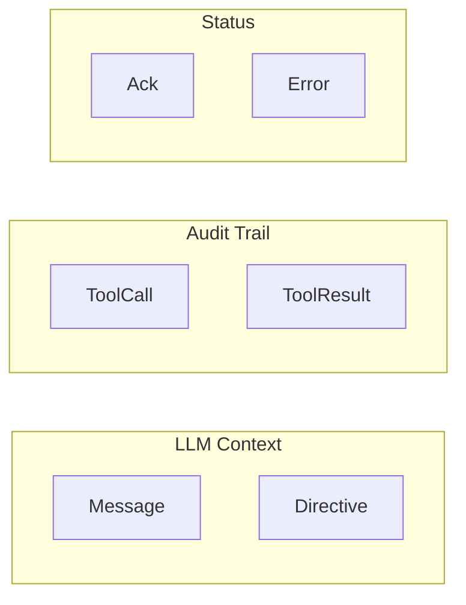
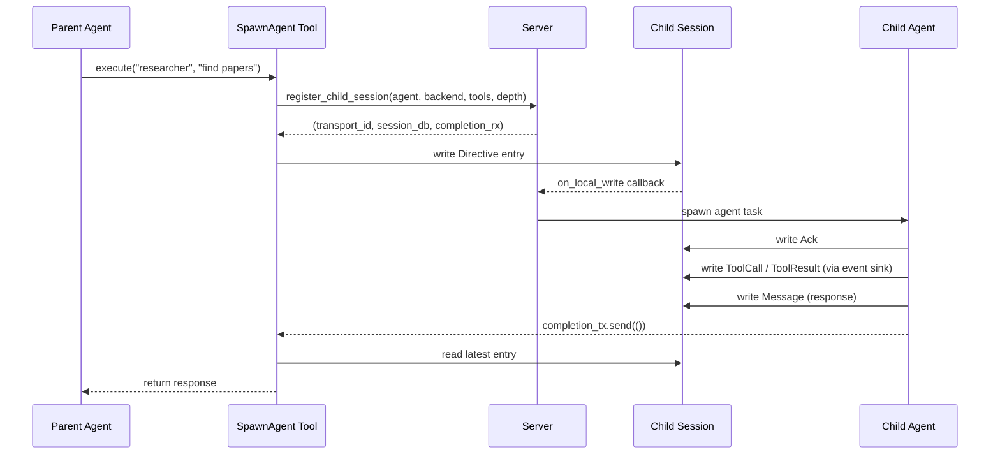

# Session Messaging Primitive

> **Status: Implemented**

## Summary

All agent invocation in chaz goes through a single mechanism: write an entry to a session database, and the server's callback-driven processing handles execution. Users, agents, schedulers, and system processes all invoke agents the same way.

## Problem

Originally, `spawn_agent` called `runtime::execute` directly, bypassing the server's callback infrastructure. This created two separate invocation paths with different behavior: gateway messages went through the server, but sub-agent tasks did not. This made it impossible to unify features like audit trails, session sharing, and scheduled runs.

## Design Goals

1. **Single invocation path**: All agent execution goes through `Server::process_session`
2. **Rich entry types**: Sessions record not just chat messages but also directives, tool calls, and acknowledgments
3. **Observable**: The full ReAct loop is visible in the session database for debugging and audit
4. **Extensible**: New invocation sources (scheduler, inter-agent messages) use the same mechanism

## Entry Types



| Type         | In LLM Context | Source                 | Purpose                            |
| ------------ | :------------: | ---------------------- | ---------------------------------- |
| `Message`    |      Yes       | Users, agents          | Chat messages                      |
| `Directive`  |      Yes       | spawn_agent, scheduler | Task instructions to an agent      |
| `ToolCall`   |       No       | Runtime event sink     | Audit: tool was invoked            |
| `ToolResult` |       No       | Runtime event sink     | Audit: tool returned               |
| `Ack`        |       No       | Server                 | Status: agent is processing        |
| `Error`      |       No       | Server                 | Status: agent encountered an error |

`Directive` entries are included in the LLM context as `user` role messages. This is because they are instructions to the agent, functionally equivalent to a user message.

## Server Processing Logic

The server's `process_session` decides whether to act on an entry:

```text
match latest.entry_type {
    Message  if sender is NOT a known agent  => spawn agent task
    Directive                                 => spawn agent task
    _                                         => ignore
}
```

This prevents the server from re-triggering on its own agent responses while allowing it to process directives from any source.

## spawn_agent Flow



### OnceLock for Circular Dependency

`SpawnAgent` is registered in the `ToolRegistry` before `Server` exists (the server needs the registry). The circular dependency is resolved with `Arc<OnceLock<Arc<Server>>>`:

1. Create the `OnceLock` and pass it to `SpawnAgent`
2. Register `SpawnAgent` in the `ToolRegistry`
3. Create `Server` with the `ToolRegistry`
4. Set the `OnceLock` with the `Server`

### SpawnContext

Spawn-specific metadata is bundled in `SpawnContext`:

- `call_depth` — current nesting level (incremented per spawn)
- `max_call_depth` — from agent definition
- `parent_tools` — the parent's `ScopedTools` for transitive narrowing
- `completion_tx` — signals the parent when the child finishes

## RuntimeEventSink

The runtime accepts an optional `mpsc::Sender<RuntimeEvent>`:

```text
enum RuntimeEvent {
    ToolCall { id, name, arguments }
    ToolResult { id, name, output, is_error }
}
```

The server spawns an event writer task that consumes events and writes `ToolCall`/`ToolResult` entries to the session database. This runs concurrently with the ReAct loop.

When `runtime::execute` returns, the event sender is dropped, the writer drains remaining events and exits.

## Future: Scheduled Runs

Scheduled runs are a direct consumer of this primitive. A scheduler background task holds cron state and periodically writes `Directive` entries into sessions. The server's existing callback machinery handles the rest -- no new invocation path needed.

## Future: Inter-Agent Communication

Agents can communicate by writing entries to shared sessions. The session messaging primitive makes this natural: any participant can write a `Directive` or `Message` to any session they have access to.
