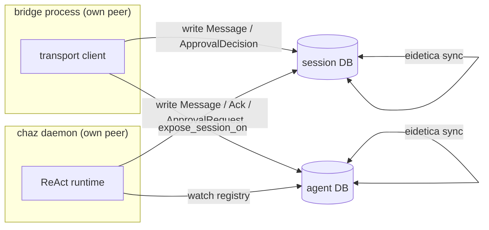
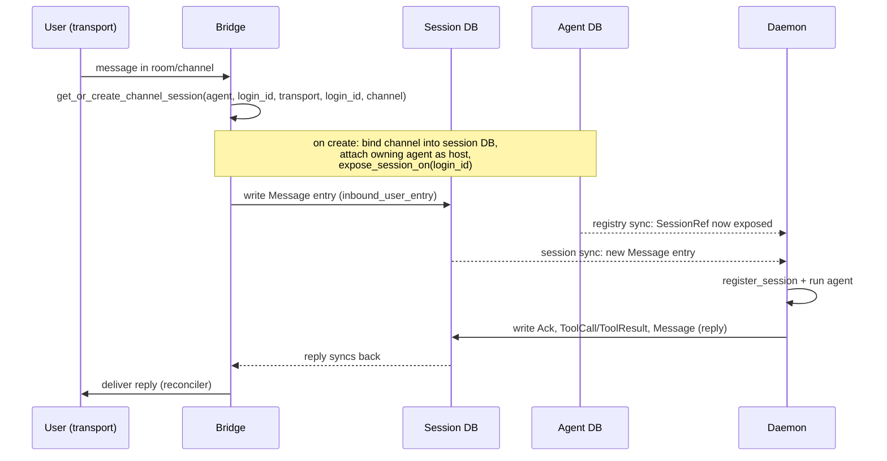
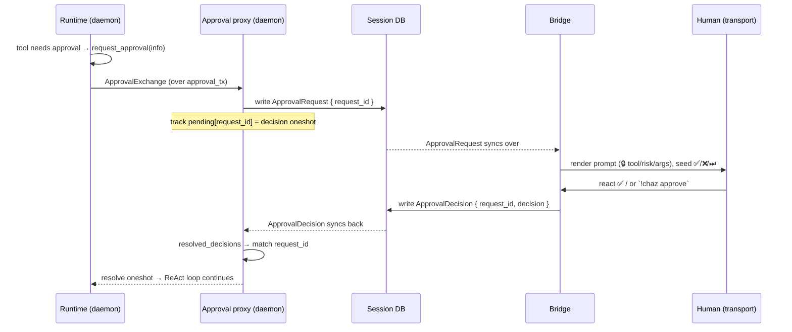

# Dumb Transport Bridges

> **Status: Implemented** (2026-06-17)
>
> This is the internal/architecture companion to the operator-facing
> [Transport Bridges](../user_guide/bridges.md) page. It explains _how_ a bridge
> and the daemon cooperate over eidetica sync — the data that flows, where it
> lives, and why the bridge runs no agent. If you are wiring up a bridge, read
> the user guide; if you are changing bridge or session-sync code, read this.

## Summary

A transport bridge (`chaz-matrix`, `chaz-discord`) is **dumb**: it is a pure I/O
translator between one transport account and a set of session databases. It
**never runs an agent**. Its entire job is three verbs:

1. **proxy inbound** — turn a received message into a `Message` entry in the
   right session DB;
2. **deliver outbound** — reconcile new agent `Message` entries back onto the
   transport;
3. **relay approvals** — render a tool-approval prompt the daemon raised, and
   write the human's decision back.

The **daemon** is a separate eidetica peer that owns the agents. It watches the
sessions a bridge exposes, runs the ReAct loop on them, and writes replies (and
approval requests) back into the session DB. The two processes share nothing but
synced eidetica databases — there is no RPC, no shared memory, no in-process
callback between them.



> The two `(session DB)` / `(agent DB)` nodes are the _same_ logical database
> replicated on both peers; the double arrow is eidetica sync. Drawn split to
> show that each side reads/writes its own replica and convergence happens
> underneath.

## Why dumb

The earlier split made each bridge its own peer (see
[Transport Bridges → Why bridges are separate peers](../user_guide/bridges.md#why-bridges-are-separate-peers))
but the bridge still called `Server::new` with the agent-running loop enabled —
so a bridge _answered its own messages_. That defeated the point: two peers could
both run the same agent against the same session and fork it.

The fix is a hard rule: **exactly one peer runs the agent for a given session.**
The daemon is that peer. A bridge sets `BuildOptions::run_agent_loop = false`,
which suppresses the `processing_loop` spawn in `Server::new`; the daemon sets it
`true`. Everything else about a bridge's embedded `Server` (the session registry,
the reconcile helpers, command dispatch) stays — it just never _executes_ an
agent.

## Where state lives

Two synced databases carry all cross-peer state. Nothing else is shared.

### The session DB — the conversation _and_ the channel

Each conversation is one session DB. Beyond its entry log it holds the
**transport bindings**: which `(transport, login_id, channel)` tuples this
session is reachable on, in a per-session `transport_bindings` `DocStore`
(`session::transport`). Putting the binding _in the session DB_ (rather than a
central peer-local index) means it syncs with the session — a bridge and the
daemon agree on where a session is reachable without a side channel.

The session DB is also the **only** channel between a bridge and the runtime.
Every inbound message, every reply, every approval request, and every approval
decision is a `SessionEntry`. See [`EntryType`](#entry-types) below.

### The agent DB — the session registry

Each agent DB carries a synced **session registry** (`SESSIONS_STORE`, a
`Table<SessionRef>`). A `SessionRef` records a session's id plus
`exposed_on: Vec<String>` — the set of bridge labels (each a `login_id`) that
expose it:

```text
SessionRef { session_db_id: "...", exposed_on: ["@chaz:example"] }
```

This is the rendezvous. A bridge, on binding a channel to a session, calls
`expose_session_on(session_id, login_id)` to add its label; that write syncs to
the daemon, which is watching the registry. The daemon never has to be told about
a session out of band — it _discovers_ exposed sessions from the registry.

Session-DB access is granted by a `DelegatedTreeRef` from the session to the
**agent DB** (installed on attach, the same primitive spawned child sessions
use). Any key with access to the agent DB — the daemon's agent key, the bridge's
`bridge` key — transitively gets access to the session DB. No per-session
tickets.

## Inbound: message → session entry



The bridge's inbound code (`handle_message` / the Matrix message handler) does no
more than resolve-or-create the session, ensure the reconciler/approval watchers
are installed, and append the `Message` entry. It then **stops**. It does not
build context, call an LLM, or write a reply.

## The daemon registry-watch

The daemon closes the loop in `watch_agent_session_registries`
(`server/build.rs`), run once at deferred startup:

1. Install an `on_write` callback on **every hosted agent DB**. eidetica's
   `on_write` fires for **local _and_ remote (synced)** writes, so a bridge's
   `expose_session_on` write — which arrives via sync — triggers it.
2. Every callback fire (debounced) calls `register_exposed_sessions`, which for
   each agent walks `list_session_refs()`, skips any ref that is not
   `exposed_on` anything or is already being watched, opens the session DB, and
   calls `register_session` — which installs the daemon's normal session
   processing and makes the ReAct loop answer it.

`register_exposed_sessions` is **self-healing**: if a freshly-exposed session's
DB hasn't synced over yet, `open_session` fails, the ref is skipped, and the next
registry sync-write re-runs the scan and retries. Registration is idempotent
(`register_session` early-returns for an already-watched session).

## Outbound: reconcile replies onto the transport

Delivery is the transport-generic reconciler `attach_reconciler`
(`chaz_core::bridge`), installed once per session. On every session write it
re-derives the set of agent `Message` entries the transport hasn't shown yet
(`undelivered_agent_messages`) and sends them in order, marking each delivered
only **after** the transport `send` succeeds. A failed send stops the pass and
leaves the tail for the next write — at-least-once, never silently dropped. The
only transport-specific part is the `send` closure (`room.send` / `ChannelId::say`).

## Tool approvals over the session DB

This is the one place a dumb bridge has to carry information _from_ the runtime
_to_ a human and back. In the in-process model the runtime sent an
`ApprovalExchange` over an mpsc to a co-located bridge; with the agent on a
different peer, that channel is gone. Approvals ride the session DB instead.

### The two control entry types

Two `EntryType`s carry the protocol, correlated by a `request_id` (a UUID):

| Entry              | Written by | Content (JSON)                                                                            |
| ------------------ | ---------- | ----------------------------------------------------------------------------------------- |
| `ApprovalRequest`  | daemon     | `ApprovalRequestPayload { request_id, tool_name, risk_level, arguments_display }`         |
| `ApprovalDecision` | bridge     | `ApprovalDecisionPayload { request_id, decision }` (`approve` \| `deny` \| `approve_all`) |

Both are **control entries**, handled like `ToolCall`/`ToolResult`: excluded from
LLM context (the context builder allowlists only `Message`/`Directive`/`Summary`),
excluded from bridge message delivery (`undelivered_agent_messages` matches only
`Message`), and ignored by `process_session` (its `should_process` match falls
through to `_ => false`) so an approval entry **never wakes an agent turn**. The
builders, parsers, and scan helpers are transport-generic, in `chaz_core::bridge`
(`approval_request_entry`, `approval_decision_entry`, `parse_approval_*`,
`resolved_decisions`, `unrendered_approval_requests`).

### The flow



The runtime is **unchanged**: it still calls
`security.request_approval(info)`, which sends an `ApprovalExchange` over
`SecurityContext.approval_callback` and blocks on a oneshot. The only new wiring
is _what consumes that channel_. For a bridge-exposed session,
`register_exposed_sessions` hands `register_session` an `approval_tx` produced by
`spawn_session_db_approval_proxy` (`server/approval_proxy.rs`) instead of `None`.

The proxy runs two tasks per exposed session:

- a **requester** that, per `ApprovalExchange`, records the pending oneshot
  (keyed by `request_id`) and writes the `ApprovalRequest` entry;
- a **resolver** driven by an `on_write` watch on the session DB that, on each
  write, scans `resolved_decisions` and completes any pending oneshot whose
  `request_id` now has a decision.

On the bridge side, `attach_approval_watcher` (installed alongside the
reconciler) watches the session DB, renders each `unrendered_approval_requests`
entry to its room/channel, and records a pending map from the posted message id
to `(session_db, request_id)`. A reaction handler (Matrix `add_event_handler` /
Discord `reaction_add`) or the `!chaz approve|deny` verbs look that up and call
`write_approval_decision`, appending the `ApprovalDecision` entry.

### Fail-closed

Every failure path denies — a bridge-exposed session never auto-_approves_:

- **No channel** (`approval_callback = None`, e.g. a session with no proxy) →
  `request_approval` returns `Deny`.
- **Proxy can't watch the DB**, or the **request write fails** → the pending slot
  is dropped, closing the oneshot → `Deny`.
- **No decision within the request's ceiling** (default 300s) → the daemon
  resolves the slot as `TimedOut`, which is not an approval. This keeps a down or
  silent bridge from hanging the ReAct loop forever.
- **No live bridge at all** → the request entry sits unanswered and times out.
  Until 4b, exposed sessions denied _silently_; now the outcome is visible as a
  `TimedOut` decision entry beside its request.

#### One clock, and it is the daemon's

The daemon reads `approvals.timeout`, stamps each request entry with its own
`timeout_secs`, and on expiry writes the `TimedOut` decision itself. **No bridge
compares a clock at any point.** It uses the ceiling only to render the window to
a human ("expires in 5 minutes"), and it learns the outcome the way it learns
everything else — by reading the session.

This matters because eidetica entries carry no time of their own. Every timestamp
in a session is one peer's wall clock written into an application payload, so a
bridge deciding "is this late?" would be comparing the daemon's clock against its
own, and on a split deployment those drift. A bridge that guessed early would
silently discard a human's answer.

So a bridge never guesses. It writes the answer it was given, and correctness
comes from resolution instead:

- Before writing, it checks whether the request already has a decision. If the
  daemon closed it, the bridge says so in the channel rather than writing.
- If it loses that race and writes anyway, nothing breaks. `resolved_decisions`
  treats **`TimedOut` as absorbing**: the daemon writes it only after claiming
  the pending slot, under the same lock a landing decision takes, so a `TimedOut`
  entry existing is equivalent to "the runtime was told `TimedOut`". Whatever
  else is written for that request, in any order, resolution names the outcome
  the daemon acted on. Among ordinary answers the first one stands, since the
  daemon took whichever reached it first.

Entry order in the tree is deliberately not the tiebreak — the entry stamped
earliest is not necessarily the one that arrived first.

So the worst case of any bug or outage is a denied tool, never an unsupervised
one. `auto_approved_tools` / `tool_policies.*.approval` still govern which tools
ask in the first place (see [Security → Tool Approval](../user_guide/security.md#tool-approval)).

## Invariants and gotchas

- **`on_write` fires on synced writes.** This is the linchpin — the daemon's
  registry-watch and the proxy's decision-resolver both depend on a _remote_
  peer's write triggering a local callback. Verified against eidetica `e4e9812`;
  `WriteEvent::source` distinguishes `Local` from `Remote` when a callback cares.
- **Never commit to a tree inside its own `on_write`.** eidetica serializes
  writes per-tree under a lock held across callbacks; a reentrant commit on the
  same tree deadlocks. Every DB write in this design happens _outside_ the
  callback: the proxy's requester is driven by the runtime mpsc, not the watch;
  the bridge writes the decision from the reaction handler, not from the request
  watcher.
- **`request_id` is the only correlation.** The proxy's pending map and the
  bridge's pending map are independent; they agree only via the `request_id`
  carried in both entries. The session-DB entry id is _not_ used.
- **The `seen` set prevents re-rendering, not the decided set prevents
  re-resolving.** A bridge tracks already-posted `request_id`s so a churning
  session DB doesn't re-prompt; the proxy's pending map is the dedup for
  resolution (a resolved `request_id` is removed, so a later decision write is a
  no-op).

## Code map

| Concern                          | Where                                                                                                          |
| -------------------------------- | -------------------------------------------------------------------------------------------------------------- |
| Agent-loop gate                  | `BuildOptions::run_agent_loop` → `Server::new` (`server/mod.rs`)                                               |
| Session registry / `exposed_on`  | `agent_db.rs` (`SessionRef`, `register_session_ref`, `expose_session_on`)                                      |
| Transport bindings               | `session::transport` (`bind_transport`, `transport_bindings`)                                                  |
| Channel→session lookup           | `session::transport` (`get_or_create_channel_session`, `find_channel_session`)                                 |
| Daemon registry-watch            | `server/build.rs` (`watch_agent_session_registries`, `register_exposed_sessions`)                              |
| Outbound reconcile               | `chaz_core::bridge` (`attach_reconciler`, `undelivered_agent_messages`)                                        |
| Approval entry types + helpers   | `session::EntryType`, `chaz_core::bridge` (`approval_*`, `resolved_decisions`, `unrendered_approval_requests`) |
| Approval proxy (daemon)          | `server/approval_proxy.rs` (`spawn_session_db_approval_proxy`)                                                 |
| Approval render/capture (bridge) | `attach_approval_watcher`, `handle_approval_reaction`, `resolve_pending_approval` in each bridge crate         |

## See also

- [Transport Bridges](../user_guide/bridges.md) — operator setup, config, the
  ticket/approval bootstrap
- [Session Messaging Primitive](./session_messaging.md) — the entry-write →
  callback invocation model these bridges build on
- [ReAct Runtime](../architecture/react.md) — where the approval gate sits in a
  turn
- [Security](../user_guide/security.md) — approval policy, capability grants
- [Session Sharing](../user_guide/session_sharing.md) — the ticket/delegation
  primitives the peers use to reach each other's DBs
