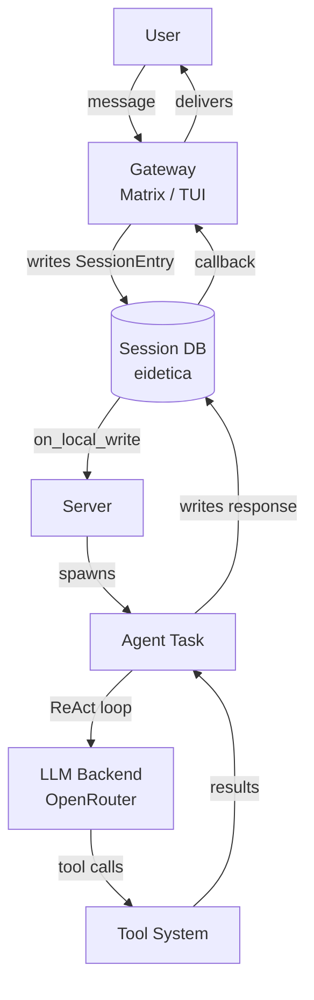

# Chaz

Chaz is an AI agent orchestrator for [Matrix](https://matrix.org). It connects to OpenAI-compatible LLM providers and orchestrates Living Agents that reason, act, and use tools in a ReAct loop. Agents, memory banks, and sessions are stored in syncable per-entity eidetica databases, so the same agent (with its system prompt and memories) can co-own conversations across multiple peers.

## Key Features

- **ReAct tool-calling loop** with built-in tools (shell, file I/O, web fetch, search, calculate, time, memory, spawn, compact, schedule, describe) plus external MCP tools.
- **Living Agents** — per-agent eidetica DBs with system prompt, memory banks, schedules, presets, and co-ownership across peers.
- **Multi-agent orchestration** with depth limiting, transitive tool narrowing, and a per-room burst budget to backstop runaways.
- **Persistent, syncable sessions** backed by [eidetica](https://github.com/arcuru/eidetica). Named sessions; share via ticket URLs.
- **MCP external tools** with auto-restart, policy enforcement, and presentation modes.
- **TUI, Matrix, and single-shot CLI** gateways over the same session model.
- **Scheduled, agent-owned wakes** via a cron-driven routine engine (no broadcast directives).
- **Security controls** — leak detection, SSRF protection, shell allow/deny lists, tool rate limiting, and explicit approval gates.

## Quick Start

```bash
# Matrix bot
chaz --config config.yaml

# Local TUI
chaz --config config.yaml --tui

# Single-shot CLI (scriptable; one ReAct turn then exit)
chaz --config config.yaml --cli "Summarize today's stand-up."
```

See [Getting Started](user_guide/getting_started.md) for detailed setup instructions.

## How It Works



Gateways (Matrix, TUI) write messages to per-session eidetica databases. The server watches for new entries via callbacks and spawns agent tasks. Agents run a ReAct loop against an OpenAI-compatible LLM backend, executing tools and writing results back to the session. Gateways detect responses via their own callbacks and deliver them to the user.

## Project Status

Chaz is under active development. The core architecture (sessions, ReAct loop, tools, agents, sync) is functional. See the [architecture overview](architecture/overview.md) for the current state.

## Links

- [GitHub Repository](https://github.com/arcuru/chaz)
- [Matrix Room: #chaz:jackson.dev](https://matrix.to/#/#chaz:jackson.dev)
- [Blog Post: Chaz: An LLM <-> Matrix Chatbot](https://jackson.dev/post/chaz/)
