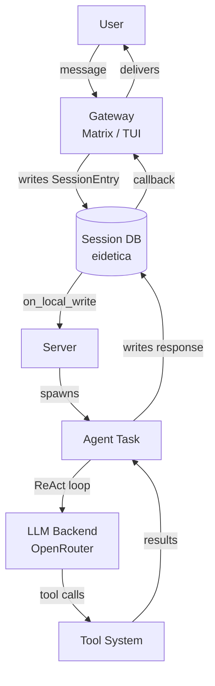

# Chaz

Chaz is an AI agent orchestrator for [Matrix](https://matrix.org). It connects to LLM providers via OpenAI-compatible APIs and orchestrates agents that reason, act, and use tools in a ReAct loop.

## Key Features

- **ReAct tool-calling loop** with 9 built-in tools (shell, file I/O, web fetch, memory, math, sub-agents)
- **Multi-agent orchestration** with depth limiting and transitive tool narrowing
- **Persistent sessions** backed by [eidetica](https://github.com/arcuru/eidetica) (CRDT-based, syncable)
- **Session sharing** between instances via eidetica sync and shareable ticket URLs
- **TUI mode** for local testing, debugging, and session management
- **Matrix integration** for production deployment as a chat bot
- **Security controls** including leak detection, SSRF protection, shell sandboxing, and tool approval gates

## Quick Start

```bash
# Run with Matrix
chaz --config config.yaml

# Run with TUI
chaz --config config.yaml --tui
```

See [Getting Started](user_guide/getting_started.md) for detailed setup instructions.

## How It Works



Gateways (Matrix, TUI) write messages to per-session eidetica databases. The server watches for new entries via callbacks and spawns agent tasks. Agents run a ReAct loop against an OpenAI-compatible LLM backend, executing tools and writing results back to the session. Gateways detect responses via their own callbacks and deliver them to the user.

## Project Status

Chaz is under active development. The core architecture (sessions, ReAct loop, tools, agents, sync) is functional. See the [architecture overview](architecture/overview.md) for the current state.

## Links

- [GitHub Repository](https://github.com/arcuru/chaz)
- [Matrix Room: #chaz:jackson.dev](https://matrix.to/#/#chaz:jackson.dev)
- [Blog Post: Chaz: An LLM <-> Matrix Chatbot](https://jackson.dev/post/chaz/)
