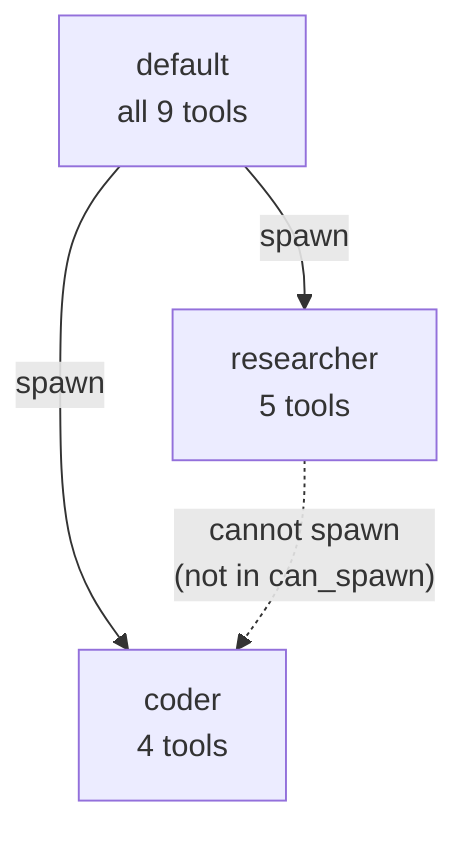
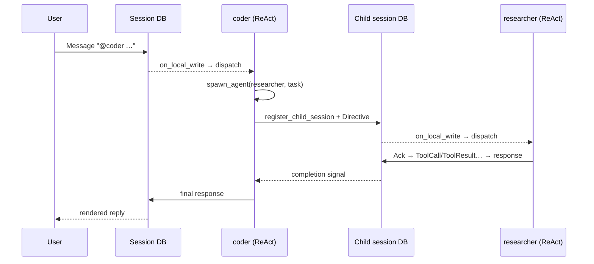
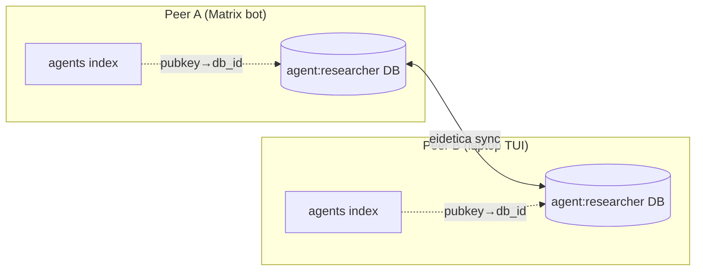

# Agents

Chaz agents have persistent identity as _Living Agents_ — each agent is its own eidetica database signed by a per-agent key. Whoever holds the key hosts the agent. Sessions declare participating agents by listing their pubkeys in the session's AuthSettings; routing follows key possession.

YAML `agents:` config is the bootstrap path: at startup, chaz materializes one Agent DB per yaml entry (idempotent), populating its `config` and `meta` stores from the yaml. Existing yaml workflows keep working; the DBs are what travel with eidetica sync.

## Defining Agents (bootstrap via YAML)

```yaml
agents:
  - name: default
    role: chaz # System prompt (from roles section)
    max_iterations: 10 # Max ReAct loop iterations before forced summary
    allowed_tools: null # null = all tools, or list specific tools
    can_spawn: # Which agents this one can delegate to
      - researcher
      - coder

  - name: researcher
    role: researcher
    max_iterations: 20
    allowed_tools:
      - web_fetch
      - calculate
      - get_time
      - remember
      - recall

  - name: coder
    role: coder
    max_iterations: 15
    allowed_tools:
      - shell
      - read_file
      - write_file
      - calculate
      - "filesystem.*" # Glob: all tools from "filesystem" MCP server
    presets:
      quick:
        max_iterations: 5
      deep:
        max_iterations: 30
```

At startup, each yaml entry becomes an Agent DB named `agent:<display_name>` on first boot only. On subsequent boots, existing DBs are reused without overwriting their `config` — yaml is a bootstrap template, and the AgentDb is the authoritative source of agent configuration once it exists. Edit live config with `/agent set <ref> <field> <value>`, which takes effect on the next message (no restart needed) via runtime hydration from the DB.

## Agent DB schema

Each Agent DB contains five well-known stores:

| Store          | Kind                         | Contents                                                                                    |
| -------------- | ---------------------------- | ------------------------------------------------------------------------------------------- |
| `config`       | DocStore                     | Serialized `AgentDbConfig`: role, model, allowed_tools, max_iterations, grants, presets     |
| `memory`       | `Table<MemoryEntry>`         | The agent's own persistent key-value facts (written by `remember`, read by `recall`)        |
| `meta`         | DocStore                     | `AgentMeta`: display_name, description, capabilities, avatar                                |
| `history`      | `Table<SessionHistoryEntry>` | Sessions this agent has participated in (appended on attach)                                |
| `memory_banks` | `Table<MemoryBankRef>`       | Refs to shared memory banks this agent has been granted access to (name, db_id, permission) |

The peer maintains two local indexes in its `chazdb` (the peer-local bookkeeping database): an `agents` DocStore for Living Agents and a `memory_banks` DocStore for standalone Memory Bank DBs. Both map `db_id → (display_name, pubkey)` and share the same `DbRegistry` type. Both exist because eidetica has no inverse "list DBs this key can access" query.

## Session participation

A session's _authoritative_ participant list is its eidetica AuthSettings. Adding an agent to a session grants its pubkey `Permission::Write` on the session DB; revoking removes it. The `SessionMeta.agents: Vec<AgentRef>` field is a readable cache that stays in sync.

### `/agent` commands

Every transport uses the same set of commands. TUI: `/agent <sub>`. Matrix: `!chaz agent <sub>`.

Every ref is either an agent's display name or its eidetica DB ID; resolution tries display name first.

| Command                      | What                                                                                                                           |
| ---------------------------- | ------------------------------------------------------------------------------------------------------------------------------ |
| `/agent add <ref>`           | Grant the agent Write permission on the session, append to `SessionMeta.agents`, log entry in the agent's history. Idempotent. |
| `/agent remove <ref>`        | Revoke the agent's session key and remove from `SessionMeta.agents`. History is append-only and is preserved.                  |
| `/agent list` (or `/agents`) | List agents attached to the current session. The _host_ agent is marked.                                                       |
| `/agent host <ref>`          | Designate the session's host agent (see turn-taking). Agent must already be attached.                                          |
| `/agent host` (no arg)       | Clear the host agent.                                                                                                          |

## Turn-taking

When a message arrives on a multi-agent session, routing picks one agent in this precedence:

1. Explicit override (scheduler `/run`, gateway directives).
2. **`@<name>` mention** in the message text — first token matching an attached agent's display_name wins. `@alpha`, `@beta-bot,`, `@gamma.` all work; `a@b.com` is ignored (no leading `@` at token start).
3. **Host agent** (`SessionMeta.host_agent_db_id`) if that agent is still attached.
4. First attached agent in AuthSettings order.
5. Legacy `SessionMeta.agent_name` (pre-Living-Agents sessions).
6. Default agent from yaml.

Mentions are case-insensitive and match exact display names. No prefix matching.

## Heartbeat rules

A heartbeat rule is a cron-scheduled trigger stored inside the session. The `HeartbeatRunner` on every peer polls hosted sessions every 30s; rules targeting agents this peer hosts get fired. Each firing writes a `Directive` entry to the session, just like a manual message, and the mention-aware router picks the target.

`last_fired` is tracked peer-locally in the `chazdb`, not in the synced rule — each peer hosting the target agent fires its own schedule independently.

### `/heartbeat` commands

Cron uses 6 fields: `sec min hour day_of_month month day_of_week`.

| Command                                                                        | What                                                         |
| ------------------------------------------------------------------------------ | ------------------------------------------------------------ |
| `/heartbeat list` (or bare `/heartbeat`)                                       | List rules on the current session.                           |
| `/heartbeat add <id> <sec> <min> <hour> <dom> <mon> <dow> <agent_ref> <task…>` | Upsert a rule keyed by `<id>`. Task may contain `@mentions`. |
| `/heartbeat remove <id>`                                                       | Remove a rule by id.                                         |

Example — make `researcher` post a morning briefing to the current session weekdays at 09:00:

```text
/heartbeat add brief 0 0 9 * * Mon-Fri researcher Summarize overnight activity and surface anything urgent.
```

## Tool Narrowing

Tool access is controlled at two levels:

1. **Agent definition**: `allowed_tools` restricts which tools an agent can see. Supports exact names and glob patterns (`"filesystem.*"` matches all tools from that MCP server namespace).
2. **Transitive narrowing**: When agent A spawns agent B, B's tools are the _intersection_ of A's tools and B's `allowed_tools`.

This means a child agent can never have more tools than its parent, even if its definition allows them.



## Spawn Permissions

The `can_spawn` field controls which agents can be delegated to. Permissions are checked bidirectionally:

- The calling agent must list the target in `can_spawn`.
- The target agent must exist in the registry.

Spawn depth is limited by `max_iterations` to prevent infinite recursion.

## Presets

Agents can define named presets that override fields:

```yaml
presets:
  quick:
    max_iterations: 5
  deep:
    max_iterations: 30
    role_suffix: "Be thorough and explore multiple angles."
```

The calling agent can request a preset via the `spawn_agent` tool:

```json
{ "agent": "researcher", "task": "...", "preset": "deep" }
```

## Synchronous vs Asynchronous Spawn

By default, `spawn_agent` waits for the child agent to complete and returns the result. With `"async": true`, it returns immediately and the child runs in the background:

```json
{ "agent": "researcher", "task": "...", "async": true }
```

Async spawns return the child session ID, which can be found via `/sessions` in the TUI.

## How Spawn Works Internally

When an agent calls `spawn_agent`:

1. A new session database is created via the server's `register_child_session`.
2. A `Directive` entry is written to the child session.
3. The server's `on_local_write` callback detects the directive and spawns an agent task.
4. The agent runs the ReAct loop, writing Ack, ToolCall, ToolResult, and response entries.
5. A completion signal notifies the parent (for synchronous spawns).
6. The parent reads the response from the child session.

This routes through the same server processing path as user messages, unifying all agent invocation.

## Lifecycle Overview

An agent moves through a small number of states, and the commands that drive those transitions mirror them closely.

```mermaid
stateDiagram-v2
    [*] --> Declared: yaml agents: entry
    Declared --> Hosted: bootstrap creates AgentDb + key
    [*] --> Hosted: /agent new <name>
    Hosted --> Attached: /agent add <ref>
    Attached --> Running: message / Directive arrives
    Running --> Attached: response written
    Attached --> Hosted: /agent remove <ref>
    Hosted --> Shared: /agent share → ticket
    Shared --> Hosted: /agent import ticket (on peer B)
    Hosted --> [*]: /agent delete (index row only; DB preserved)
```



Key invariants:

- **Hosted** means this peer holds the per-agent private key — eidetica authorisation, not a config flag, is what decides. The local `agents` index in `chazdb` tracks which DBs that's true for.
- **Attached** means the agent's pubkey has `Permission::Write` on a specific session DB. A single agent can be attached to many sessions.
- Every transition writes to an eidetica DB; there is no in-memory-only agent state that survives a restart.

## End-to-End Walkthrough: Creating and Using an Agent

This walks through the full lifecycle against the TUI. Matrix uses the same commands under `!chaz <cmd>`.

### 1. Create the agent

Either declare it in yaml (bootstrapped once, on first start):

```yaml
agents:
  - name: researcher
    role: researcher
    max_iterations: 20
    allowed_tools: [web_fetch, calculate, remember, recall]
```

…or create one live:

```text
/agent new researcher role=researcher max_iterations=20 tools=web_fetch,calculate,remember,recall
```

Either path produces an Agent DB (`agent:researcher`) signed by a fresh per-agent key, plus a row in the local `agents` index.

### 2. Tweak config without restarting

Edits flow through `/agent set`. The server re-reads each agent's `AgentDb::config` per message, so changes take effect on the _next_ message:

```text
/agent set researcher max_iterations 30
/agent set researcher role deep-researcher
```

No yaml reload, no restart.

### 3. Attach the agent to a session

```text
/agent add researcher
/agent list
```

`/agent add` writes the agent's pubkey to the session's `AuthSettings` (authoritative), mirrors an `AgentRef` into `SessionMeta.agents` (readable cache), and appends a row to the agent's own `history` Table.

### 4. Send messages — with or without mentions

If there's only one agent attached, every message goes to it. Attach a second agent and you pick per-message with `@name`:

```text
/agent add coder
@researcher summarise the linked paper
@coder write a minimal repro in Rust
```

Unmentioned messages fall through: host agent → first attached → default.

### 5. Delegate via `spawn_agent`

Once `coder` lists `researcher` in its `can_spawn`, `coder` can call the `spawn_agent` tool mid-ReAct:

```json
{ "agent": "researcher", "task": "find the canonical reference", "preset": "deep" }
```

The parent blocks on completion (sync) or gets a child session ID back (`async: true`) and continues.



### 6. Schedule heartbeats

```text
/heartbeat add brief 0 0 9 * * Mon-Fri researcher Summarise overnight activity
```

Every peer hosting `researcher` polls its sessions every 30s. When a rule fires, it writes a `Directive` — indistinguishable from a user message from the router's perspective.

### 7. Share the agent with another peer

```text
/agent share researcher
# → eidetica:?db=sha256:…&pr=http:…
```

On peer B:

```text
/agent import eidetica:?db=sha256:…&pr=http:…
```

If the ticket carries a key, peer B _hosts_ the agent too: both peers can route turns to it, and the fastest to respond wins (the server's per-session serialisation prevents duplicate replies). Without a key it's read-only — peer B sees the agent exist in sync but can't run it.

### 8. Detach or delete

```text
/agent remove researcher   # session-scoped: revoke AuthSettings, keep DB
/agent delete researcher   # peer-scoped: unregister from local index (DB preserved for archive)
```

History is append-only; detach does not erase it.

## Multi-Peer Topology

A single agent DB can be hosted by several peers simultaneously. Each keeps its own copy of the key and the index row; eidetica sync replicates `config`, `memory`, `meta`, `history`, and `memory_banks`.



Turn-taking within a session is still per-entry: whichever peer reads the new entry first and has the target agent hosted picks it up.
