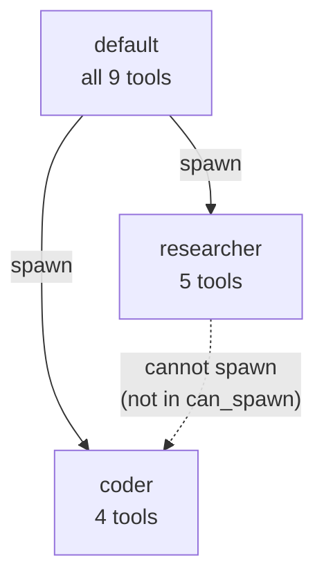

# Agents

Chaz supports multiple agent definitions with different roles, tool access, and spawn permissions. Agents are configured in YAML and orchestrated at runtime.

## Defining Agents

Agents are defined in the `agents` section of the config:

```yaml
agents:
  - name: default
    role: chaz # System prompt (from roles section)
    max_iterations: 10 # Max ReAct loop iterations before forced summary
    allowed_tools: null # null = all tools, or list specific tools
    can_spawn: # Which agents this one can delegate to
      - researcher
      - coder

  - name: researcher
    role: researcher
    max_iterations: 20
    allowed_tools:
      - web_fetch
      - calculate
      - get_time
      - remember
      - recall

  - name: coder
    role: coder
    max_iterations: 15
    allowed_tools:
      - shell
      - read_file
      - write_file
      - calculate
      - "filesystem.*" # Glob: all tools from "filesystem" MCP server
    presets:
      quick:
        max_iterations: 5
      deep:
        max_iterations: 30
```

## Agent Selection

Agent selection is a per-session setting (stored in the session's `meta.agent_name`), not a per-room setting. That means a session's agent choice travels with the session over eidetica sync and is shared between every channel attached to it.

- **Matrix**: The session attached to the room determines the agent. Change it by running `!chaz attach` to a different session or by setting a new agent via configuration/spawn-level overrides.
- **TUI**: The agent is read from the current session's `meta`. Switch sessions with `/join` or `/new` to change context.
- **spawn_agent**: The calling agent names the target agent explicitly.

## Tool Narrowing

Tool access is controlled at two levels:

1. **Agent definition**: `allowed_tools` restricts which tools an agent can see. Supports exact names and glob patterns (`"filesystem.*"` matches all tools from that MCP server namespace).
2. **Transitive narrowing**: When agent A spawns agent B, B's tools are the _intersection_ of A's tools and B's `allowed_tools`

This means a child agent can never have more tools than its parent, even if its definition allows them. Glob patterns in child allowlists are expanded against the registry and intersected with the parent's scope.



## Spawn Permissions

The `can_spawn` field controls which agents can be delegated to. Permissions are checked bidirectionally:

- The calling agent must list the target in `can_spawn`
- The target agent must exist in the registry

Spawn depth is limited by `max_iterations` to prevent infinite recursion.

## Presets

Agents can define named presets that override fields:

```yaml
presets:
  quick:
    max_iterations: 5
  deep:
    max_iterations: 30
    role_suffix: "Be thorough and explore multiple angles."
```

The calling agent can request a preset via the `spawn_agent` tool:

```json
{ "agent": "researcher", "task": "...", "preset": "deep" }
```

## Synchronous vs Asynchronous Spawn

By default, `spawn_agent` waits for the child agent to complete and returns the result. With `"async": true`, it returns immediately and the child runs in the background:

```json
{ "agent": "researcher", "task": "...", "async": true }
```

Async spawns return the child session ID, which can be found via `/sessions` in the TUI.

## How Spawn Works Internally

When an agent calls `spawn_agent`:

1. A new session database is created via the server's `register_child_session`
2. A `Directive` entry is written to the child session
3. The server's `on_local_write` callback detects the directive and spawns an agent task
4. The agent runs the ReAct loop, writing Ack, ToolCall, ToolResult, and response entries
5. A completion signal notifies the parent (for synchronous spawns)
6. The parent reads the response from the child session

This routes through the same server processing path as user messages, unifying all agent invocation.
