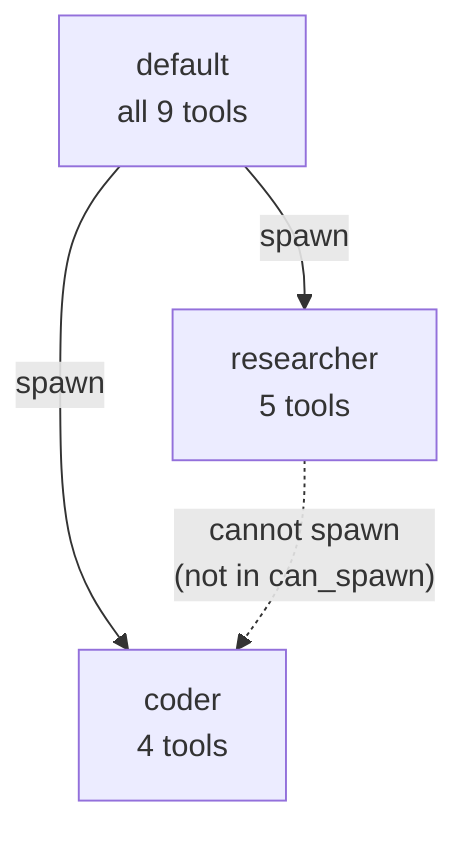
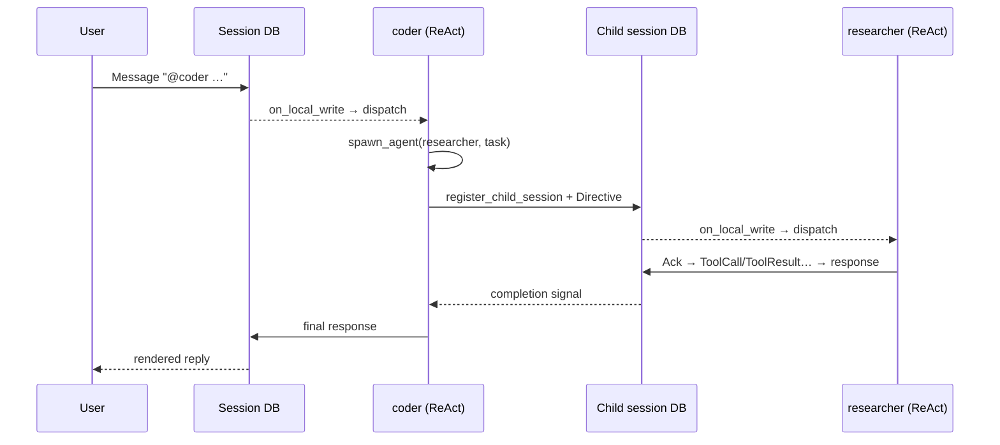
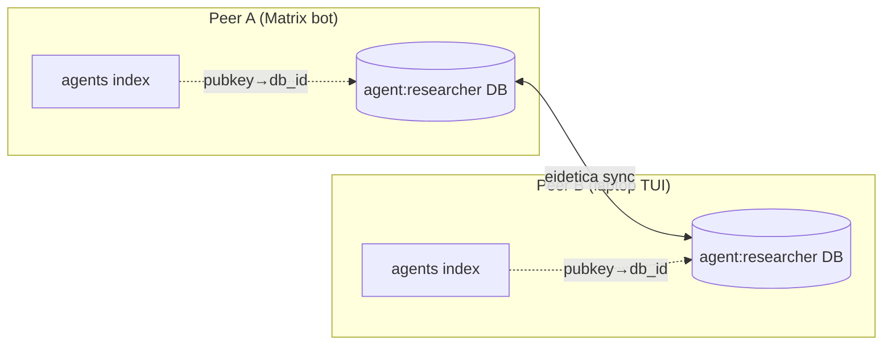

# Agents

Chaz agents have persistent identity as _Living Agents_ — each agent is its own eidetica database signed by a per-agent key. Whoever holds the key hosts the agent. Sessions declare participating agents by listing their pubkeys in the session's AuthSettings; routing follows key possession.

YAML `agents:` config is the bootstrap path: at startup, chaz materializes one Agent DB per yaml entry (idempotent), populating its `config` and `meta` stores from the yaml. Existing yaml workflows keep working; the DBs are what travel with eidetica sync.

## Defining Agents (bootstrap via YAML)

```yaml
agents:
  - name: default
    persona: # System prompt (file includes + inline text)
      description: "the default chaz agent"
      files:
        - ~/AGENTS.md # Tilde expands to $HOME
      prompt: |
        Stay terse on Matrix.
    max_iterations: 10 # Max ReAct loop iterations before forced summary
    allowed_tools: null # null = all tools, or list specific tools
    can_spawn: # Which agents this one can delegate to
      - researcher
      - coder

  - name: researcher
    persona:
      description: "tracks down sources and synthesizes"
      prompt: "You are a researcher. Cite primary sources."
    max_iterations: 20
    allowed_tools:
      - web_fetch
      - calculate
      - get_time
      - remember
      - recall

  - name: coder
    persona:
      prompt: "You are a careful Rust engineer. Edit files in-place; don't rewrite from scratch."
    max_iterations: 15
    allowed_tools:
      - shell
      - read_file
      - write_file
      - calculate
      - "filesystem.*" # Glob: all tools from "filesystem" MCP server
    presets:
      quick:
        max_iterations: 5
      deep:
        max_iterations: 30
```

At startup, each yaml entry becomes an Agent DB named `agent:<display_name>` on first boot only. On subsequent boots, existing DBs are reused without overwriting their `config` — yaml is a bootstrap template, and the AgentDb is the authoritative source of agent configuration once it exists. Edit live config with `/agent set <ref> <field> <value>`, which takes effect on the next message (no restart needed) via runtime hydration from the DB.

## Personas (system prompts)

A persona is what shapes the LLM's behavior — what older systems called the "system prompt." It has three pieces, all optional:

| Field         | Type          | Notes                                                         |
| ------------- | ------------- | ------------------------------------------------------------- |
| `description` | `String`      | Surfaced in `/agent persona show`. Doesn't enter the prompt.  |
| `files`       | `Vec<String>` | Paths concatenated in order. `~`/`~/...` expansion supported. |
| `prompt`      | `String`      | Inline text appended after file content.                      |

### Snapshots: deterministic prompts per session

When an agent is attached to a session, chaz reads each `files:` path, hashes the content with blake3, and writes a single audit-only `PersonaSnapshot` entry to the session's eidetica DB. That snapshot is what ContextBuilder injects as the system message — **disk edits to the source files do not silently mutate ongoing sessions**. To pick up file changes, run:

```text
/agent persona bump <ref>
```

This re-resolves the persona and writes a fresh snapshot. Each snapshot records the source files, their byte counts, and their hashes, so months later you can audit "what instructions was the agent running with on 2026-05-07?"

### Editing a persona

Persona fields are edited through `/agent set` with dotted keys; the change writes to the AgentDb and triggers a fresh snapshot on the active session.

| Command                                          | Effect                                                                                 |
| ------------------------------------------------ | -------------------------------------------------------------------------------------- |
| `/agent set <ref> persona.files <path1>,<path2>` | Replace the file list (comma-separated, supports `~`).                                 |
| `/agent set <ref> persona.prompt "<text>"`       | Set the inline prompt text (empty string clears it).                                   |
| `/agent set <ref> persona.description "<text>"`  | Update the description label.                                                          |
| `/agent set <ref> persona.clear x`               | Drop the persona entirely. The agent falls back to the migrated `role:` lookup if any. |
| `/agent persona show <ref>`                      | Print current persona definition + latest snapshot summary.                            |
| `/agent persona bump <ref>`                      | Re-resolve files and write a new snapshot.                                             |

### Migrating from `role:`

Older configs used a top-level `roles:` block plus an `agent.role:` reference:

```yaml
roles:
  - name: chaz
    prompt: "..."
agents:
  - name: default
    role: chaz
```

Both still parse for one release, with a deprecation warning at startup. At runtime, an agent with `role:` set and `persona:` unset gets a synthetic persona built from the role's prompt — same behavior, different shape. New configs should drop `roles:` and put the prompt directly under the agent's `persona:`.

## Agent DB schema

Each Agent DB contains five well-known stores:

| Store          | Kind                         | Contents                                                                                    |
| -------------- | ---------------------------- | ------------------------------------------------------------------------------------------- |
| `config`       | DocStore                     | Serialized `AgentDbConfig`: role, model, allowed_tools, max_iterations, grants, presets     |
| `memory`       | `Table<MemoryEntry>`         | The agent's own persistent key-value facts (written by `remember`, read by `recall`)        |
| `meta`         | DocStore                     | `AgentMeta`: display_name, description, capabilities, avatar                                |
| `history`      | `Table<SessionHistoryEntry>` | Sessions this agent has participated in (appended on attach)                                |
| `memory_banks` | `Table<MemoryBankRef>`       | Refs to shared memory banks this agent has been granted access to (name, db_id, permission) |

The peer maintains two **in-memory** indices (`hosted_index::HostedIndex`) — one for Living Agents and one for standalone Memory Bank DBs — built once at startup by walking eidetica's `user.databases()` and reading each DB's `meta.kind` marker (`agent` / `bank` / `session`, written at creation time). Both indices map `db_id ↔ display_name ↔ pubkey`. They exist because eidetica has no inverse "list DBs this key can access" query, and routing reads them on every session entry. Mutations from `/agent new`, `/memory new`, `/agent delete`, etc. update the cache directly. There is no persistent mirror — eidetica's key store is the single source of truth for "which DBs does this peer host."

## Session participation

A session's _authoritative_ participant list is its eidetica AuthSettings. Adding an agent to a session grants its pubkey `Permission::Write` on the session DB; revoking removes it. The `SessionMeta.agents: Vec<AgentRef>` field is a readable cache that stays in sync.

### `/agent` commands

Every transport uses the same set of commands. TUI: `/agent <sub>`. Matrix: `!chaz agent <sub>`.

Every ref is either an agent's display name or its eidetica DB ID; resolution tries display name first.

| Command                      | What                                                                                                                                   |
| ---------------------------- | -------------------------------------------------------------------------------------------------------------------------------------- |
| `/agent add <ref>`           | Grant the agent Write permission on the session, append to `SessionMeta.agents`, log entry in the agent's history. Idempotent.         |
| `/agent remove <ref>`        | Revoke the agent's session key and remove from `SessionMeta.agents`. History is append-only and is preserved.                          |
| `/agent list` (or `/agents`) | List agents attached to the current session. The _host_ agent is marked.                                                               |
| `/agent host <ref>`          | Designate the session's host agent (see turn-taking). Agent must already be attached.                                                  |
| `/agent host` (no arg)       | Clear the host agent.                                                                                                                  |
| `/agent room`                | Chat-room status: attached roster, designated host (flags a dangling host id), and the agent→agent burst-budget state (`used/budget`). |

### Lifecycle, sharing, and co-ownership

These aren't session-scoped; they act on the Living Agent itself.

| Command                                             | What                                                                                                                                                                                               |
| --------------------------------------------------- | -------------------------------------------------------------------------------------------------------------------------------------------------------------------------------------------------- |
| `/agent new <name> [k=v ...]`                       | Create a new Living Agent DB. Optional `k=v` for `role`/`model`/`tools`/`can_spawn`/`allowed_callers`/`autonomous`/`max_iterations`/`tool_profile`/`max_context_tokens`.                           |
| `/agent set <ref> <field> <value>`                  | Edit one field on the agent's DB config. Takes effect on the next message via live hydration — no restart.                                                                                         |
| `/agent hosted`                                     | List every Living Agent this peer hosts (from the in-memory hosted-agents index).                                                                                                                  |
| `/agent delete <ref>`                               | Unregister locally (index + runtime registry). The DB is **preserved** for archive. Refuses if the agent is still attached to any known session.                                                   |
| `/agent share <ref>`                                | Generate a `DatabaseTicket` URL for the agent's DB, so another peer can sync it.                                                                                                                   |
| `/agent unshare <ref>`                              | Stop sharing the agent's DB — disable sync so this peer stops serving it. Does not revoke keys already held by peers who imported it.                                                              |
| `/agent import <ticket> [admin\|write\|read]`       | Request access to a synced agent DB via the bootstrap workflow. Default `write`. If the receiver's key is preseeded, sync proceeds; otherwise queues a request for the owner's `/sharing approve`. |
| `/pubkey`                                           | Print this peer's default pubkey, for pasting into an owner's `/agent invite`.                                                                                                                     |
| `/agent invite <ref> <pubkey> [admin\|write\|read]` | Preseed another peer's pubkey on this agent's DB so their `/agent import` succeeds without an approval round-trip. Default `admin` (`Admin(1)`).                                                   |
| `/agent revoke-peer <ref> <pubkey>`                 | Revoke a previously-invited pubkey. Historical entries signed by it remain verifiable; no new writes. Cannot revoke this peer's own key (use `/agent delete` for that).                            |
| `/sharing` or `/sharing status`                     | List every database this peer is currently sharing, grouped by kind (agent / bank / session) with DB root IDs.                                                                                     |
| `/sharing requests`                                 | List bootstrap requests pending an admin's approval on this peer (covers agents, banks, sessions — eidetica's queue is unified).                                                                   |
| `/sharing approve <id>`                             | Approve a queued bootstrap request, granting the requester their requested permission.                                                                                                             |
| `/sharing reject <id>`                              | Reject a queued bootstrap request.                                                                                                                                                                 |

## Turn-taking

When a message arrives on a multi-agent session, routing picks one agent in this precedence:

1. Explicit override (gateway/schedule directives).
2. **`@<name>` mention** in the message text — first token matching an attached agent's display_name wins. `@alpha`, `@beta-bot,`, `@gamma.` all work; `a@b.com` is ignored (no leading `@` at token start).
3. **Host agent** (`SessionMeta.host_agent_db_id`) if that agent is still attached.
4. First attached agent in AuthSettings order.
5. Legacy `SessionMeta.agent_name` (pre-Living-Agents sessions).
6. Default agent from yaml.

Mentions are case-insensitive and match exact display names. No prefix matching.

If a human `@mentions` a name that is **not** an attached agent (typo, or an
agent that was detached), the turn does **not** fail — it falls through to
host / first-attached. That fallback is logged at `WARN` (with the
mentioned vs. attached names) so a misroute is observable rather than
silent. Use `/agent room` to see the live roster and diagnose it.

### Agent→agent burst budget

In a multi-agent session an agent's reply can `@mention` and wake another
attached agent. The runaway backstop is a **burst budget**: the maximum
run of consecutive agent-authored messages since the last human message or
`Directive`. When the trailing burst reaches the budget, further
agent→agent wakes are suppressed until a human (or a schedule) speaks
again. The default is **6**; operators set it via `multi_agent.burst_budget`
in config (see [Configuration](./configuration.md)). `/agent room` shows
the current `used/budget` and whether it is exhausted.

Detaching the agent currently designated as host clears
`host_agent_db_id` automatically, so a removed host can't leave a dangling
pointer that silently re-routes turns.

## Schedules

A schedule is a time-driven, **agent-owned** wake. It lives in the owning agent's DB `schedules` store (so it syncs and travels with the agent, exactly like its persona), not in any session. The chaz `RoutineEngine` (one per peer) sleeps until the next due fire across every hosted agent's schedules, then runs the **standalone fire path**: it loads the owning agent, resolves the schedule's target, and runs that agent's turn directly. The schedule's `prompt` is invocation-scoped input for that turn — it is **not** written as a broadcast `Directive` entry, and there is no "resolve who responds" step (the schedule names its owner). A peer that doesn't host the owning agent silently skips, so multi-peer setups don't double-fire.

Each schedule has a **target**: `Pinned` (fire into a specific existing session) or `Fresh` (create a new session per fire — an autonomous recurring task). Two trigger shapes:

- **Cron triggers** fire on a recurring schedule (`cron: "0 */5 * * * *"`). Each peer hosting the owning agent fires independently.
- **One-shot triggers** fire once at an absolute `fire_at`, then the engine drops the schedule. These back the `schedule_once` tool described in [Tools](./tools.md).

**Lifecycle bounds.** A cron schedule is infinite by default. Two optional bounds make finite recurring work expressible without inventing a new trigger type:

- `max_fires` — retire after N fires. `cron` hourly + `max_fires: 8` = "wake hourly for 8 hours".
- `expires_at` — an RFC 3339 instant after which it stops.

Whichever is hit first retires the schedule: the fire path (the authoritative chokepoint, which holds the agent DB) persists `enabled = false` and the per-fire `fire_count`, so `max_fires` survives restarts and a retired schedule is **not** re-seeded on reload. A retired schedule is kept (disabled) rather than deleted so its history stays auditable — `schedule_list` shows the bounds and a `[fired N×]` counter. (Implementation note: the in-memory routine keeps its cron slot until the next reload/restart, but every post-bound tick early-returns at the fire path without running the agent — correctness is at the chokepoint, not the heap.)

A schedule whose `Pinned` session is gone, or whose owning agent is no longer a member, self-skips at fire time (logged, not errored) — there is no detach/delete sweep.

Fire timing is sleep-until-next, capped at a 5-minute idle wake so a wall-clock jump can't strand a routine. The engine fires due rules within seconds of their scheduled time rather than waiting for a poll interval.

### Entry points

Routines are created two ways, both compiling to the same `Routine` rows fired by the one engine:

- **Interactive** — the `/schedule add|remove|list` command and the `schedule_add|modify|remove|list` / `schedule_once` tools (this section and [Tools](./tools.md)). This is the only interactive surface; there is no separate `/schedule` command.
- **Static config** — the `schedules:` block in the chaz config ([Configuration](./configuration.md)), translated into session-scoped routines at startup.

### When rules fire

Firing is **server-side and independent of any UI**. A rule fires whenever chaz is running and the session is registered — you do _not_ need the session open or focused in the TUI, and for Matrix no one needs to be in the room. The fire writes the `Directive` and the agent turn runs on the server regardless; a gateway only affects when you _see_ the result.

- **chaz must be running.** The engine is one per-process task, not a system cron. While chaz is down nothing fires, and a missed cron tick is skipped, not backfilled (`last_fired` just anchors the next fire after restart). A one-shot whose `fire_at` passed while down fires once on the next start.
- **The session must still be registered.** Closing/deregistering a session prunes its routines from the engine, so a closed session stops firing.
- **The target agent must be hosted on this peer** — otherwise the handler silently skips (the multi-peer dedupe above).
- **Changes are live.** `/schedule add|remove`, `schedule_modify`, and `schedule_once` take effect on the running engine immediately — no restart needed.

### `/schedule` commands

Cron uses 6 fields: `sec min hour day_of_month month day_of_week`.

| Command                                                                       | What                                                                                                                        |
| ----------------------------------------------------------------------------- | --------------------------------------------------------------------------------------------------------------------------- |
| `/schedule list` (or bare `/schedule`)                                        | List rules on the current session. One-shot rules are rendered with an `@YYYY-MM-DD HH:MM:SSZ` marker in place of the cron. |
| `/schedule add <id> <sec> <min> <hour> <dom> <mon> <dow> <agent_ref> <task…>` | Upsert a cron rule keyed by `<id>`. Task may contain `@mentions`.                                                           |
| `/schedule remove <id>`                                                       | Remove a rule by id (cron or one-shot).                                                                                     |

To create a one-shot rule from the TUI, agents call the `schedule_once` tool. There's no slash-command form yet.

Example — make `researcher` post a morning briefing to the current session weekdays at 09:00:

```text
/schedule add brief 0 0 9 * * Mon-Fri researcher Summarize overnight activity and surface anything urgent.
```

## Tool Narrowing

Tool access is controlled at two levels:

1. **Agent definition**: `allowed_tools` restricts which tools an agent can see. Supports exact names and glob patterns (`"filesystem.*"` matches all tools from that MCP server namespace).
2. **Transitive narrowing**: When agent A spawns agent B, B's tools are the _intersection_ of A's tools and B's `allowed_tools`.

This means a child agent can never have more tools than its parent, even if its definition allows them.



## Spawn Permissions

The `can_spawn` field controls which agents can be delegated to. Permissions are checked bidirectionally:

- The calling agent must list the target in `can_spawn`.
- The target agent must exist in the registry.

Spawn depth is limited by `max_iterations` to prevent infinite recursion.

## Presets

Agents can define named presets that override fields:

```yaml
presets:
  quick:
    max_iterations: 5
  deep:
    max_iterations: 30
    role_suffix: "Be thorough and explore multiple angles."
```

The calling agent can request a preset via the `spawn_agent` tool:

```json
{ "agent": "researcher", "task": "...", "preset": "deep" }
```

## Synchronous vs Asynchronous Spawn

By default, `spawn_agent` waits for the child agent to complete and returns the result. With `"async": true`, it returns immediately and the child runs in the background:

```json
{ "agent": "researcher", "task": "...", "async": true }
```

Async spawns return the child session ID, which can be found via `/sessions` in the TUI.

## How Spawn Works Internally

When an agent calls `spawn_agent`:

1. A new session database is created via the server's `register_child_session`.
2. A `Directive` entry is written to the child session.
3. The server's `on_local_write` callback detects the directive and spawns an agent task.
4. The agent runs the ReAct loop, writing Ack, ToolCall, ToolResult, and response entries.
5. A completion signal notifies the parent (for synchronous spawns).
6. The parent reads the response from the child session.

This routes through the same server processing path as user messages, unifying all agent invocation.

## Lifecycle Overview

An agent moves through a small number of states, and the commands that drive those transitions mirror them closely.

```mermaid
stateDiagram-v2
    [*] --> Declared: yaml agents: entry
    Declared --> Hosted: bootstrap creates AgentDb + key
    [*] --> Hosted: /agent new <name>
    Hosted --> Attached: /agent add <ref>
    Attached --> Running: message / Directive arrives
    Running --> Attached: response written
    Attached --> Hosted: /agent remove <ref>
    Hosted --> Invited: /agent invite <peer-pubkey> (preseed)
    Invited --> CoHosted: /agent share → /agent import (peer B)
    Hosted --> Requested: /agent share → /agent import (peer B, no preseed)
    Requested --> CoHosted: /sharing approve (owner) → re-run /agent import (peer B)
    CoHosted --> Hosted: /agent revoke-peer (by owner)
    Hosted --> [*]: /agent delete (index row only; DB preserved)
```



Key invariants:

- **Hosted** means this peer holds the per-agent private key — eidetica authorisation, not a config flag, is what decides. The in-memory `agents` index (built from eidetica's tracked-DBs list at startup) reflects which DBs that's true for.
- **Attached** means the agent's pubkey has `Permission::Write` on a specific session DB. A single agent can be attached to many sessions.
- Every transition writes to an eidetica DB; there is no in-memory-only agent state that survives a restart.

## End-to-End Walkthrough: Creating and Using an Agent

This walks through the full lifecycle against the TUI. Matrix uses the same commands under `!chaz <cmd>`.

### 1. Create the agent

Either declare it in yaml (bootstrapped once, on first start):

```yaml
agents:
  - name: researcher
    role: researcher
    max_iterations: 20
    allowed_tools: [web_fetch, calculate, remember, recall]
```

…or create one live:

```text
/agent new researcher role=researcher max_iterations=20 tools=web_fetch,calculate,remember,recall
```

Either path produces an Agent DB (`agent:researcher`) signed by a fresh per-agent key, plus a row in the local `agents` index.

### 2. Tweak config without restarting

Edits flow through `/agent set`. The server re-reads each agent's `AgentDb::config` per message, so changes take effect on the _next_ message:

```text
/agent set researcher max_iterations 30
/agent set researcher role deep-researcher
```

No yaml reload, no restart.

### 3. Attach the agent to a session

```text
/agent add researcher
/agent list
```

`/agent add` writes the agent's pubkey to the session's `AuthSettings` (authoritative), mirrors an `AgentRef` into `SessionMeta.agents` (readable cache), and appends a row to the agent's own `history` Table.

### 4. Send messages — with or without mentions

If there's only one agent attached, every message goes to it. Attach a second agent and you pick per-message with `@name`:

```text
/agent add coder
@researcher summarise the linked paper
@coder write a minimal repro in Rust
```

Unmentioned messages fall through: host agent → first attached → default.

### 5. Delegate via `spawn_agent`

Once `coder` lists `researcher` in its `can_spawn`, `coder` can call the `spawn_agent` tool mid-ReAct:

```json
{
  "agent": "researcher",
  "task": "find the canonical reference",
  "preset": "deep"
}
```

The parent blocks on completion (sync) or gets a child session ID back (`async: true`) and continues.



### 6. Schedules

```text
/schedule add brief 0 0 9 * * Mon-Fri researcher Summarise overnight activity
```

The schedule is stored in `researcher`'s DB. Every peer hosting `researcher` runs its own copy (sleep-until-next, no polling). When it fires, the standalone path runs `researcher`'s turn directly with the prompt as invocation input — no `Directive` is written — whether or not anyone is watching the session.

### 7. Share the agent with another peer (co-ownership)

Chaz uses a **preseed-pubkey** model for co-ownership: keys stay peer-local, and the owner authorises a second peer by writing that peer's pubkey into the agent DB's `AuthSettings`. The share ticket then only carries the DB reference — no key material ever crosses the wire.

On peer B, get the pubkey to paste:

```text
/pubkey
# → ed25519:AbCd…xyz
```

On peer A (the agent's current owner), invite that pubkey and share the DB:

```text
/agent invite researcher ed25519:AbCd…xyz admin
# → Invited ed25519:AbCd… as Admin on agent 'researcher' (DB sha256:…).

/agent share researcher
# → eidetica:?db=sha256:…&pr=http:…
```

On peer B, import the ticket:

```text
/agent import eidetica:?db=sha256:…&pr=http:…
```

Because peer B already holds a key for the DB (it's the one the owner pre-authorised), `/agent import` registers the agent under peer B's own key. Both peers now host the agent: either can attach it to sessions, edit config, run turns — and `/agent share` + `/agent import` can daisy-chain further peers from there. The server's per-session serialisation prevents duplicate replies when two peers race on the same message.

`/agent invite` takes an optional permission — `admin` (default), `write`, or `read`:

| Token   | Eidetica permission | Co-owner can …                                                                                                      |
| ------- | ------------------- | ------------------------------------------------------------------------------------------------------------------- |
| `admin` | `Admin(1)`          | Edit config/memory, grant Read/Write to further peers. **Cannot revoke the original owner** (who holds `Admin(0)`). |
| `write` | `Write(10)`         | Append memory/history entries, attach the agent to their own sessions — but not edit settings or invite others.     |
| `read`  | `Read`              | Sync + open the DB, read config/memory/history. No writes at all.                                                   |

To revoke a co-owner later:

```text
/agent revoke-peer researcher ed25519:AbCd…xyz
```

Historical entries the revoked peer signed remain verifiable — no new writes under that key are accepted. (Revoking **this** peer's own key on an agent is rejected; use `/agent delete` to unregister the agent locally instead.)

**Note**: `Admin(0)` stays with the creating peer — there is no "handover primary ownership" flow today. Multi-tier admin grants (`Admin(2)`, `Admin(3)`, …) aren't exposed yet either.

### 8. Detach or delete

```text
/agent remove researcher   # session-scoped: revoke AuthSettings, keep DB
/agent delete researcher   # peer-scoped: unregister from local index (DB preserved for archive)
```

History is append-only; detach does not erase it.

## Multi-Peer Topology

A single agent DB can be hosted by several peers simultaneously. Each peer holds its _own_ keypair — `/pubkey` + `/agent invite` is the handshake that pre-authorises a second peer's pubkey on the DB before the ticket ever moves. The keys never sync; only DB entries do.

Each peer keeps its own row in its local `agents` index; eidetica sync replicates `config`, `memory`, `meta`, `history`, and `memory_banks` between peers. Session `AuthSettings` lists each peer's pubkey separately, so routing treats them as distinct authorised writers — whichever peer picks up the entry first answers.



Turn-taking within a session is still per-entry: whichever peer reads the new entry first and has the target agent hosted picks it up.
