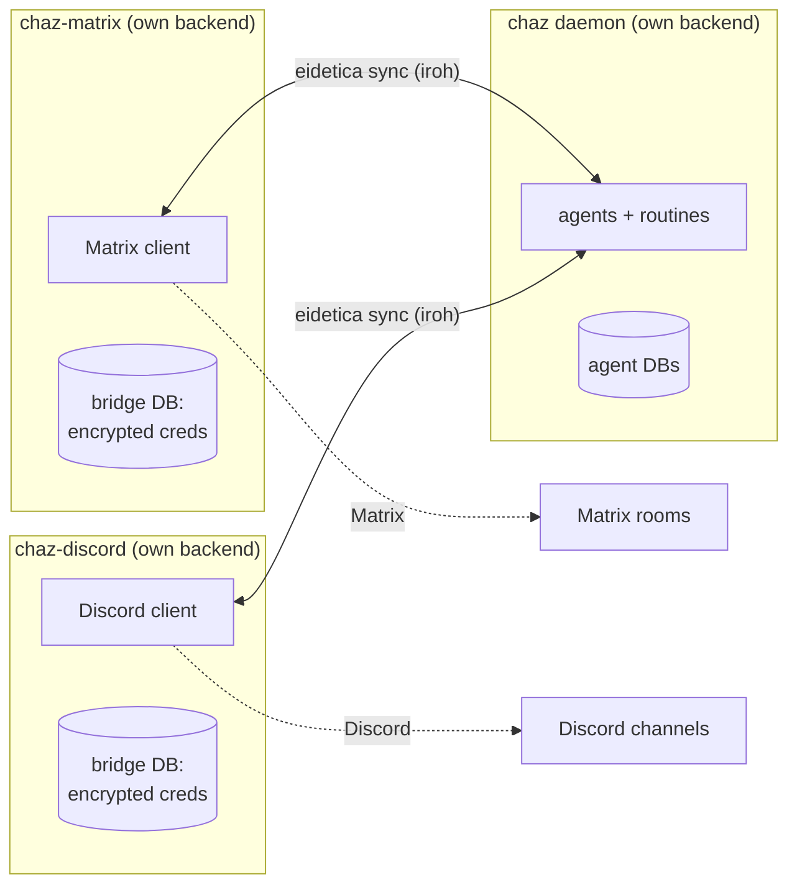

# Transport Bridges

A **bridge** connects chaz to a chat transport — Matrix or Discord — translating
messages between a transport's rooms/channels and chaz session databases.

Each bridge is a **standalone binary**: `chaz-matrix` and `chaz-discord` are
separate processes from the `chaz` daemon. They are transport I/O — they carry
messages in and replies out — and the configured executor runs the agents.
Like every Chaz process, a bridge connects to Eidetica through explicit
settings (see [Connection settings](#connection-settings)): as a **direct
owner** it is its own Eidetica peer with its own key and database, reaching the
executor's agent over eidetica sync; as a **service client** it shares the
Eidetica daemon's login with the executor and needs no sync setup of its own.

This page covers the architecture and the one-time setup/approval flow common to
both bridges. For transport-specific configuration see [Matrix Bot](matrix.md)
and [Discord Bot](discord.md).

## Why bridges are separate processes

Earlier versions ran the Matrix bridge inside the `chaz` process and read its
credentials (`homeserver_url`, `username`, `password`) from the central config.
That coupling is gone. Now:

- **A login belongs to exactly one agent.** A bridge's job is to route one
  transport account's traffic to one owning agent's sessions.
- **Credentials never sit in the daemon's config or database.** Each bridge owns
  an encrypted settings database (a `PasswordStore`) holding its own
  homeserver/token/allow-list, unlocked by a password the daemon never sees. The
  daemon stores only a non-secret pointer (a `LoginRef`) in the agent's database
  saying "a login of this kind exists, managed by this bridge DB."
- **The daemon owns no transport config at all.** It runs agents, the TUI, and
  the CLI. Bridges are independently deployable — a different host, a separate
  `systemd` unit, its own restart lifecycle.

The following diagram shows **direct-owner** bridges. Service clients instead
share the Eidetica daemon login and use its Unix socket, without tickets or
peer-to-peer sync. Both layouts keep transport processes separate from the
agent executor.



In this direct-owner layout, three peers have separate backend files and sync
over iroh. Access to an agent DB is granted with a ticket (see below), as in
[Sharing & Sync](session_sharing.md). Service clients connect to one daemon
backend through Eidetica instead; they do not use this ticket flow.

## Connection settings

A bridge's config file carries the same `execution:` and `eidetica:` keys as
every other entry point ([Configuration](configuration.md#eidetica-connection-and-execution-role)).
The execution role is explicit: a bridge deployment is normally `client`, and
nothing about the binary forces or assumes that.

As its own Eidetica peer (the layout the setup below describes):

```yaml
execution: client
eidetica:
  connection: "sqlite:///var/lib/chaz-matrix/eidetica.db"
  login: { username: chaz-matrix, passwordless: true }
  sync:
    iroh: true # and/or http_listen for the loopback transport
```

An existing bridge store from an earlier release lives at
`<state_dir>/eidetica.db` under the login `chaz-matrix` / `chaz-discord`, so the
example above opens it unchanged. A direct owner must configure `sync:` — ticket
bootstrap and the executor's replies both travel over it. Nothing is created
implicitly: a new store is provisioned with the Eidetica CLI first, and a
missing `eidetica:` or `execution:` block stops the bridge with this exact
example for its own state directory.

Sharing the Eidetica daemon's login with the executor:

```yaml
execution: client
eidetica:
  connection: "unix:///run/eidetica/service.sock"
  login: { username: chaz, passwordless: true }
```

A service client holds the agent databases already, so the `ticket:` field on
its logins is an owner-only control and must be omitted; the bridge refuses to
start otherwise and names the owner-side command. It publishes a login pointer
without sync addresses, needs no approval, and monitors the connection the way
the daemon does: a transient Eidetica daemon restart tears the bridge's runtime
and transport connections down completely, then reconnects with bounded
backoff, re-logs in, reopens the databases, reinstalls its hooks, and
reconciles delivery progress. Bad credentials or invalid configuration fail
immediately.

## Fresh-state service rehearsal (no automatic migration)

1. Back up the old Chaz config and Eidetica/bridge state together; keep an
   untouched, **compatible** copy for rollback. An older binary may not safely
   reopen state written by the new version.
2. On disposable storage, stop all old direct owners. Provision the Eidetica
   daemon's store and login explicitly using Eidetica's CLI; start the service.
   Configure exactly one Chaz `execution: executor` process against its
   `unix://` endpoint, with the same login as the clients. Check its startup
   log and ensure no second executor is running for those sessions.
3. Configure CLI/TUI and each Matrix/Discord bridge with `execution: client`,
   the same service endpoint and login, and **no** `eidetica.sync` or login
   `ticket`. Provision fresh bridge settings/identities deliberately; old
   bridge databases, identities, delivery progress and channel bindings are
   **not** imported into this layout. Reattach channels and verify an inbound
   message and one reply on a disposable Matrix room before any live cutover.
4. Test a client and bridge restart while the executor stays up, then an
   executor restart. Check committed replies arrive and already acknowledged
   chunks do not resend. Roll back by stopping the new processes and restoring
   the preserved compatible copy with its old config and binaries, not by
   pointing an old binary at the newly written store.

This is a rehearsal, not a data move or production cutover. Service selection
never searches for or silently shadows old direct-owner state. Delivery remains
at-least-once across the transport-acknowledgement window (see
[Delivery guarantees](#delivery-guarantees)).

## The bridge config file

A bridge reads its own YAML file — `chaz-matrix` defaults to
`$XDG_CONFIG_HOME/chaz/matrix-bridge.yaml`, `chaz-discord` to
`discord-bridge.yaml` — or pass `--config <path>`. The same file carries two
kinds of keys, parsed independently:

- **chaz runtime keys** the bridge's embedded server needs: `execution:`,
  `eidetica:`, `backends:`, `agents:` (just the identities the bridge serves),
  `security:`, and optionally `state_dir:`. These are the ordinary
  [config](configuration.md) keys.
- **bridge-only keys**: `unlock_password:`, an optional `label:`, and a
  `logins:` list.

Each entry in `logins:` ties one transport account to one agent:

```yaml
# bridge-only keys
unlock_password: ${CHAZ_BRIDGE_UNLOCK} # unlocks the encrypted credential store
label: matrix # names the bridge's settings DB (default per transport)

logins:
  - agent: chaz # the owning agent (its DB receives the LoginRef pointer)
    ticket: "eidetica:?db=...&pr=..." # direct owners only: access ticket for that agent's DB (see Setup)
    # ...transport-specific credential fields (see Matrix / Discord pages)

# chaz runtime keys the embedded server needs
state_dir: /var/lib/chaz-matrix
execution: client
eidetica:
  connection: "sqlite:///var/lib/chaz-matrix/eidetica.db"
  login: { username: chaz-matrix, passwordless: true }
  sync: { iroh: true }
backends:
  - name: openai
    api_key: ${OPENAI_API_KEY}
agents:
  - name: chaz
```

Secret fields (`unlock_password`, the Matrix `password`, the Discord
`bot_token`) accept `${ENV}` references and are resolved at startup, so the file
itself never has to hold a plaintext secret. The resolved credentials are sealed
into the bridge's encrypted settings DB on first run and re-sealed (idempotently)
on every boot, so editing the config and restarting is how you rotate them.

## Setup

This is the flow for a bridge running as its own Eidetica peer. A service
client sharing the daemon's login skips it entirely: it holds the agent DB
through that login, so there is no ticket, no key to invite, and no approval.

A direct-owner bridge needs **Write** access to each agent DB it serves, and the
daemon must approve that access once. It uses that access sparingly: its login pointer still
travels as metadata on the access request and is registered by the daemon at
approval, so you see the claim in `/sharing requests` before granting it. The
write authority is for **session exposure** — every new channel adds an entry to
the agent DB's session registry, and that happens per channel, long after the
one-time login handshake. (Write on the _session_ DBs, where it proxies messages,
is separate and granted by attachment.) The flow mirrors [`/agent import`](session_sharing.md#request-flow-default):

1. **On the daemon**, share the agent the bridge will serve and copy the ticket:

   ```text
   /agent share chaz
   # eidetica:?db=<agent_db_id>&pr=iroh:<addr>
   ```

2. **Write the bridge config** (see above and the per-transport pages). Put the
   ticket from step 1 in the login's `ticket:` field, and set the credential and
   `unlock_password` env vars.

3. **Start the daemon** (`chaz`) and leave it running — the bridge can only
   bootstrap access against a reachable daemon.

4. **Start the bridge:**

   ```bash
   chaz-matrix --config /etc/chaz/matrix-bridge.yaml     # or chaz-discord
   ```

   On first run the bridge generates its own key, seeds its encrypted credential
   store, and requests Write on each agent DB via the ticket, attaching the
   login's pointer to the request. If the daemon hasn't yet authorized the
   bridge's key, the request is **queued** and that login is skipped with a log
   line like:

   ```text
   WARN login="@chaz:example" Access pending owner approval (...); skipping.
        Approve with /sharing approve on the daemon, then restart.
   ```

5. **Approve on the daemon:**

   ```text
   /sharing requests
   #   [1] SHA256:<fingerprint of the bridge's key>
   #        wants write(10) on agent 'chaz'
   #        request <id>, claimed time <ts>
   #        claimed by the requester — unverified:
   #          kind:        matrix
   #          identifier:  @chaz:example
   #          bridge DB:   <bridge settings DB id>
   /sharing approve <id>
   ```

   **Read the fingerprint, not the claim.** The `SHA256:` fingerprint is a digest
   of the key that signed the request, and it is the only part the requester
   cannot choose — compare it against the key the bridge logs on startup (or the
   one you preseeded). Everything under `claimed` comes from the requester: it is
   escaped, length-capped and stripped of control and bidi characters before it is
   printed, so what you read cannot repaint the prompt, but it is still only a
   claim. If approving would replace a login pointer already registered under that
   identifier, the entry says so and shows `old:` and `new:` side by side —
   approving is what performs the replacement.

6. **Restart the bridge.** Now the request resolves immediately: the bridge
   registers its `LoginRef` pointer in the agent DB, reads its credentials, and
   connects to the transport.

> **Skip the approval step:** if you preseed the bridge's key on the daemon ahead
> of time with `/agent invite chaz <bridge_pubkey> write`, the bridge's first run
> is approved instantly — no queue, no restart. The bridge logs its key on
> startup. See [the preseed flow](session_sharing.md#preseed-flow-still-supported).

Once approved and connected, operation is transparent: inbound messages are
written into the per-channel session DBs (which sync to the daemon), the daemon's
agents respond, and the replies sync back for the bridge to deliver. Day-to-day
commands (`!chaz …`) are documented on the per-transport pages.

## Delivery guarantees

Replies are delivered **at least once**, never exactly once. The bridge keeps
delivery progress for every channel it serves — per transport, login, channel,
and session — in its peer-local state, and records a chunk as delivered only
after the transport acknowledged it. A bridge that restarts, or reconnects to
the Eidetica daemon, resumes from that record: a reply the executor committed
while the bridge was down goes out on startup, a long reply interrupted between
chunks resumes at the failed chunk, and nothing already acknowledged is sent
again. Two bridges sharing one Eidetica login keep separate progress. A failed
send is retried with bounded backoff (one second doubling to a minute) without
waiting for new activity in the session.

On the first start after upgrading a channel that has no delivery-progress
record yet, existing agent messages can be repeated. The bridge treats them as
unacknowledged rather than risk dropping a reply committed during the upgrade.

The one window that can repeat a message is a crash between the transport
accepting a chunk and the bridge recording it. Each chunk carries a stable
idempotency key — a Matrix transaction ID, an enforced Discord nonce — so the
transport collapses a repeat it still remembers; a repeat outside that window
appears twice in the room. Delivery to the room is not tied to the TUI's own
history view, which reads the session directly.

The bridge runs no agent of its own — it only carries messages. The daemon
discovers each channel's session (the bridge marks it _exposed_ in the agent DB's
synced session registry), runs the agent, and writes the reply back. The full
data flow — session-DB bindings, the registry watch, the reconcile delivery, and
the approval protocol below — is documented internally in
[Dumb Transport Bridges](../design/transport_bridges.md).

## Approving tools from a room

When an agent wants to run a tool that requires approval (see
[Security → Tool Approval](security.md#tool-approval)), the daemon posts a prompt
into the room/channel the turn came from:

```text
🔒 Tool approval required
Tool: shell
Risk: High
Args: rm -rf ./build
React: ✅ approve · ❌ deny · ⏭ approve all
Or reply: !chaz approve / !chaz deny
```

**React** ✅ / ❌ / ⏭ on the prompt (Discord seeds the reactions for you; on
Matrix add them yourself), or reply `!chaz approve` / `!chaz deny` to resolve the
oldest pending prompt in that room. The decision travels back to the daemon over
the synced session DB and the turn continues.

This is **fail-closed**: if no one responds within 30 minutes, or the bridge is
offline when the agent asks, the tool is **denied** — a bridge-exposed session
never runs an approval-required tool unsupervised. Which tools ask in the first
place is set by `auto_approved_tools` / `tool_policies.*.approval` on the daemon.

## Running as a service

Bridges are long-lived and operator-supervised — run them under `systemd` (or
your supervisor of choice), not from the daemon. A minimal unit:

```ini
[Service]
ExecStart=/usr/local/bin/chaz-matrix --config /etc/chaz/matrix-bridge.yaml
Environment=CHAZ_BRIDGE_UNLOCK=...
Environment=MATRIX_PASSWORD=...
Restart=on-failure
```

Prefer `systemd` credentials / an `EnvironmentFile` over inline `Environment=`
for the secrets. A bridge restart is cheap and idempotent: it re-seeds its
credential store and re-bootstraps access (a no-op once approved).

## How credentials are stored

The bridge's settings database is an eidetica `PasswordStore<DocStore>` —
encrypted at rest and on the wire. Only ciphertext ever syncs; the
`unlock_password` lives in the bridge's environment and never enters any synced
database. A wrong password makes the store refuse to open (reads error rather
than leaking plaintext), and losing it makes the stored credentials
unrecoverable — re-seed from config. The daemon never holds the unlock password
and never reads this database; it only ever sees the non-secret `LoginRef`
pointer.

## Troubleshooting

**The bridge logs "Access pending owner approval" and exits / skips a login.**
Expected on first run before approval. Run `/sharing requests` then
`/sharing approve <id>` on the daemon, then restart the bridge. See Setup step 5.
To avoid the round-trip entirely, preseed with `/agent invite`.

**"no Matrix/Discord logins are ready."** Every configured login is still
pending approval (or none are configured). Approve them on the daemon and
restart.

**The bridge can't reach the daemon.** Bootstrap and sync need network
reachability between the two peers. With the iroh transport this works across
NATs, but both must be online; check the daemon's startup log for its sync
address. The `eidetica.sync.http_listen` bind is for environments where iroh
can't connect.

**The bridge exits naming `execution` and `eidetica`.** The connector settings
are required; the message carries the exact block for this bridge's existing
store. See [Connection settings](#connection-settings).

**A service-client bridge exits over `ticket`.** Tickets are owner-only. Remove
the field from that login; the shared login already holds the agent DB.

**Credential reads fail after a restart.** The `unlock_password` changed or isn't
set in the environment. It must match what the store was first sealed with; if
it's truly lost, delete the bridge's settings DB and re-seed from config.

**Replies don't appear in the room/channel even though the agent ran.** The
session DB has to sync from the daemon back to the bridge. Confirm both peers are
syncing (see [Sharing & Sync → Troubleshooting](session_sharing.md#troubleshooting)).

**Sync is refused with "key … is not authorized to read …".** A bridge reaches
its agent DB with its own named key, but eidetica's background sync engine signs
every request with the _instance device key_ instead — which the owner never
authorized. chaz works around this with a reconciler that re-syncs each tracked
database under the key actually recorded for it, so the round-trip completes on
the next tick rather than immediately. The interval defaults to 5 seconds;
`CHAZ_KEYED_SYNC_INTERVAL_SECS` overrides it, and `0` turns the reconciler off.
Seeing this message in the log is therefore expected and harmless as long as
messages do arrive a few seconds later. If they never arrive, the reconciler is
not running or the peer relationship is missing — check for the
`Keyed sync reconciler started` line at startup.

## See also

- [Dumb Transport Bridges](../design/transport_bridges.md) — the internal
  architecture: how the daemon runs exposed sessions and the approval protocol
- [Matrix Bot](matrix.md) — Matrix-specific config, commands, behavior
- [Discord Bot](discord.md) — Discord-specific config and portal setup
- [Sharing & Sync](session_sharing.md) — tickets, `/agent share`, the
  `/sharing` approval queue
- [Agents](agents.md) — agents, hosting, and the home-peer execution gate
