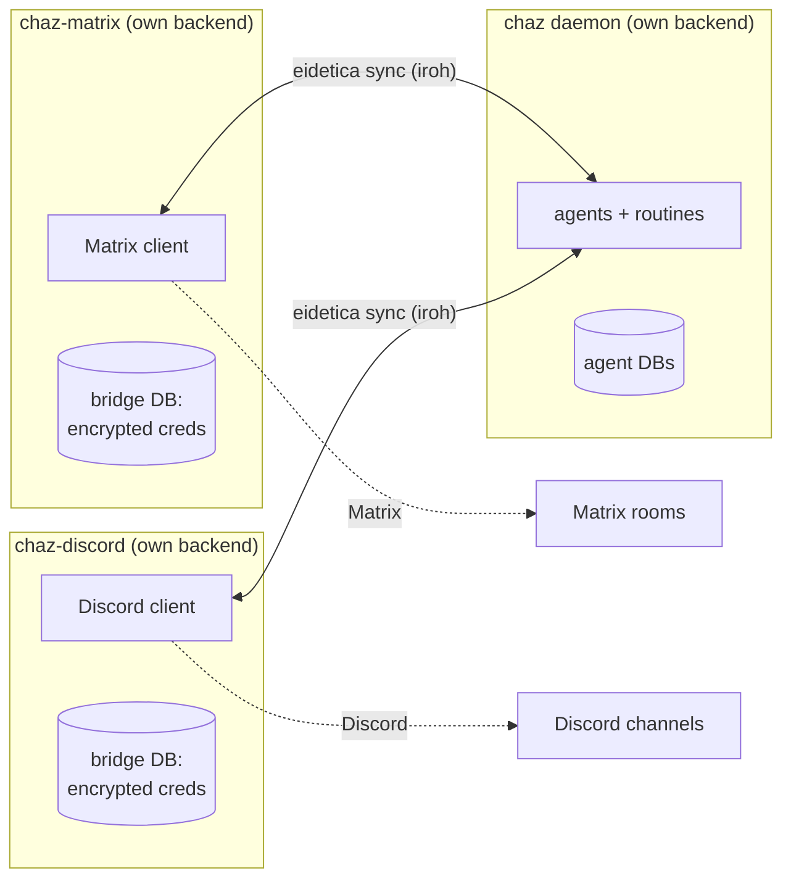

# Transport Bridges

A **bridge** connects chaz to a chat transport — Matrix or Discord — translating
messages between a transport's rooms/channels and chaz session databases.

Each bridge is a **standalone binary and its own eidetica peer**: `chaz-matrix`
and `chaz-discord` are separate processes from the `chaz` daemon, each with its
own key and its own database. They are pure transport I/O — they do **not** run
agents. The `chaz` daemon runs the agents; a bridge only carries messages in and
replies out. The two communicate over eidetica sync.

This page covers the architecture and the one-time setup/approval flow common to
both bridges. For transport-specific configuration see [Matrix Bot](matrix.md)
and [Discord Bot](discord.md).

## Why bridges are separate peers

Earlier versions ran the Matrix bridge inside the `chaz` process and read its
credentials (`homeserver_url`, `username`, `password`) from the central config.
That coupling is gone. Now:

- **A login belongs to exactly one agent.** A bridge's job is to route one
  transport account's traffic to one owning agent's sessions.
- **Credentials never sit in the daemon's config or database.** Each bridge owns
  an encrypted settings database (a `PasswordStore`) holding its own
  homeserver/token/allow-list, unlocked by a password the daemon never sees. The
  daemon stores only a non-secret pointer (a `LoginRef`) in the agent's database
  saying "a login of this kind exists, managed by this bridge DB."
- **The daemon owns no transport config at all.** It runs agents, the TUI, and
  the CLI. Bridges are independently deployable — a different host, a separate
  `systemd` unit, its own restart lifecycle.



Three peers, three separate backend files, syncing over eidetica's iroh
transport. No process opens another's database directly — access to an agent's
DB is granted with a ticket (see below), exactly the way one chaz peer shares an
agent with another in [Sharing & Sync](session_sharing.md).

## The bridge config file

A bridge reads its own YAML file — `chaz-matrix` defaults to
`$XDG_CONFIG_HOME/chaz/matrix-bridge.yaml`, `chaz-discord` to
`discord-bridge.yaml` — or pass `--config <path>`. The same file carries two
kinds of keys, parsed independently:

- **chaz runtime keys** the bridge's embedded server needs: `backends:`,
  `agents:` (just the identities the bridge serves), `security:`, optionally
  `sync_listen:` and `state_dir:`. These are the ordinary [config](configuration.md)
  keys.
- **bridge-only keys**: `unlock_password:`, an optional `label:`, and a
  `logins:` list.

Each entry in `logins:` ties one transport account to one agent:

```yaml
# bridge-only keys
unlock_password: ${CHAZ_BRIDGE_UNLOCK} # unlocks the encrypted credential store
label: matrix # names the bridge's settings DB (default per transport)

logins:
  - agent: chaz # the owning agent (its DB receives the LoginRef pointer)
    ticket: "eidetica:?db=...&pr=..." # access ticket for that agent's DB (see Setup)
    # ...transport-specific credential fields (see Matrix / Discord pages)

# chaz runtime keys the embedded server needs
state_dir: /var/lib/chaz-matrix
backends:
  - name: openai
    api_key: ${OPENAI_API_KEY}
agents:
  - name: chaz
```

Secret fields (`unlock_password`, the Matrix `password`, the Discord
`bot_token`) accept `${ENV}` references and are resolved at startup, so the file
itself never has to hold a plaintext secret. The resolved credentials are sealed
into the bridge's encrypted settings DB on first run and re-sealed (idempotently)
on every boot, so editing the config and restarting is how you rotate them.

## Setup

A bridge needs **Write** access to each agent DB it serves, and the daemon must
approve that access once. The flow mirrors [`/agent import`](session_sharing.md#request-flow-default):

1. **On the daemon**, share the agent the bridge will serve and copy the ticket:

   ```text
   /agent share chaz
   # eidetica:?db=<agent_db_id>&pr=iroh:<addr>
   ```

2. **Write the bridge config** (see above and the per-transport pages). Put the
   ticket from step 1 in the login's `ticket:` field, and set the credential and
   `unlock_password` env vars.

3. **Start the daemon** (`chaz`) and leave it running — the bridge can only
   bootstrap access against a reachable daemon.

4. **Start the bridge:**

   ```bash
   chaz-matrix --config /etc/chaz/matrix-bridge.yaml     # or chaz-discord
   ```

   On first run the bridge generates its own key, seeds its encrypted credential
   store, and requests Write on each agent DB via the ticket. If the daemon
   hasn't yet authorized the bridge's key, the request is **queued** and that
   login is skipped with a log line like:

   ```text
   WARN login="@chaz:example" Access pending owner approval (...); skipping.
        Approve with /sharing approve on the daemon, then restart.
   ```

5. **Approve on the daemon:**

   ```text
   /sharing requests
   # <id> — agent 'chaz' requested by ed25519:... as write(10) at <ts>
   /sharing approve <id>
   ```

6. **Restart the bridge.** Now the request resolves immediately: the bridge
   registers its `LoginRef` pointer in the agent DB, reads its credentials, and
   connects to the transport.

> **Skip the approval step:** if you preseed the bridge's key on the daemon ahead
> of time with `/agent invite chaz <bridge_pubkey> write`, the bridge's first run
> is approved instantly — no queue, no restart. The bridge logs its key on
> startup. See [the preseed flow](session_sharing.md#preseed-flow-still-supported).

Once approved and connected, operation is transparent: inbound messages are
written into the per-channel session DBs (which sync to the daemon), the daemon's
agents respond, and the replies sync back for the bridge to deliver. Day-to-day
commands (`!chaz …`) are documented on the per-transport pages.

## Running as a service

Bridges are long-lived and operator-supervised — run them under `systemd` (or
your supervisor of choice), not from the daemon. A minimal unit:

```ini
[Service]
ExecStart=/usr/local/bin/chaz-matrix --config /etc/chaz/matrix-bridge.yaml
Environment=CHAZ_BRIDGE_UNLOCK=...
Environment=MATRIX_PASSWORD=...
Restart=on-failure
```

Prefer `systemd` credentials / an `EnvironmentFile` over inline `Environment=`
for the secrets. A bridge restart is cheap and idempotent: it re-seeds its
credential store and re-bootstraps access (a no-op once approved).

## How credentials are stored

The bridge's settings database is an eidetica `PasswordStore<DocStore>` —
encrypted at rest and on the wire. Only ciphertext ever syncs; the
`unlock_password` lives in the bridge's environment and never enters any synced
database. A wrong password makes the store refuse to open (reads error rather
than leaking plaintext), and losing it makes the stored credentials
unrecoverable — re-seed from config. The daemon never holds the unlock password
and never reads this database; it only ever sees the non-secret `LoginRef`
pointer.

## Troubleshooting

**The bridge logs "Access pending owner approval" and exits / skips a login.**
Expected on first run before approval. Run `/sharing requests` then
`/sharing approve <id>` on the daemon, then restart the bridge. See Setup step 5.
To avoid the round-trip entirely, preseed with `/agent invite`.

**"no Matrix/Discord logins are ready."** Every configured login is still
pending approval (or none are configured). Approve them on the daemon and
restart.

**The bridge can't reach the daemon.** Bootstrap and sync need network
reachability between the two peers. With the default iroh transport this works
across NATs, but both must be online; check the daemon's startup log for its sync
address. The optional `sync_listen:` HTTP bind is for environments where iroh
can't connect.

**Credential reads fail after a restart.** The `unlock_password` changed or isn't
set in the environment. It must match what the store was first sealed with; if
it's truly lost, delete the bridge's settings DB and re-seed from config.

**Replies don't appear in the room/channel even though the agent ran.** The
session DB has to sync from the daemon back to the bridge. Confirm both peers are
syncing (see [Sharing & Sync → Troubleshooting](session_sharing.md#troubleshooting)).

## See also

- [Matrix Bot](matrix.md) — Matrix-specific config, commands, behavior
- [Discord Bot](discord.md) — Discord-specific config and portal setup
- [Sharing & Sync](session_sharing.md) — tickets, `/agent share`, the
  `/sharing` approval queue
- [Agents](agents.md) — agents, hosting, and the home-peer execution gate
