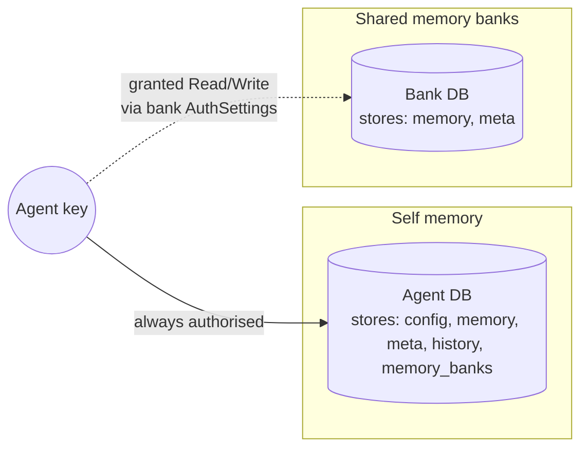
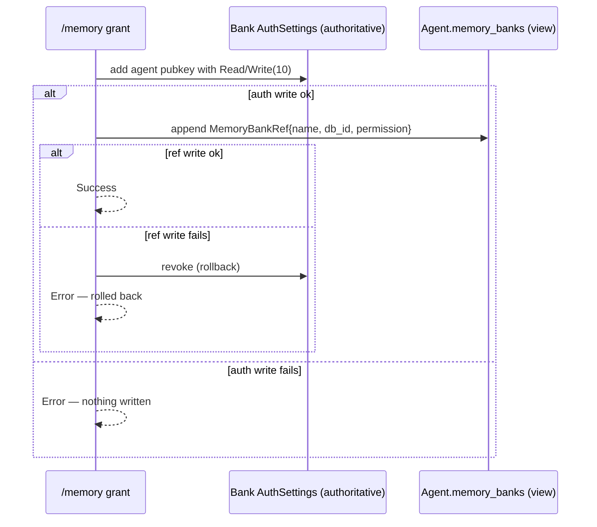

# Memory

Chaz agents have persistent memory that survives restarts and travels across peers via eidetica sync. There are two flavours, but they're the same primitive under the hood: **a `memory` Table inside an eidetica DB**. What changes is _which_ DB, and _who holds the key_.



## The Two Kinds

| Kind                   | DB                                                | Tool call                                   | Who can read/write                                            |
| ---------------------- | ------------------------------------------------- | ------------------------------------------- | ------------------------------------------------------------- |
| **Self memory**        | Agent's own DB                                    | `remember` / `recall` (no `bank`)           | Just the agent — it owns the DB key                           |
| **Shared memory bank** | Standalone `MemoryBankDb` (or another agent's DB) | `remember` / `recall` with `bank: "<name>"` | Anyone granted `Read` or `Write` on the bank's `AuthSettings` |

"Another agent's DB" works here because every Agent DB _is_ a memory bank — it has the same `memory` Table. Granting agent B Read on agent A's DB means B can `recall` from A's notes.

## Why It Looks This Way

Earlier iterations had a `MemoryGrant` capability flag and a `global_memory` store in the peer-local group DB. All of that was removed. The current model is **authorisation by key possession**: an agent can read or write a bank iff eidetica's `AuthSettings` on that bank's DB says so. There is no app-level permission flag to forget to check — opening the DB with the wrong key just fails.

Two consequences worth noticing:

- **Self memory is not grant-gated.** If `remember`/`recall` is in the agent's `allowed_tools`, it works on its own memory. An agent always holds its own DB key.
- **Cross-agent sharing is always a bank grant.** There is no shortcut for "give alpha access to beta's memory" other than granting alpha on beta's DB (or a shared bank).

## The Tools

Agents interact with memory through three tools. All three need to be in `allowed_tools`.

### `remember`

```json
{ "key": "project.chaz.deadline", "value": "2026-06-01" }
```

Writes to the agent's own memory. Add `"bank": "<name>"` to write to a shared bank where the agent has Write.

### `recall`

```json
{ "query": "deadline" }
```

Searches the agent's own memory. Add `"bank": "<name>"` to search a bank. Returns matching entries with timestamps.

### `list_memory_banks`

```json
{}
```

Lists every bank the agent can see, with the permission level. Always includes `self`. Designed to be called on-demand when the agent needs to discover what's available — same pattern as `describe_tool`.

## The `/memory` Commands

Bank management is shared across transports. TUI uses `/memory <sub>`; Matrix uses `!chaz memory <sub>`.

| Command                                      | What                                                                                                  |
| -------------------------------------------- | ----------------------------------------------------------------------------------------------------- |
| `/memory new <name> [description]`           | Create a new standalone bank DB on this peer. The peer holds the bank's key.                          |
| `/memory list`                               | List banks hosted by this peer.                                                                       |
| `/memory delete <ref>`                       | Unregister the bank from this peer's index. The DB itself is preserved as an archive.                 |
| `/memory grant <bank> <agent> <read\|write>` | Authorise an agent on a bank. Writes bank AuthSettings first, then mirrors a ref into the agent's DB. |
| `/memory revoke <bank> <agent>`              | Reverse a grant. Revokes auth, then best-effort removes the ref.                                      |
| `/memory share <bank>`                       | Generate a DatabaseTicket URL for the bank (like `/agent share`).                                     |
| `/memory import <ticket>`                    | Sync a shared bank from another peer's ticket. Requires the ticket to carry a key for this peer.      |

Refs accept either a display name or an eidetica DB ID.

## Bank Grant: What Actually Happens

The grant path is order-sensitive. The auth side is authoritative; the ref is a view cache. If they disagree, auth wins.



Revoke is the opposite order, but without rollback: auth goes first (the security-relevant bit), then the ref is best-effort removed. A leftover ref without auth just means the agent may _see_ the bank listed but eidetica will reject writes.

## End-to-End Walkthrough

Scenario: two agents (`alpha`, `beta`) share a project-notes bank.

### 1. Create the bank

```text
/memory new project-notes "Shared notes for the chaz project"
```

Produces a fresh `MemoryBankDb` signed by a bank-specific key held by this peer.

### 2. Grant the agents

```text
/memory grant project-notes alpha write
/memory grant project-notes beta  read
```

`alpha` can now `remember` into the bank; `beta` can only `recall` from it.

### 3. The agents use it

Mid-conversation, `alpha` calls:

```json
{
  "key": "architecture.sessions",
  "value": "Each conversation gets its own eidetica DB.",
  "bank": "project-notes"
}
```

Later, `beta` (in a totally different session) calls:

```json
{ "query": "sessions", "bank": "project-notes" }
```

and gets `alpha`'s entry back.

### 4. Share the bank with another peer

```text
/memory share project-notes
# → eidetica:?db=sha256:…&pr=http:…
```

On peer B:

```text
/memory import eidetica:?db=sha256:…&pr=http:…
/memory grant project-notes gamma write   # authorise a local agent on the imported bank
```

Writes from either peer replicate bidirectionally.

### 5. Revoke when done

```text
/memory revoke project-notes beta
```

`beta`'s pubkey is stripped from the bank's AuthSettings, and its `memory_banks` ref is removed. Past entries remain — memory is append-only.

## Agent-DB-as-Bank

Because an Agent DB has the same `memory` Table a bank does, you can grant one agent access to another's _own_ notes:

```text
/memory grant alpha beta read   # here the "bank" is alpha's own Agent DB
```

This only works if alpha is a hosted agent on this peer (its DB ID is in the `agents` index). The command resolves the bank ref against both `memory_banks` and `agents` indices, and treats the agent DB as a bank for the purposes of the grant.

## What Doesn't Exist (Any More)

If you find references in old notes or issues to any of these, they're gone:

- `MemoryGrant` capability type in `security.tool_policies`
- `global_remember` / `global_recall` tools
- `Grants.memory` field on agents
- `global_memory` store in the peer-local group DB

All of it was replaced by key-possession on bank DBs.

## Limitations

- **Bank writes are signed by the agent's own key, not a bank-scoped key.** Same limitation as Stage 5 session attachment. Blocked on eidetica exposing `open_database_with_key` so that writes can be signed under a specific delegated key. Doesn't affect authorisation correctness — eidetica still enforces which keys are allowed to write.
- **Read-only bank imports are not supported.** `/memory import` requires the ticket to include a key for the importing peer. The underlying eidetica `Database::open_unauthenticated` is `pub(crate)` for now.
- **No per-entry ACLs.** Permissions are at the bank-DB level: Read or Write on the whole thing.
