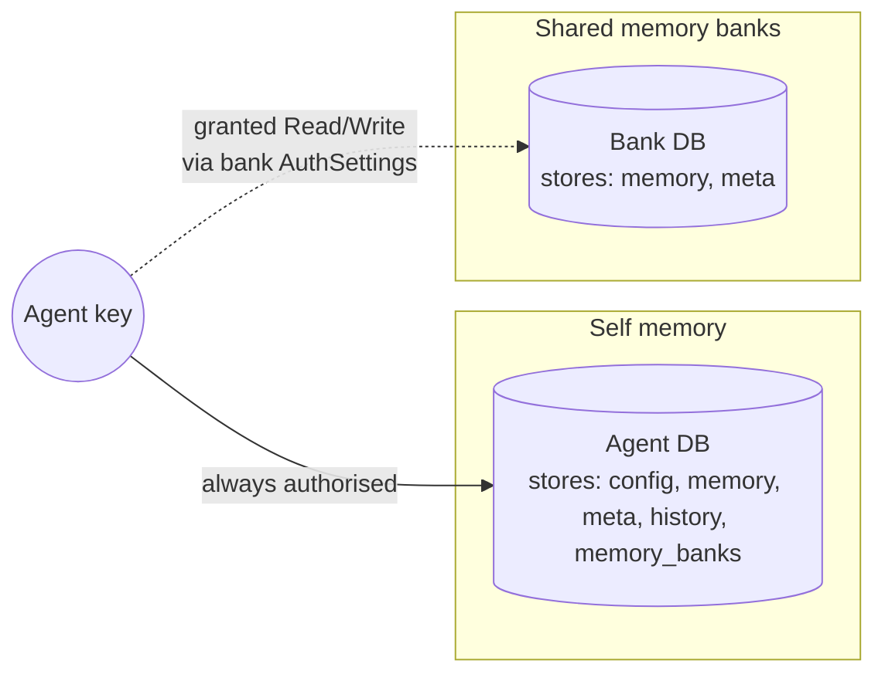
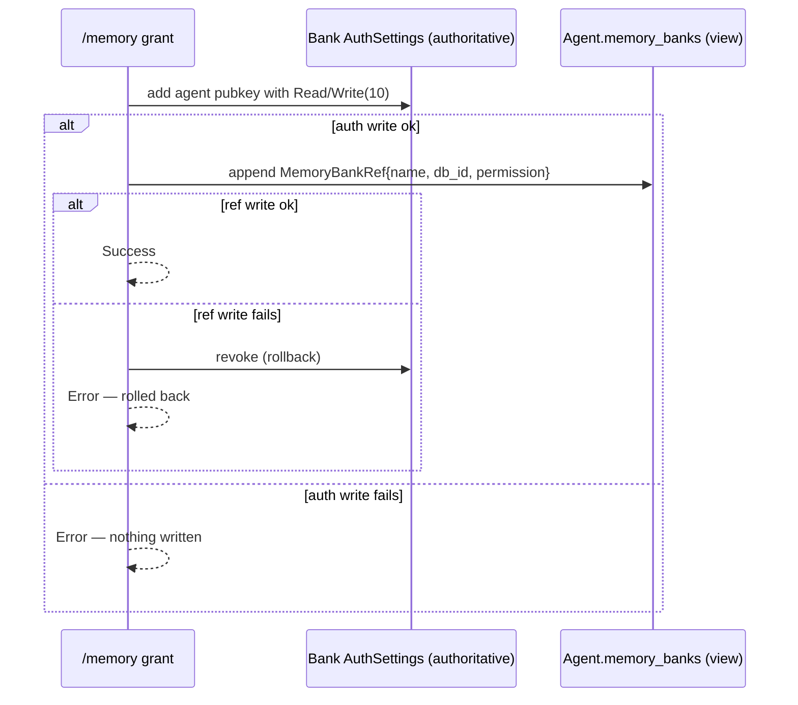
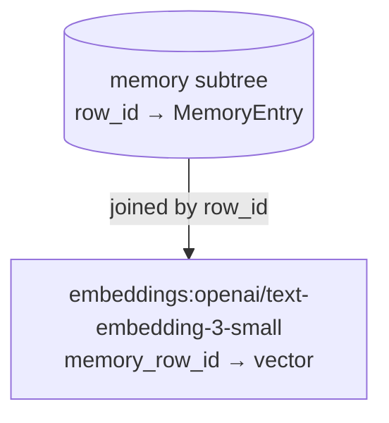

# Memory

Chaz agents have persistent memory that survives restarts and travels across peers via eidetica sync. There are two flavours, but they're the same primitive under the hood: **a `memory` Table inside an eidetica DB**. What changes is _which_ DB, and _who holds the key_.



## The Two Kinds

| Kind                   | DB                                                | Tool call                                   | Who can read/write                                            |
| ---------------------- | ------------------------------------------------- | ------------------------------------------- | ------------------------------------------------------------- |
| **Self memory**        | Agent's own DB                                    | `remember` / `recall` (no `bank`)           | Just the agent — it owns the DB key                           |
| **Shared memory bank** | Standalone `MemoryBankDb` (or another agent's DB) | `remember` / `recall` with `bank: "<name>"` | Anyone granted `Read` or `Write` on the bank's `AuthSettings` |

"Another agent's DB" works here because every Agent DB _is_ a memory bank — it has the same `memory` Table. Granting agent B Read on agent A's DB means B can `recall` from A's notes.

## Why It Looks This Way

Earlier iterations had a `MemoryGrant` capability flag and a `global_memory` store in the peer-local group DB. All of that was removed. The current model is **authorisation by key possession**: an agent can read or write a bank iff eidetica's `AuthSettings` on that bank's DB says so. There is no app-level permission flag to forget to check — opening the DB with the wrong key just fails.

Two consequences worth noticing:

- **Self memory is not grant-gated.** If `remember`/`recall` is in the agent's `allowed_tools`, it works on its own memory. An agent always holds its own DB key.
- **Cross-agent sharing is always a bank grant.** There is no shortcut for "give alpha access to beta's memory" other than granting alpha on beta's DB (or a shared bank).

## The Tools

Agents interact with memory through three tools. All three need to be in `allowed_tools`.

### `remember`

```json
{
  "key": "project.chaz.deadline",
  "value": "2026-06-01",
  "tags": ["project", "chaz"]
}
```

Writes to the agent's own memory. Optional `tags: [string]` attach free-form labels for later filtering. Add `"bank": "<name>"` to write to a shared bank where the agent has Write.

If an [embedding backend](configuration.md#embeddings) is configured, every write also embeds `key + " " + value` and stores the vector in the same DB under `embeddings:<provider>/<model>` — joined to the memory row by the row ID. This happens in one transaction. If the embedding API fails, the memory is still stored; only the vector is missing.

### `recall`

```json
{ "query": "deadline", "tags": ["project"], "limit": 5 }
```

Searches the agent's own memory. Add `"bank": "<name>"` to search a bank. All three extra fields are optional:

- `tags: [string]` — AND-filter; only entries carrying every listed tag are considered.
- `limit: integer` — cap on returned entries (default 10).
- `query: ""` — empty string returns by recency (handy with a `tags` filter).

See [Searching memory](#searching-memory) below for how ranking works.

### `list_memory_banks`

```json
{}
```

Lists every bank the agent can see, with the permission level. Always includes `self`. Designed to be called on-demand when the agent needs to discover what's available — same pattern as `describe_tool`.

## The `/memory` Commands

Bank management is shared across transports. TUI uses `/memory <sub>`; Matrix uses `!chaz memory <sub>`.

| Command                                      | What                                                                                                                                       |
| -------------------------------------------- | ------------------------------------------------------------------------------------------------------------------------------------------ |
| `/memory new <name> [description]`           | Create a new standalone bank DB on this peer. The peer holds the bank's key.                                                               |
| `/memory list`                               | List banks hosted by this peer.                                                                                                            |
| `/memory delete <ref>`                       | Unregister the bank from this peer's index. The DB itself is preserved as an archive.                                                      |
| `/memory grant <bank> <agent> <read\|write>` | Authorise an agent on a bank. Writes bank AuthSettings first, then mirrors a ref into the agent's DB.                                      |
| `/memory revoke <bank> <agent>`              | Reverse a grant. Revokes auth, then best-effort removes the ref.                                                                           |
| `/memory share <bank>`                       | Generate a DatabaseTicket URL for the bank (like `/agent share`).                                                                          |
| `/memory unshare <bank>`                     | Stop sharing the bank — disable sync so this peer stops serving it. Does not revoke keys held by peers who already imported it.            |
| `/memory import <ticket>`                    | Sync a shared bank from another peer's ticket. Requires the ticket to carry a key for this peer.                                           |
| `/memory attach <bank>`                      | Attach a bank to the current session. Its memories are surfaced in context (see [Autonomous Auto-recall](#autonomous-memory-auto-recall)). |
| `/memory detach <bank>`                      | Detach a previously-attached bank from this session.                                                                                       |
| `/memory config [show\|set\|reset]`          | View or change memory auto-recall behaviour for this agent. See [Auto-recall config](#auto-recall-configuration).                          |

Refs accept either a display name or an eidetica DB ID.

## Autonomous Memory Auto-recall

When the `memory` extension is active, chaz automatically searches the agent's own memory and all attached banks for facts relevant to the current conversation. The top results are injected at the end of context as a `## Relevant Memories` block — the agent sees them alongside the conversation history, not in its system prompt.

**No manual `recall` needed.** It fires every turn, before the LLM call. If no relevant memories are found, nothing is injected.

### How it works

1. The last 5 conversation messages are joined, tokenized, and stopwords removed to form a query.
2. The agent's own `memory` store is searched with BM25 + cosine hybrid ranking.
3. Every attached bank (via `/memory attach` or `default_memory_banks`) is searched the same way.
4. Up to 3 results per store (configurable) are formatted and appended.

```text
## Relevant Memories
- [deploy process]: Build via nix build && scp to prod
- [api endpoint]: https://api.example.com/v2

_(from bank: project-conventions)_
- [naming]: Use kebab-case for all new crates
```

### Attaching banks to a session

Banks must be explicitly attached to participate in auto-recall (even if the agent has a grant). Two ways:

**Per-session** — attach for the current conversation only:

```text
/memory attach project-conventions
/memory detach project-conventions
```

**Per-agent (persistent)** — declare in `config.yaml` to auto-attach at startup:

```yaml
agents:
  - name: ava
    system_prompt: "You are Ava..."
    default_memory_banks:
      - project-conventions
      - shared-facts
```

`default_memory_banks` are applied at bootstrap and on `/agent reload`. They grant Write access and write a `MemoryBankRef` to the agent DB — idempotent across restarts.

Missing banks are auto-created on first startup — no manual `/memory new` needed for banks listed in `default_memory_banks`. The same bank name can appear on multiple agents to share it between them.

### Auto-recall configuration

Per-agent settings stored in the agent DB. View and change with `/memory config`:

```text
/memory config show
# Auto-recall config:
# ──────────────────────
# auto_recall_enabled = true
# max_entries         = 3
# auto_recall_banks   = (all attached)

/memory config set max_entries 5
/memory config set auto_recall_banks project-notes,shared-facts
/memory config set auto_recall_enabled false       # disable auto-recall
/memory config reset                             # revert to defaults
```

| Setting               | Default | Range      | What                                                   |
| --------------------- | ------- | ---------- | ------------------------------------------------------ |
| `auto_recall_enabled` | `true`  | true/false | Turn autonomous auto-recall on/off                     |
| `max_entries`         | `3`     | 1–20       | Max results auto-recalled from own memory + per bank   |
| `auto_recall_banks`   | _(all)_ | names      | Which banks participate; comma-separated, empty = none |

Disabling auto-recall stops the `## Relevant Memories` block but leaves the `remember`/`recall` tools fully functional. Auto-recall only searches banks listed in `auto_recall_banks` (or all attached banks when unset).

When `auto_recall_banks` is set, only the named banks are searched by auto-recall. Other attached banks remain available for explicit `recall bank="..."` — they're just excluded from the automatic `## Relevant Memories` block.

### Trust model

Auto-recall is read-only — it searches existing memory stores, never writes. The write path stays with the `remember` tool (gated by eidetica AuthSettings). Banks the agent can't open (no key, no grant) are silently skipped during auto-recall.

## Bank Grant: What Actually Happens

The grant path is order-sensitive. The auth side is authoritative; the ref is a view cache. If they disagree, auth wins.



Revoke is the opposite order, but without rollback: auth goes first (the security-relevant bit), then the ref is best-effort removed. A leftover ref without auth just means the agent may _see_ the bank listed but eidetica will reject writes.

## End-to-End Walkthrough

Scenario: two agents (`alpha`, `beta`) share a project-notes bank.

### 1. Create the bank

```text
/memory new project-notes "Shared notes for the chaz project"
```

Produces a fresh `MemoryBankDb` signed by a bank-specific key held by this peer.

### 2. Grant the agents

```text
/memory grant project-notes alpha write
/memory grant project-notes beta  read
```

`alpha` can now `remember` into the bank; `beta` can only `recall` from it.

### 3. The agents use it

Mid-conversation, `alpha` calls:

```json
{
  "key": "architecture.sessions",
  "value": "Each conversation gets its own eidetica DB.",
  "bank": "project-notes"
}
```

Later, `beta` (in a totally different session) calls:

```json
{ "query": "sessions", "bank": "project-notes" }
```

and gets `alpha`'s entry back.

### 4. Share the bank with another peer

```text
/memory share project-notes
# → eidetica:?db=sha256:…&pr=http:…
```

On peer B:

```text
/memory import eidetica:?db=sha256:…&pr=http:…
/memory grant project-notes gamma write   # authorise a local agent on the imported bank
```

Writes from either peer replicate bidirectionally.

### 5. Revoke when done

```text
/memory revoke project-notes beta
```

`beta`'s pubkey is stripped from the bank's AuthSettings, and its `memory_banks` ref is removed. Past entries remain — memory is append-only.

## Agent-DB-as-Bank

Because an Agent DB has the same `memory` Table a bank does, you can grant one agent access to another's _own_ notes:

```text
/memory grant alpha beta read   # here the "bank" is alpha's own Agent DB
```

This only works if alpha is a hosted agent on this peer (its DB ID is in the `agents` index). The command resolves the bank ref against both `memory_banks` and `agents` indices, and treats the agent DB as a bank for the purposes of the grant.

## Searching memory

`recall` ranks results, it doesn't just substring-match. There are two rankers, and they're combined.

### Lexical ranking — always on

Every memory entry is treated as a "document": `key + " " + value + " " + tags`. The query is tokenized (lowercase, split on non-alphanumeric, drop tokens shorter than 2 chars — no stemming, no stopwords) and scored against each document with **BM25** (`k1=1.5`, `b=0.75`). Entries that match no query token are dropped from the BM25 list.

This works without any external service or configuration. It's the only ranker on by default.

### Semantic ranking — opt-in via `embedding:`

Configure an [embedding backend](configuration.md#embeddings) and chaz also stores a vector for every memory write under `embeddings:<provider>/<model>` on the same DB:



At recall time, the query is embedded the same way, and **cosine similarity** ranks every entry that has a stored vector for the active model. Entries with non-positive similarity are dropped.

The `<provider>/<model>` naming means **multiple models coexist on the same DB**. Switching models leaves the old subtree dormant; entries written under the old model stop contributing to semantic recall until [`/memory reindex`](#) (Stage 3, planned) backfills them.

### Hybrid ranking — Reciprocal Rank Fusion

When both rankers produce hits, results are fused with **RRF** (`k=60`, [Cormack et al. 2009](https://plg.uwaterloo.ca/~gvcormac/cormacksigir09-rrf.pdf)): each entry's combined score is `1/(60 + rank_BM25) + 1/(60 + rank_cosine)`, summed over whichever lists it appears in. Entries in only one ranker still surface; entries in both are boosted. The top `limit` are returned.

### Where settings live

The embedding system spans three storage layers, and it's worth knowing which is which because they have very different lifecycle and sync behavior.

| What                                                            | Where                                                              | Peer-local? | Synced? |
| --------------------------------------------------------------- | ------------------------------------------------------------------ | ----------- | ------- |
| `embedding:` block (`backend`, `model`, `provider`, `api_base`) | chaz config yaml file                                              | yes         | no      |
| Embedding API key                                               | `chaz_peer.credentials` (peer-local eidetica DB, never syncs)      | yes         | no      |
| Stored vectors                                                  | `embeddings:<provider>/<model>` subtree on each agent DB / bank DB | no          | **yes** |

The choice of _which_ embedder to use is currently peer-config-only — there is **no DB field that declares a preferred model for an agent or bank**. Two peers hosting the same shared bank can each configure a different embedder, and both write to their own model's subtree on the synced DB. Subtrees coexist; nothing collides.

The trade-off:

- **Pro**: peer autonomy. A self-hosted Ollama peer and an OpenAI peer can both write into the same shared bank without coordinating on a model.
- **Con**: a peer's recall only matches against vectors written under _its own_ configured model. Peer A's `openai/text-embedding-3-small` vectors are invisible to peer B's `ollama/nomic-embed-text` recall path until backfilled. Until [`/memory reindex`](#) (Stage 3, planned), the only fallback for peer B on those entries is BM25.

If the design ever moves to a "DB declares its preferred model" model, the field would live in `meta` next to `display_name` / `description` so it syncs with the DB.

### Fallback semantics

The hybrid path degrades gracefully — none of these scenarios error out:

| Scenario                                                     | Behavior                                                  |
| ------------------------------------------------------------ | --------------------------------------------------------- |
| No `embedding:` configured                                   | BM25-only.                                                |
| Embedder configured, but the active DB has no `embeddings:M` | BM25-only (subtree just doesn't exist yet).               |
| Embedding API call fails on **write**                        | Memory still stored; no vector written. Logged at `warn`. |
| Embedding API call fails on **read**                         | BM25-only for this query. Logged at `warn`.               |
| Empty `query` string                                         | Recency sort over the surviving entries.                  |
| Query matches no BM25 token AND no semantic match            | Returns "No memories found …"                             |

The guarantee: configuring an embedder never makes recall worse, and a flaky embedding service never costs you a memory write.

## What Doesn't Exist (Any More)

If you find references in old notes or issues to any of these, they're gone:

- `MemoryGrant` capability type in `security.tool_policies`
- `global_remember` / `global_recall` tools
- `Grants.memory` field on agents
- `global_memory` store in the peer-local group DB

All of it was replaced by key-possession on bank DBs.

## Limitations

- **Bank writes are signed by the agent's own key, not a bank-scoped key.** Same limitation as Stage 5 session attachment. eidetica's `open_database_with_key` is now available; chaz hasn't adopted it yet. Doesn't affect authorisation correctness — eidetica still enforces which keys are allowed to write.
- **No per-entry ACLs.** Permissions are at the bank-DB level: Read or Write on the whole thing.
