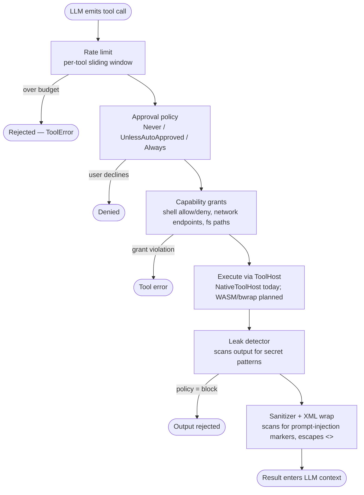

# Security

Chaz includes multiple security layers that compose into a defense-in-depth model. This page walks through the model first, then documents each layer with the config keys you'd touch, and ends with a worked example.

## The Layered Model

Five separately-configurable layers sit between an LLM tool call and any real-world effect. They're enforced in this order; an earlier layer can short-circuit the rest:



The layers in plain words:

| Layer                    | What it guards against                                         | Where it's configured                              |
| ------------------------ | -------------------------------------------------------------- | -------------------------------------------------- |
| **Rate limiting**        | Runaway loops, denial-of-wallet on paid tools                  | `tool_policies.<tool>.rate_limit`                  |
| **Approval**             | A misbehaving model invoking dangerous tools without oversight | `auto_approved_tools` + `tool_policies.*.approval` |
| **Capability grants**    | A correctly-invoked tool reaching resources it shouldn't       | `tool_policies.<tool>.grants` (shell/network/fs)   |
| **Leak detector**        | Tool output exfiltrating secrets back into the LLM context     | `leak_policy: redact \| block`                     |
| **Sanitizer + XML wrap** | Tool output performing prompt-injection against the LLM        | Always-on; logged at `warn`                        |

Two more orthogonal layers wrap everything:

- **Secret store** keeps API keys out of LLM context entirely — they're resolved at the HTTP client boundary, never quoted to the model.
- **Agent-level controls** (`allowed_tools`, per-Agent `workers:` list, depth caps) shrink which layers even get a chance to run for a given Agent.

The capability boundary is the **`ToolHost`** trait. The default `NativeToolHost` runs in-process and enforces grants; future hosts (WASM, bubblewrap) will swap in stronger isolation without any tool-code changes. Tools never call OS APIs directly — they request a `Capability::Shell|FileRead|FileWrite|HttpRequest` from the host.

## Tool Approval

Each tool has a default approval requirement that can be overridden in config:

```yaml
security:
  # Tools that never need approval (even if their default requires it)
  auto_approved_tools:
    - get_time
    - calculate
    - read_file
    - remember
    - recall

  # Per-tool policy overrides
  tool_policies:
    shell:
      approval: Always # Always ask, even if auto-approved
      timeout: 60 # Seconds before execution times out
    web_fetch:
      approval: UnlessAutoApproved
      timeout: 30
```

Approval levels:

- **Never** -- runs without asking
- **UnlessAutoApproved** -- runs if in `auto_approved_tools`, asks otherwise
- **Always** -- always asks the user

In the TUI, approval is an inline y/n/a prompt. In Matrix, unapproved tools time out (Matrix approval UX is planned).

## Capability Grants

Tools access system resources through the **ToolHost** trait — a sandboxed capability boundary. Grants configure _what_ each tool is allowed to do; the host enforces those grants at execution time. The default `NativeToolHost` enforces grants in-process; future hosts (WASM, bubblewrap) will add stronger sandboxing without changing any tool code.

### Shell grants

The `shell` tool's commands are filtered by `allow`/`deny` lists in its grant:

```yaml
security:
  tool_policies:
    shell:
      grants:
        shell:
          allow:
            - ls
            - cat
            - grep
            - find
            - wc
          deny:
            - rm
            - sudo
            - chmod
            - chown
            - dd
```

If `allow` is non-empty, only commands starting with an allowed prefix are permitted. The `deny` list blocks commands regardless of the allowlist.

> **Deprecated**: `security.shell_allowlist` and `security.shell_denylist` are legacy fields. They still work but are converted to shell grants at startup with a deprecation warning. Use `tool_policies.shell.grants.shell` for new configs.

### Network grants

The `web_fetch` tool's HTTP requests are filtered by endpoint patterns:

```yaml
security:
  tool_policies:
    web_fetch:
      grants:
        network:
          endpoints:
            - host: "api.example.com"
              path_prefix: "/v1"
              methods: ["GET", "POST"]
            - host: "httpbin.org"
          allow_private: false
```

Private IP addresses (RFC 1918, loopback, link-local) are always blocked unless `allow_private: true`. Wildcard hosts (`"*.example.com"`) are supported.

> **Deprecated**: `security.allowed_endpoints` is a legacy field. It still works but is converted to a network grant at startup with a deprecation warning. Use `tool_policies.web_fetch.grants.network.endpoints` for new configs.

### Filesystem grants

File read/write path restrictions are configured but enforcement is a stub (not yet active):

```yaml
security:
  tool_policies:
    read_file:
      grants:
        fs:
          allow_read: ["/tmp", "/home/user/projects"]
    write_file:
      grants:
        fs:
          allow_write: ["/tmp", "/home/user/projects"]
```

## Leak Detection

All tool outputs are scanned for secret patterns before entering the LLM context. The detector recognizes 12 patterns including:

- API keys (OpenAI, Anthropic, OpenRouter, GitHub, AWS, Google)
- SSH private keys
- PEM-encoded certificates
- Bearer tokens
- Generic high-entropy strings matching key formats

When a secret is detected:

- **Redact** (default): The secret is replaced with `[REDACTED]` and the output proceeds
- **Block**: The entire tool output is rejected

```yaml
security:
  leak_policy: "redact" # or "block"
```

## XML Tool Output Wrapping

Tool results fed back to the LLM are wrapped in XML delimiters:

```xml
<tool_output tool="shell">
file1.txt
file2.txt
</tool_output>
```

Angle brackets (`<`, `>`) in the tool output are escaped to `&lt;`/`&gt;`, preventing injection attacks where malicious content could break out of the delimiter and inject system-level instructions.

## Prompt Injection Detection

Tool outputs are scanned for prompt injection patterns (role markers, instruction overrides, chat template tokens). Currently warning-only -- detections are logged but not blocked.

## Tool Rate Limiting

Per-tool call frequency can be limited via the `rate_limit` field in tool policies:

```yaml
security:
  tool_policies:
    shell:
      rate_limit: 5 # max 5 calls per minute
    web_fetch:
      rate_limit: 20
```

A sliding-window rate limiter tracks call timestamps per tool within each agent turn. When a tool exceeds its limit, the call is rejected with an informative message including the retry-after time. The LLM receives this as a tool error and can adjust its behavior.

## Secret Management

API keys are stored in eidetica's SecretStore and resolved at the HTTP client boundary. Config supports environment variable references (`"${VAR_NAME}"`). Secrets are never included in LLM context or session entries.

## Agent-Level Controls

- **Tool narrowing**: Each Agent definition can restrict available tools via `tools:` (supports glob patterns like `"filesystem__*"`)
- **Transitive narrowing**: Spawned children (peer Agents via `spawn_agent`, Workers via `spawn_worker`) can never have more tools than their parent
- **Worker scoping**: Workers are declared per-Agent under `workers:`. An Agent can only invoke a Worker that's declared under itself — no global Worker registry
- **Depth limiting**: Spawn depth is capped to prevent infinite recursion
- **Concurrency**: Global semaphore limits concurrent LLM calls to 10
- **Memory isolation**: Each agent's own memory lives in its own Living Agent DB (keyed access, enforced by eidetica). Cross-agent sharing requires an explicit `/memory grant` on a shared bank — there is no peer-wide "global" memory
- **Per-session serialization**: Only one agent task runs per session at a time, preventing duplicate responses from concurrent writes

## End-to-End Walkthrough

Scenario: harden an agent named `researcher` so it can shell out for read-only inspection and fetch from one upstream API, but nothing else.

### 1. Start from the agent definition

In `config.yaml`:

```yaml
agents:
  - name: researcher
    model: openrouter/openai/gpt-4o-mini
    system_prompt_files: ["prompts/researcher.md"]
    tools: ["shell", "read_file", "web_fetch", "remember", "recall"]
```

`tools:` is the outer envelope (the agent-level tool allow-list). Anything outside this list is invisible to the agent, no matter what `security:` says.

### 2. Layer in the security policy

```yaml
security:
  leak_policy: redact

  auto_approved_tools:
    - read_file
    - remember
    - recall

  tool_policies:
    shell:
      approval: Always # never auto-approve, even for trusted users
      rate_limit: 5 # max 5 calls / minute
      timeout: 30
      grants:
        shell:
          allow: ["ls", "cat", "grep", "find", "wc", "head", "tail"]
          deny: ["rm", "mv", "dd", "sudo", "chmod", "chown"]
    web_fetch:
      approval: UnlessAutoApproved
      rate_limit: 20
      grants:
        network:
          endpoints:
            - host: "api.example.com"
              path_prefix: "/v1"
              methods: ["GET"]
          allow_private: false
```

What just happened, layer by layer:

1. `shell` calls are throttled to 5/min before anything else fires.
2. Each `shell` call asks for human approval (`Always` overrides `auto_approved_tools`).
3. If approved, the `ShellGrant` allow/deny lists run; `rm -rf /` is denied even if the user said yes.
4. `web_fetch` can only hit `https://api.example.com/v1/*` with `GET`. Private IPs are blocked (the default), so the LLM can't reach `169.254.169.254` to scrape cloud metadata.
5. Any output is scanned for secret patterns; matches are redacted (set `leak_policy: block` to drop the entire result).

### 3. Watch it work

With logs at `info`, every enforcement decision is recorded. Tail the file and try a few requests in the TUI:

```text
INFO  Approval decision tool=shell decision=Approve
WARN  Shell command denied: deny pattern matched 'sudo'
WARN  Network request blocked by policy method=GET url=https://169.254.169.254/latest/meta-data
WARN  Tool output blocked by leak detector tool=read_file
WARN  Rate limited tool=shell
```

The "Approval decision" line is at `info`; everything else is `warn`. See [Logging — Security Audit Trail](logging.md#security-audit-trail) for a ready-made filter.

### 4. Adjust without restart

Most of `security:` is read at startup, so changes need a relaunch. The two exceptions:

- `/agent set <ref> tools=<comma,list>` adjusts an agent's allow-list at runtime (per-agent narrowing, persisted to the Agent DB).
- Adding or removing an MCP server reloads tool policies for the affected tools.

Everything else — grants, leak policy, rate limits — comes from `config.yaml` on next boot.
