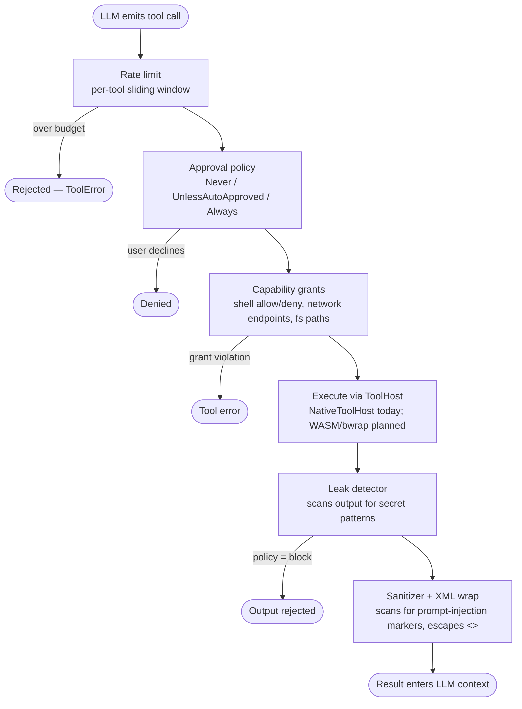

# Security

Chaz includes multiple security layers that compose into a defense-in-depth model. This page walks through the model first, then documents each layer with the config keys you'd touch, and ends with a worked example.

## The Layered Model

Five separately-configurable layers sit between an LLM tool call and any real-world effect. They're enforced in this order; an earlier layer can short-circuit the rest:


```mermaid
flowchart TD
    LLM([LLM emits tool call]) --> RL[Rate limit<br/>per-tool sliding window]
    RL -->|over budget| Reject1([Rejected — ToolError])
    RL --> AP[Approval policy<br/>Never / UnlessAutoApproved / Always]
    AP -->|user declines| Reject2([Denied])
    AP --> CG[Capability grants<br/>shell allow/deny, network endpoints, fs paths]
    CG -->|grant violation| Reject3([Tool error])
    CG --> EXEC[Execute via ToolHost<br/>NativeToolHost today; WASM/bwrap planned]
    EXEC --> LD[Leak detector<br/>scans output for secret patterns]
    LD -->|policy = block| Reject4([Output rejected])
    LD --> SAN[Sanitizer + XML wrap<br/>scans for prompt-injection markers, escapes &lt;&gt;]
    SAN --> CTX([Result enters LLM context])
```

The layers in plain words:

| Layer                    | What it guards against                                         | Where it's configured                                                                                                  |
| ------------------------ | -------------------------------------------------------------- | ---------------------------------------------------------------------------------------------------------------------- |
| **Rate limiting**        | Runaway loops, denial-of-wallet on paid tools                  | `tool_policies.<tool>.rate_limit`                                                                                      |
| **Approval**             | A misbehaving model invoking dangerous tools without oversight | `auto_approved_tools` + `tool_policies.*.approval`                                                                     |
| **Capability grants**    | A correctly-invoked tool reaching resources it shouldn't       | `tool_policies.<tool>.grants`, plus session/agent ceilings (see [Capability tiers](#capability-tiers-and-attenuation)) |
| **Leak detector**        | Tool output exfiltrating secrets back into the LLM context     | `leak_policy: redact \| block`                                                                                         |
| **Sanitizer + XML wrap** | Tool output performing prompt-injection against the LLM        | Always-on; logged at `warn`                                                                                            |

Two more orthogonal layers wrap everything:

- **Secret store** keeps API keys out of LLM context entirely — they're resolved at the HTTP client boundary, never quoted to the model.
- **Agent-level controls** (`allowed_tools`, per-Agent `workers:` list, depth caps) shrink which layers even get a chance to run for a given Agent.

The capability boundary is the **`ToolHost`** trait. The default `NativeToolHost` runs in-process and enforces grants; the opt-in `BubblewrapToolHost` (`tool_host: bubblewrap`) runs shell commands in OS-level namespaces without any tool-code changes, and a WASM host is planned. Tools never call OS APIs directly — they request a `Capability::Shell|FileRead|FileWrite|HttpRequest` from the host.

## Tool Approval

Each tool has a default approval requirement that can be overridden in config:

```yaml
security:
  # Tools that never need approval (even if their default requires it)
  auto_approved_tools:
    - get_time
    - calculate
    - read_file
    - remember
    - recall

  # Per-tool policy overrides
  tool_policies:
    shell:
      approval: Always # Always ask, even if auto-approved
      timeout: 60 # Seconds before execution times out
    web_fetch:
      approval: UnlessAutoApproved
      timeout: 30
```

Approval levels:

- **Never** -- runs without asking
- **UnlessAutoApproved** -- runs if in `auto_approved_tools`, asks otherwise
- **Always** -- always asks the user

How you're asked depends on the surface:

- **TUI** — an inline y/n/a prompt.
- **Matrix / Discord** — the daemon posts a 🔒 approval prompt into the room/channel; **react** ✅ approve · ❌ deny · ⏭ approve-all, or reply `!chaz approve` / `!chaz deny`. The decision rides back to the daemon over the session DB. This is **fail-closed**: if no one answers in time, or the bridge is down, the tool is **denied**, never run unsupervised. See [Dumb Transport Bridges → Tool approvals over the session DB](../design/transport_bridges.md#tool-approvals-over-the-session-db) for the mechanism.

An unanswered prompt expires after `approvals.timeout` seconds (default 300). The tool does not run, and the room is told which one expired:

```yaml
approvals:
  timeout: 300
```

Only the daemon reads this block — it owns the waiting runtime, so it owns the clock, and no bridge keeps one. Every request the daemon posts carries the ceiling, so the prompt can tell you how long you have; on expiry the daemon records the outcome in the session and each bridge renders it to its channel. An expiry is recorded distinctly from a deliberate deny, so a transcript shows whether a call was refused or simply never answered.

An answer that arrives after the expiry does not revive the request. The daemon already told the agent the call was not approved, and the session resolves to that outcome no matter what lands afterwards.

## Capability Grants

Tools access system resources through the **ToolHost** trait — a sandboxed capability boundary. Grants configure _what_ each tool is allowed to do; the host enforces those grants at execution time. The default `NativeToolHost` enforces grants in-process; the opt-in `BubblewrapToolHost` (`tool_host: bubblewrap`) adds OS-level shell sandboxing, and a WASM host is planned — both without changing any tool code.

### Capability tiers and attenuation

The same grant shape (`shell` / `network` / `fs`) is set at **four tiers**. They are intersected at every tool call, and **each inner tier can only subtract authority — never widen it** ("most-restrictive-wins"):

```
effective = tool policy  ∩  session ceiling  ∩  agent capabilities  ∩  per-tool override
```

| Tier                   | Scope                                                  | Config key                                                  |
| ---------------------- | ------------------------------------------------------ | ----------------------------------------------------------- |
| **Tool policy**        | The baseline grant for a tool, across all agents       | `security.tool_policies.<tool>.grants`                      |
| **Session ceiling**    | Every tool call by every agent in one session          | `SessionMeta.capabilities` (per-session, on the session DB) |
| **Agent capabilities** | Every tool call this agent makes, across all its tools | `agents[].capabilities` (the agent-wide chokepoint)         |
| **Per-tool override**  | One tool, for one agent                                | `agents[].grants.<tool>`                                    |

The key property: the **session ceiling** and **agent capabilities** are chokepoints. The filesystem is reachable through both `shell` and `write_file`; the network through both `web_fetch` and `shell` (`curl`). Setting `allow_private: false` on a single tool doesn't stop another tool reaching the resource — but a session or agent ceiling binds _every_ tool that can reach it at once. That is how you express "this agent has no network" (a `private` profile) or "this is a confined session."

Within each grant, attenuation means: **allowlists intersect**, **denylists union**, and booleans like `allow_private` are AND-ed. A narrower tier clearing a `deny` entry cannot un-deny it — the union keeps it.

Allowlists (`shell.allow`, `network.endpoints`, `fs.allow_read`/`allow_write`) have three states, so "allow everything" and "allow nothing" are distinct:

| Config                       | Meaning                                   |
| ---------------------------- | ----------------------------------------- |
| field omitted                | **permissive** — no constraint, allow-all |
| `allow: ["git", "ls"]`       | only entries matching the list            |
| `allow: []` (explicit empty) | **deny-all** — nothing matches            |

A permissive (omitted) allowlist narrows to whatever the other tier specifies; an explicit `[]` is the hard floor that lets a ceiling say "no shell at all" or "no network."

### Shell grants

The `shell` tool's commands are filtered by `allow`/`deny` lists in its grant:

```yaml
security:
  tool_policies:
    shell:
      grants:
        shell:
          allow:
            - ls
            - cat
            - grep
            - find
            - wc
          deny:
            - rm
            - sudo
            - chmod
            - chown
            - dd
```

If `allow` is non-empty, only commands starting with an allowed prefix are permitted. The `deny` list blocks commands regardless of the allowlist.

> **Deprecated**: `security.shell_allowlist` and `security.shell_denylist` are legacy fields. They still work but are converted to shell grants at startup with a deprecation warning. Use `tool_policies.shell.grants.shell` for new configs.

### Network grants

The `web_fetch` tool's HTTP requests are filtered by endpoint patterns:

```yaml
security:
  tool_policies:
    web_fetch:
      grants:
        network:
          endpoints:
            - host: "api.example.com"
              path_prefix: "/v1"
              methods: ["GET", "POST"]
            - host: "httpbin.org"
          allow_private: false
```

Private IP addresses (RFC 1918, loopback, link-local) are always blocked unless `allow_private: true`. Wildcard hosts (`"*.example.com"`) are supported.

#### Redirects are never followed

The grant is checked against the URL the tool asked for, so the host does not follow HTTP redirects: a server answering `302 Location: /admin` could otherwise steer an allowed request to a path, host, or private address the grant never covered. A 3xx response comes back as-is, and `web_fetch` reports where it points:

```text
[302]
Location: https://api.example.com/admin
(redirect not followed; fetch the Location URL to continue)
```

The agent can fetch that `Location` with a new `web_fetch` call, which is checked against the grant like any other request. Above, `/admin` is outside the `/v1` prefix and is denied.

Grant checks look at the URL text, not the address the hostname resolves to. A public hostname whose DNS answer is a private address (DNS rebinding) is not caught by `allow_private: false`; that needs the sandboxed host's network boundary.

> **Deprecated**: `security.allowed_endpoints` is a legacy field. It still works but is converted to a network grant at startup with a deprecation warning. Use `tool_policies.web_fetch.grants.network.endpoints` for new configs.

### Filesystem grants

File read/write paths are bounded to a set of allowed roots. An omitted list is permissive; a populated list confines paths to at/under one of the roots; an explicit empty list (`allow_write: []`) denies all writes:

```yaml
security:
  tool_policies:
    read_file:
      grants:
        fs:
          allow_read: ["/tmp", "/home/user/projects"]
    write_file:
      grants:
        fs:
          allow_write: ["/tmp", "/home/user/projects"]
```

Paths are normalized lexically before the check — `.`/`..` are resolved and the match is on path boundaries, so `/work` permits `/work/sub/x` but **not** `/workother/x` or `/work/../etc/passwd`.

> This is **advisory** confinement: symlinks are not followed, so a symlink under an allowed root can still point outside it. True confinement (a process that physically cannot see other paths) is the job of a sandboxed host — the `BubblewrapToolHost` (`tool_host: bubblewrap`) provides it for `shell` commands, which run in a mount namespace with only the system directories, `/tmp`, and the working directory present. Until then, treat fs grants as a guardrail against accidental writes, not a boundary against a hostile tool.

### Agent and session ceilings

Set an agent-wide ceiling with `capabilities` on the agent — it attenuates every tool the agent uses at once. This is how you build a reusable profile like "no network":

```yaml
agents:
  - name: private
    tools: ["shell", "read_file", "remember", "recall"]
    capabilities:
      network:
        endpoints: [] # paired with the session/tool layers; see note
        allow_private: false
      fs:
        allow_write: ["/work"] # binds shell AND write_file at once
```

The session ceiling lives on the session itself (`SessionMeta.capabilities`) rather than in `config.yaml`, so it travels with the session and applies to whichever agents run in it.

> **Expressing "no network at all":** set an explicit empty endpoint allowlist on the ceiling:
>
> ```yaml
> capabilities:
>   network:
>     endpoints: [] # deny-all egress
> ```
>
> This is an in-process check, so it blocks the `web_fetch` capability but a determined `shell` tool could still shell out to `curl`. For a hard guarantee that a shell command _cannot_ reach the network regardless of tool, the enforcement point has to be the OS boundary — the `BubblewrapToolHost` (`tool_host: bubblewrap`) runs every shell command with `--unshare-net`, so there is no interface beyond loopback inside the namespace. File and HTTP capabilities still run in-process under their grants, so pair the `endpoints: []` ceiling with a `shell` denylist (or no `shell` tool) to cover those paths too.

## The bubblewrap tool host

Setting `tool_host: bubblewrap` routes shell commands through
[bubblewrap](https://github.com/containers/bubblewrap) (`bwrap`), which gives each command its own Linux namespaces using unprivileged user namespaces — no root, no setuid. Inside the sandbox a shell command gets:

- **No network** (`--unshare-net`) — loopback only, no external interfaces.
- **A private PID namespace** (`--unshare-pid`) — host PIDs are unaddressable, so a same-UID host process cannot be signalled or inspected.
- **No `/proc`** — mounting a procfs for the new PID namespace is refused by some hardened kernels, and its absence is stronger confinement anyway: no host process list, no `/proc/<pid>/root`. This has a practical cost: with no procfs, `/dev/fd` is a dangling symlink, so shell constructs that depend on it fail — bash process substitution, for example, errors with `cat: /dev/fd/63: No such file or directory`. Tools that read `/proc` directly will not work either.
- **An empty environment** (`--clearenv`) restored with fixed `PATH`, `HOME=/tmp`, and `LANG` — provider API keys and other host secrets never reach a shell command.
- **Read-only system directories**: `/usr`, `/bin`, `/lib`, `/lib64`, `/nix/store`, and `/run/current-system`. Only `/nix/store` is bound — not all of `/nix` — because a read-only mount still allows connecting to the Nix daemon's Unix socket under `/nix/var/nix`.
- **Ephemeral `/tmp`** (tmpfs) and a minimal `/dev`.

File read/write and HTTP capabilities are not namespaced; they run on the native host's grant-checked path exactly as before.

### Writable working directories

By default **nothing on the host is writable from inside the sandbox** — commands run against the ephemeral `/tmp`. To let a command work in a real directory, list approved roots:

```yaml
tool_host_writable_roots:
  - /srv/work
  - /tmp/agent-scratch
```

A requested working directory must canonicalize (symlinks and `..` resolved) to a directory inside one of these roots; anything else — including `/`, `/home`, or a symlink pointing outside — is refused before `bwrap` runs. A root that canonicalizes to `/` is itself refused at startup: it would mount the entire host filesystem read-write, so chaz refuses to start rather than run with the sandbox nullified. The read-only system binds above are applied after the writable working-dir bind, so they always win even if a working directory overlaps an ancestor of one of them.

### Fail-closed selection

Selecting `bubblewrap` requires a working sandbox: at startup chaz probes `bwrap` by actually creating a namespace, and if that fails the server refuses to start rather than silently running unsandboxed. If you genuinely want to degrade to native execution when `bwrap` is unavailable, say so explicitly:

```yaml
tool_host: bubblewrap-unsafe-fallback
```

That logs a prominent warning and runs shell commands natively (grant checks only). The unsafe fallback is always opt-in; plain `bubblewrap` fails closed.

## Leak Detection

All tool outputs are scanned for secret patterns before entering the LLM context. The detector recognizes 12 patterns including:

- API keys (OpenAI, Anthropic, OpenRouter, GitHub, AWS, Google)
- SSH private keys
- PEM-encoded certificates
- Bearer tokens
- Generic high-entropy strings matching key formats

When a secret is detected:

- **Redact** (default): The secret is replaced with `[REDACTED]` and the output proceeds
- **Block**: The entire tool output is rejected

```yaml
security:
  leak_policy: "redact" # or "block"
```

## XML Tool Output Wrapping

Tool results fed back to the LLM are wrapped in XML delimiters:

```xml
<tool_output tool="shell">
file1.txt
file2.txt
</tool_output>
```

Angle brackets (`<`, `>`) in the tool output are escaped to `&lt;`/`&gt;`, preventing injection attacks where malicious content could break out of the delimiter and inject system-level instructions.

## Prompt Injection Detection

Tool outputs are scanned for prompt injection patterns (role markers, instruction overrides, chat template tokens). Currently warning-only -- detections are logged but not blocked.

## Tool Rate Limiting

Per-tool call frequency can be limited via the `rate_limit` field in tool policies:

```yaml
security:
  tool_policies:
    shell:
      rate_limit: 5 # max 5 calls per minute
    web_fetch:
      rate_limit: 20
```

A sliding-window rate limiter tracks call timestamps per tool within each agent turn. When a tool exceeds its limit, the call is rejected with an informative message including the retry-after time. The LLM receives this as a tool error and can adjust its behavior.

## Secret Management

API keys are stored in eidetica's SecretStore and resolved at the HTTP client boundary. Config supports environment variable references (`"${VAR_NAME}"`). Secrets are never included in LLM context or session entries.

## Agent-Level Controls

- **Tool narrowing**: Each Agent definition can restrict available tools via `tools:` (supports glob patterns like `"filesystem__*"`)
- **Capability ceiling**: `capabilities:` on an Agent attenuates _every_ tool call it makes (see [Agent and session ceilings](#agent-and-session-ceilings)) — the chokepoint for profiles like a no-network `private` agent or a write-confined `researcher`
- **Transitive narrowing**: Spawned children (peer Agents via `spawn_agent`, Workers via `spawn_worker`) can never have more tools than their parent
- **Worker scoping**: Workers are declared per-Agent under `workers:`. An Agent can only invoke a Worker that's declared under itself — no global Worker registry
- **Depth limiting**: Spawn depth is capped to prevent infinite recursion
- **Concurrency**: Global semaphore limits concurrent LLM calls to 10
- **Memory isolation**: Each agent's own memory lives in its own Living Agent DB (keyed access, enforced by eidetica). Cross-agent sharing requires an explicit `/memory grant` on a shared bank — there is no peer-wide "global" memory
- **Per-session serialization**: Only one agent task runs per session at a time, preventing duplicate responses from concurrent writes

## End-to-End Walkthrough

Scenario: harden an agent named `researcher` so it can shell out for read-only inspection and fetch from one upstream API, but nothing else.

### 1. Start from the agent definition

In `config.yaml`:

```yaml
agents:
  - name: researcher
    model: openrouter/openai/gpt-4o-mini
    system_prompt_files: ["prompts/researcher.md"]
    tools: ["shell", "read_file", "web_fetch", "remember", "recall"]
```

`tools:` is the outer envelope (the agent-level tool allow-list). Anything outside this list is invisible to the agent, no matter what `security:` says.

### 2. Layer in the security policy

```yaml
security:
  leak_policy: redact

  auto_approved_tools:
    - read_file
    - remember
    - recall

  tool_policies:
    shell:
      approval: Always # never auto-approve, even for trusted users
      rate_limit: 5 # max 5 calls / minute
      timeout: 30
      grants:
        shell:
          allow: ["ls", "cat", "grep", "find", "wc", "head", "tail"]
          deny: ["rm", "mv", "dd", "sudo", "chmod", "chown"]
    web_fetch:
      approval: UnlessAutoApproved
      rate_limit: 20
      grants:
        network:
          endpoints:
            - host: "api.example.com"
              path_prefix: "/v1"
              methods: ["GET"]
          allow_private: false
```

What just happened, layer by layer:

1. `shell` calls are throttled to 5/min before anything else fires.
2. Each `shell` call asks for human approval (`Always` overrides `auto_approved_tools`).
3. If approved, the `ShellGrant` allow/deny lists run; `rm -rf /` is denied even if the user said yes.
4. `web_fetch` can only hit `https://api.example.com/v1/*` with `GET`. Private IPs are blocked (the default), so the LLM can't reach `169.254.169.254` to scrape cloud metadata.
5. Any output is scanned for secret patterns; matches are redacted (set `leak_policy: block` to drop the entire result).

### 2b. Add an agent-wide ceiling

The `tool_policies` above bound each tool individually. To guarantee `researcher` can _only_ write under `/work` no matter which tool it reaches the filesystem with — `shell` (via `tee`, `>`) or `write_file` — add an agent-wide ceiling:

```yaml
agents:
  - name: researcher
    # ...as above...
    capabilities:
      fs:
        allow_write: ["/work"]
```

Now both the `shell` and `write_file` paths are attenuated by `allow_write: ["/work"]` at once. A per-tool `grants.write_file.fs.allow_write: ["/work/out"]` would narrow it _further_ (to `/work/out`), but nothing — not a per-tool grant, not a clever shell redirect — can widen it back beyond `/work`. That is the attenuation guarantee: inner tiers only subtract.

If the same agent runs in a session that carries its own `capabilities` ceiling, that intersects on top — the session can tighten `researcher`, never loosen it.

### 3. Watch it work

With logs at `info`, every enforcement decision is recorded. Tail the file and try a few requests in the TUI:

```text
INFO  Approval decision tool=shell decision=Approve
WARN  Shell command denied: deny pattern matched 'sudo'
WARN  Network request blocked by policy method=GET url=https://169.254.169.254/latest/meta-data
WARN  Tool output blocked by leak detector tool=read_file
WARN  Rate limited tool=shell
```

The "Approval decision" line is at `info`; everything else is `warn`. See [Logging — Security Audit Trail](logging.md#security-audit-trail) for a ready-made filter.

### 4. Adjust without restart

Most of `security:` is read at startup, so changes need a relaunch. The two exceptions:

- `/agent set <ref> tools=<comma,list>` adjusts an agent's allow-list at runtime (per-agent narrowing, persisted to the Agent DB).
- Adding or removing an MCP server reloads tool policies for the affected tools.

Everything else — grants, leak policy, rate limits — comes from `config.yaml` on next boot.
