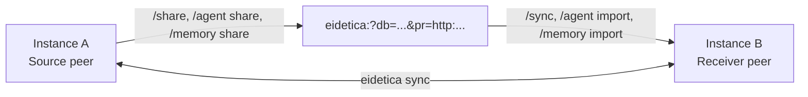

# Sharing & Sync

Chaz instances can share sessions, agents, and memory banks over the network using [eidetica's sync protocol](https://github.com/arcuru/eidetica). Use cases include viewing a remote agent's conversation from a local TUI, multiple instances collaborating on the same session, sharing a curated knowledge base across deployments, and inviting a co-owner to an agent.

## How It Works

Each chaz instance starts an HTTP sync server automatically at startup. The server address is logged:

```text
INFO Eidetica sync listening on 127.0.0.1:12345
```

Shared databases are advertised via **database tickets** -- URLs that encode the database ID and the source peer's network address. Eidetica handles the sync protocol, entry replication, conflict resolution, and (for sessions) bidirectional propagation. A `/share` command flips eidetica's per-DB `sync_enabled` flag for the current peer so it actually serves the DB to ticket holders, then prints the ticket; an `/import` or `/sync` command on the receiver does the inverse.



Three things sync as separate database kinds, each with its own commands:

| Kind         | Source command       | Receiver command      | What syncs                              |
|--------------|----------------------|-----------------------|-----------------------------------------|
| Session      | `/share`             | `/sync <ticket>`      | Conversation entries + session metadata |
| Living Agent | `/agent share <ref>` | `/agent import <tkt>` | Agent config + per-agent memory         |
| Memory Bank  | `/memory share <ref>`| `/memory import <tkt>`| Bank contents + grants                  |

Tickets and the on-the-wire protocol are identical across kinds; the source and receiver commands diverge because each kind has different post-import bookkeeping (registering with the local hosted index, etc.).

## Sharing a Session

On the instance that has the session:

```text
/share
```

Output:

```text
Share this ticket to sync the current session:

eidetica:?db=<database_id>&pr=http:192.168.1.10:12345
```

Paste the ticket on the receiving instance:

```text
/sync eidetica:?db=<database_id>&pr=http:192.168.1.10:12345
```

After syncing, the session appears in the session list. Use `/sessions` to find and open it.

## Sharing an Agent or Memory Bank

Sharing an agent or memory bank with another peer is a two-step process: pre-authorize the receiver's pubkey, then hand them the ticket. This is the **preseed-pubkey model** described in [Living Agents](agents.md#lifecycle-sharing-and-co-ownership).

```text
# On Receiver (peer B): print B's default pubkey
/pubkey
# Output: ed25519:abc123...

# On Source (peer A): authorize B's pubkey on the agent's auth settings
/agent invite my-agent ed25519:abc123... write
# (use `admin` for a co-owner, `read` for read-only — read-only support is partial)

# On Source: generate the share ticket
/agent share my-agent
# Output: eidetica:?db=<agent_db_id>&pr=http:...

# On Receiver: import
/agent import eidetica:?db=<agent_db_id>&pr=http:...
# Receiver now hosts the agent and can attach it to their own sessions.
```

Memory banks follow the same shape with `/memory invite` (coming soon — currently use `/memory grant <bank> <agent>` to give a hosted agent access; cross-peer pubkey grant lands with the bootstrap UX), `/memory share`, and `/memory import`.

> **Heads up — bootstrap UX in progress:** the manual `/pubkey` → `/agent invite` → `/agent share` → `/agent import` sequence will be collapsed into a single `/agent request <ticket>` flow once chaz wires up eidetica's bootstrap-request machinery. Until then, the steps above are the supported path.

## Example: Watching a Matrix Bot's Session

1. Start the Matrix bot on a server:

   ```bash
   chaz --config /etc/chaz/config.yaml
   # Logs: Eidetica sync listening on 0.0.0.0:12345
   ```

2. Start a local TUI:

   ```bash
   chaz --config ~/chaz-local.yaml --tui
   ```

3. On the server (via a second TUI or programmatically), get the session ticket:

   ```text
   /join !roomid:matrix.org
   /share
   # Output: eidetica:?db=<id>&pr=http:myserver.com:12345
   ```

4. On the local TUI, sync and open:

   ```text
   /sync eidetica:?db=<id>&pr=http:myserver.com:12345
   /sessions
   ```

5. Select the synced session. You'll see the full conversation history. New messages from Matrix should appear in real time — see *Troubleshooting* if they don't.

## Requirements

- Both instances must be able to reach each other over the network
- The sync server binds to a random port by default
- Firewalls must allow the sync port (check the startup log for the address)
- Both instances use separate eidetica databases (separate `state_dir` paths)
- Sharing a database flips its `sync_enabled` flag on the source peer; this persists across restarts. To stop advertising a DB, the source peer can re-create the ticket but a `/unshare` command isn't built yet — track it on the followups list.

## Ticket Format

Tickets use a magnet-style URI format:

```text
eidetica:?db=<database_id>&pr=<transport>:<address>
```

Multiple peer addresses can be included (the receiver tries them concurrently and succeeds on the first):

```text
eidetica:?db=<id>&pr=http:192.168.1.10:8080&pr=http:10.0.0.1:8080
```

See the [eidetica documentation](https://github.com/arcuru/eidetica) for details on the sync protocol, transport types, and ticket format.

## Troubleshooting

**The receiver synced but new messages from the source don't appear.**
This was a real bug fixed in 2026-04 — `/share`/`/agent share`/`/memory share` were generating valid-looking tickets but the source peer wasn't actually advertising the DB. If you see this on a build older than the Database Layout Refactor Stage 1 fix, upgrade. On current builds, also check that:
- Both peers are on the same eidetica protocol version (chaz pins eidetica to a specific revision; mismatched peers won't handshake).
- The source peer's sync server log shows incoming connections from the receiver's address.

**A co-owner's edits to a synced session don't trigger an agent run on the host.**
Known limitation: chaz only listens to `on_local_write`, but remote-write callbacks were dead code in eidetica until a recent fix. Until that fix is merged and chaz subscribes to `on_remote_write`, remote pushes land in the database silently — they're visible if you re-render the session, but agents won't react to them. Tracked as the "Remote-write callback subscription" item in the followups.

**`/agent import` or `/memory import` fails with "this peer holds no key for the DB".**
The ticket synced the DB contents but the receiver wasn't preseeded with a key. The owner must run `/agent invite <receiver_pubkey>` (or `/memory invite`) first; tickets carry no key material themselves. Read-only sharing (no key) is blocked on an upstream eidetica change.

**Tickets stop working after a restart.**
The sync server picks a random port at each startup, so a ticket minted in one session encodes an address that's stale after the source peer restarts. Workaround: regenerate the ticket after the source restarts. Tracked as "configurable sync server address" in the followups.

## Limitations

- The sync server address/port is not yet configurable (random port per restart).
- No authentication on the sync connection beyond the ticket capability and per-DB auth keys (any peer with the ticket can reach the source's sync server; whether they can read/write a specific DB is gated by eidetica's `AuthSettings`).
- Registry index entries (Matrix channel bindings, name index) are local to each peer — only the database contents (entries + meta) sync.
- To make a synced session reachable from a specific Matrix room on the receiver, run `!chaz attach <name-or-id>` in that room after syncing.
- Read-only import (no preseeded key) is blocked on `Database::open_unauthenticated` becoming public in eidetica.
