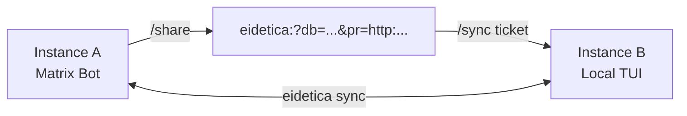

# Session Sharing

Chaz instances can share sessions over the network using [eidetica's sync protocol](https://github.com/arcuru/eidetica). This enables viewing a remote agent's conversation from a local TUI, multiple instances collaborating on the same session, and real-time bidirectional updates.

## How It Works

Each chaz instance starts an HTTP sync server automatically at startup. The server address is logged:

```text
INFO Eidetica sync listening on 127.0.0.1:12345
```

Sessions are shared via **database tickets** -- URLs that encode the session's eidetica database ID and the server's network address. Eidetica handles the sync protocol, entry replication, and conflict resolution.



Once synced, writes from either side propagate automatically via eidetica's `on_local_write` callbacks. The TUI will see new entries appear in real time.

## Sharing a Session

On the instance that has the session you want to share, use the TUI command:

```text
/share
```

This generates a ticket URL:

```text
eidetica:?db=sha256:a1b2c3...&pr=http:192.168.1.10:12345
```

The URL contains:

- `db=` -- the eidetica database ID for this session
- `pr=` -- peer address hints (the sync server's address)

## Syncing a Remote Session

On another chaz instance, paste the ticket:

```text
/sync eidetica:?db=sha256:a1b2c3...&pr=http:192.168.1.10:12345
```

After syncing completes, the session appears in the session list. Use `/sessions` to find and open it.

## Example: Watching a Matrix Bot's Session

1. Start the Matrix bot on a server:

   ```bash
   chaz --config /etc/chaz/config.yaml
   # Logs: Eidetica sync listening on 0.0.0.0:12345
   ```

2. Start a local TUI:

   ```bash
   chaz --config ~/chaz-local.yaml --tui
   ```

3. On the server (via a second TUI or programmatically), get the session ticket:

   ```text
   /join !roomid:matrix.org
   /share
   # Output: eidetica:?db=sha256:abc...&pr=http:myserver.com:12345
   ```

4. On the local TUI, sync and open:

   ```text
   /sync eidetica:?db=sha256:abc...&pr=http:myserver.com:12345
   /sessions
   ```

5. Select the synced session. You'll see the full conversation history, and new messages from Matrix will appear in real time.

## Requirements

- Both instances must be able to reach each other over the network
- The sync server binds to a random port by default
- Firewalls must allow the sync port (check the startup log for the address)
- Both instances use separate eidetica databases (separate `state_dir` paths)

## Ticket Format

Tickets use a magnet-style URI format:

```text
eidetica:?db=<database_id>&pr=<transport>:<address>
```

Multiple peer addresses can be included:

```text
eidetica:?db=sha256:abc...&pr=http:192.168.1.10:8080&pr=http:10.0.0.1:8080
```

See the [eidetica documentation](https://github.com/arcuru/eidetica) for details on the sync protocol, transport types, and ticket format.

## Limitations

- The sync server address is not yet configurable (random port)
- No authentication on the sync connection (any peer with the ticket can sync)
- Registry index entries (Matrix channel bindings, name index) are local to each peer — only the session database contents (entries + meta) sync.
- To make a synced session reachable from a specific Matrix room on the receiver, run `!chaz attach <name-or-id>` in that room after syncing.
